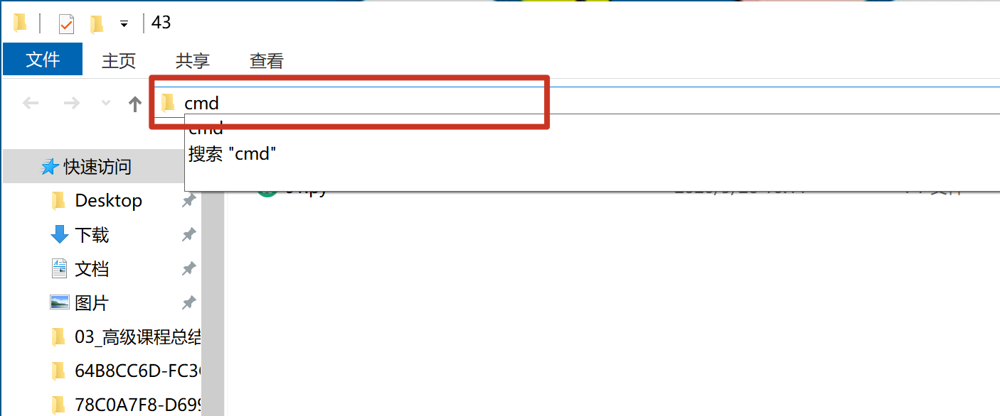
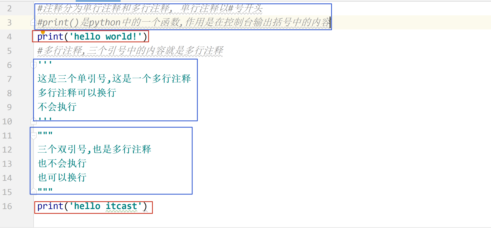
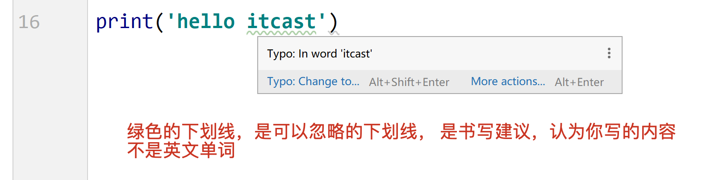
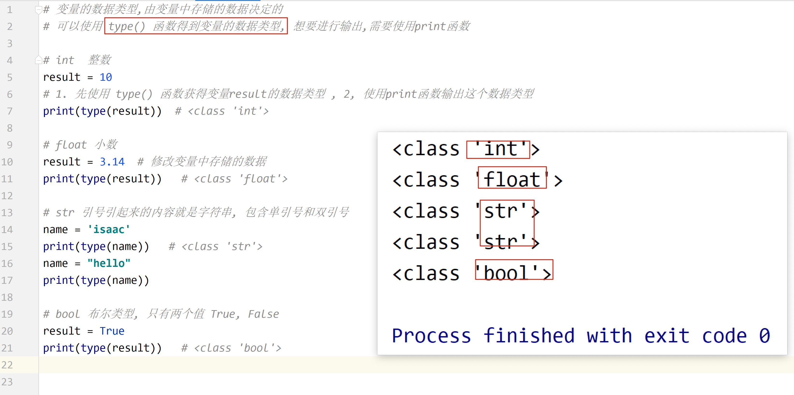
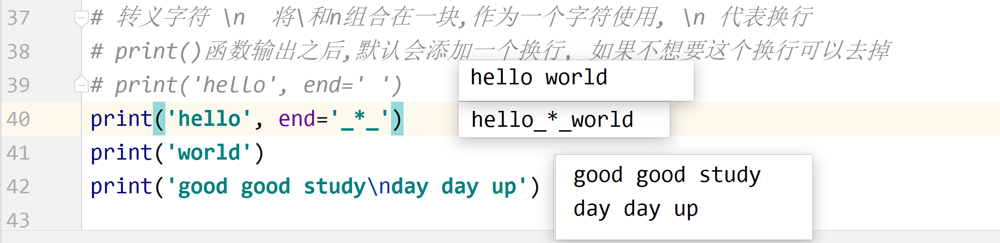
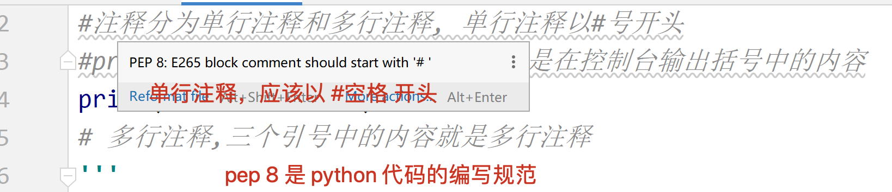
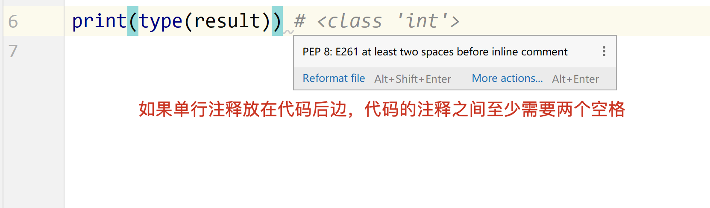

## 1. 第一个 python 程序[掌握]

> python:   python 解释器, 将 python 代码解释成计算机认识的语言.
>
> pycharm:  IDE(集成开发环境), 写代码的一个软件, 集成了写代码, 运行代码,代码调试等功能
>
> 写代码的软件除了使用 pycharm 之外,还可以使用 记事本,  sublime, vscode .... 

### 使用记事本(sublime)书写一个 python 代码

1. 新打开一个记事本程序

2. 书写 `print('hello world!')`, 注意,标点符号都是英文

3. 保存文件, 文件的后缀是`.py`

   

   

   

4. 打开 cmd 窗口,  执行代码 `python 代码文件名`

   

   


4. 运行代码, 右键运行

   


## Pycharm

#### setting -- 设置解释器


## 2. 注释[掌握]

- 注释是不会执行的
- 注释是对代码的解释说明,是让人看得
- 单行注释的快捷键/取消单行注释  `Ctrl /`,  可以一次选中多行,给其添加单行注释







## 7. 变量的定义和使用[掌握]


## 8. 数据类型[掌握]




## 9. 标识符和关键字[掌握]

- 标识符命名规则: ==由字母,数字和下划线组成,不能以数字开头==

- 变量的命名规范

  - 遵循标识符的规则
  - 见名知意
  - 使用下划线连接
  - 不能使用系统的关键字

- 关键字: 系统定义好的标识符,具有特殊的作用

  > 不需要刻意的记忆,后续课程中会逐渐学习

## 10. 输出[掌握]




## 11. 输入[掌握]


## 12. 数据类型转换[掌握]int() float() str() eval()

```python
'''
类型转换
将原始数据转换为需要的数据,不会改变原值,会生成一个新的数据

int(值)
float(值)
'''


# 1转换为int类型     int(值)
# 1.1 float => int
pi = 3.14
num = int(pi)
print(type(pi))     # <class 'float'>
print(type(num))    # <class 'int'>

# 1.2 整数类型字符串 => int
str1 = '3'
num1 = int(str1)
print(type(str1))   # <class 'str'>
print(type(num1))   # <class 'int'>

# 非整形就报错了
# str2 = '3.1'
# num2 = int(str2)
# str3 = '3a'
# num3 = int(str3)


# 2 转换为float
# 2.1 int => float
num2 = 10
num3 = float(num2)
print(type(num2))   # <class 'int'>
print(type(num3))   # <class 'float'>

# 2.2 数字类型字符串 => float
str4 = '23.1'
num4 = float(str4)
print(type(str4))   # <class 'str'>
print(type(num4))   # <class 'float'>

# 非数字就报错了
# str5 = '3.1a'
# num5 = float(str5)


# eval() 还原原来的数据类型,去掉字符串的引号,获取变量名,这个变量应该提前定义,不然报错
num6 = eval('100')
print(type(num6))       # <class 'int'>
num7 = eval('3.102')
print(type(num7))       # <class 'float'>
list1 = "[{'name': 'b', 'age': 14, 'gender': 'm'}]"
list1 = eval(list1)
print(list1, type(list1))   # <class 'list'>


# 就变为变量名了
# num8 = eval('num')  会报错,没有赋值
# 这样可以,因为将 num7 的值给了 num8
num8 = eval('num7')
print(num8)     # 3.102
```


**eval()去除字符串两端的引号,数字变为int或float,也能去除字符串两边引号,但是这个名字是一个变量名,所以要提前定义它,不然报错,不建议去除字符串两边的引号**


## 13. 运算符[掌握]

### 算术运算符

```
+ - * /  
// 整除(求商)
% 取余数
** 指数,幂运算
() 可以改变优先级
```

### 赋值运算符

```python
= 将等号右边的结果赋值给等号左边的变量
等号左边,必须是变量,不能是具体的数字
```

### 复合赋值运算符

```python
+=  c+=a  => c = c + a
```

### 比较运算符

> 比较运算符的结果是 bool 类型, 即 True,或者是 False

```python 
== 判断是否相等, 相等是 True. 不相等是 False
!= 判断是否不相等, 不相等是 True, 相等 False
>
<
>=
<=
```

### 逻辑运算符

> 逻辑运算符可以连接连个表达式, 两个表达式共同的结果决定最终的结果是 True,还是 False

```python 
and 优先级高于 or

and  逻辑与, 连接的两个条件都必须为 True,结果为 True,  一假为假	    &&
	如果第一个条件为 False,就不会再判断第二个条件
or   逻辑或, 连接的两个条件都为 False,结果为 False,    一真为真	 ||
	如果第一个条件为 True,第二个条件就不会再判断了
not  逻辑非, 取反,原来是 True,变为 False,原来是 False,变为 True	!
```

```python
flag1 = True
flag2 = False
print(flag1 and flag2)  # False
print(flag1 or flag2)   # True

print(not flag1)        # False
```


## PEP 8 规范

1. 单行注释#后边应该有一个空格

   

2. 代码文件的最后一行是空行

   

3. 行内注释需要两个空格

   


http://192.168.154.31:8000