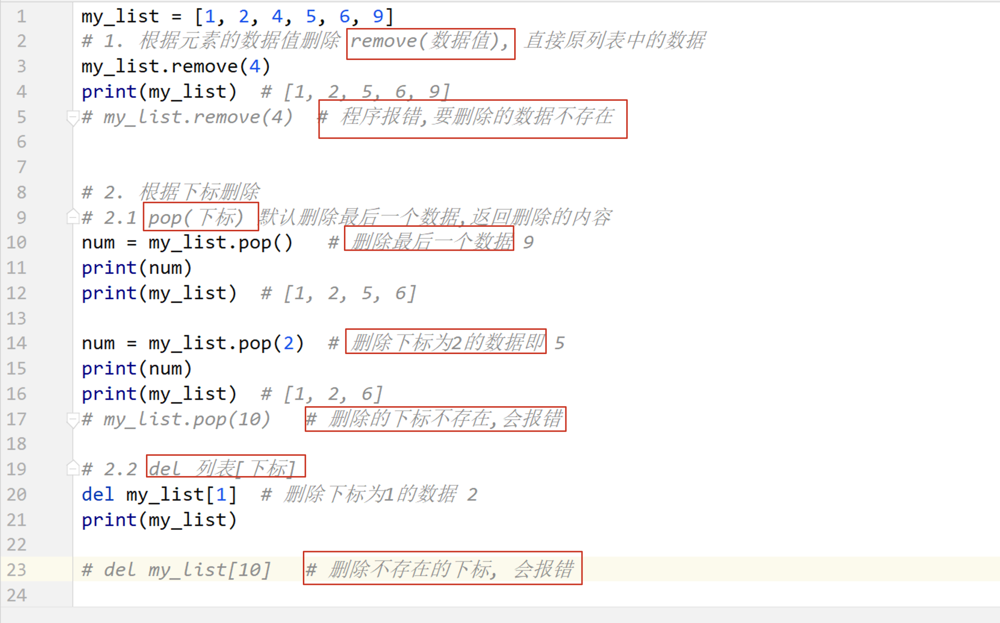

## Day03 笔记

[toc]

## 复习和反馈


## 1. 字符串 str

### 1.1 字符串定义

```python
带引号的内容就是字符串.

在 python 中,字符串可以乘上一个整数, 
字符串 * num  复制几份
```


### 1.2 字符串的输出和输出

```python
# 输入 input()
input() 函数得到的内容就是字符串

# 输出 print() 函数 %s 
f-string 
```

### 1.3 下标

```python
'''
下标,可以用于字符串
整数下标 从左到右从 0 开始    0  1  2  3
负数下标 从右到左从 -1开始   -4 -3 -2 -1
'''

str1 = 'abcdefg'

print(str1[1])  # b
print(str1[-1]) # g

list1 = [1, 2, ['a', 'b', 3]]
print(list1[2][0])  # a
print(list1[-2])    # 2

'''
len() 得到字符串长度
'''
print(len(str1))    # 7
```


## 下面对字符串的修改都不会修改原字符串,而是返回新值

### 1.4 切片

**一个大的字符串里面截取一部分内容**

**切片语法: [起始,结束,步长]**

**从起始位开始,到结束的前一个位置,步长表示选取间隔**

**不会改变原值,会返回新的值**

```python
'''
一个大的字符串里面截取一部分内容
切片语法: [start:end:step]
start:  开始截取位置,不写默认为0
end:    结束位置后一个,不写位置直接到最后一个(前提步长是整数,如果步长是负数的话,它是第一个)
step:   步长,截取间隔,默认是1

start 和 end 能写负数,从右往左数  -1 -2 -3

my_str[:]  得到和原来一样的字符串
my_str[::-1]  字符串的倒置

不会改变原值,会返回新的值.
'''
str1 = 'abcdefghijklmn'

print(str1[2:4])    # cd
print(str1[3:10:2]) # dfhj


# 不写 end 自动截取到最后
print(str1[5:])     # fghijklmn


# [:] 得到和原来一样的字符串
print(str1[:])      # abcdefghijklmn


# [] 里面可以填写负数,从右往左数,顺序没有倒转 -1 -2 -3 -4
print(str1[-5:-1])  # jklm

# end在start的前边,没数据
print(str1[3:1])    # 没数据

# end在start的前边,没数据 step为负数,从右往左找
print(str1[3:1:-1]) # dc

# [::-1]  字符串的逆置
print(str1[::-1])   # nmlkjihgfedcba

# [::2]   隔两位输出一次
print(str1[::2])    # acegikm
```


### 1.5 查找方法

#### find() & rfind()

```python
str1 = "hello world itcast and itcastcpp"

'''
find
从左边开始查找是否存在某个字符串,找第一个位置
mystr.find(substr,start,end)
substr: 要找的内容
start:  开始查找位置,默认是0
end:    结束查找位置之后的位置,默认是 len()
返回结果是 substr 位置的整数下标,找不到返回 -1
'''

# 说明参数2是结束下标的下一个位置
print(str1.find('p', 1, 4))  # -1
print(str1.find('o', 1, 5))  # 4

print(str1.find('itcast'))       # 12
print(str1.find('itcast', 15))   # 23
print('---------------------------')


'''
rfind
从右边开始查找是否存在某个字符串,找第一个位置
mystr.rfind(substr,start,end)
substr: 要找的内容
start:  开始查找位置,默认是0                 也是正数
end:    结束查找位置之后的位置,默认是 len()    也是正数
返回结果是 substr 位置的整数下标,找不到返回 -1
'''
print(str1.rfind('itcast'))     # 23
# rfind参数2和参数3也填写正数
print(str1.rfind('itcast', 1, 25))  # 12
print('---------------------------')
```


#### index & rindex()

```python
'''
index
从左边开始查找是否存在某个字符串,找第一个位置
mystr.index(substr,start,end)
substr: 要找的内容
start:  开始查找位置,默认是0                 也是正数
end:    结束查找位置之后的位置,默认是 len()    也是正数
返回结果是 substr 位置的整数下标,找不到报错
'''
print(str1.index('itcast'))    # 12
#print(str1.index('p', 1, 4))  # 报错了
print('---------------------------')


'''
rindex
从右边开始查找是否存在某个字符串,找第一个位置
mystr.rindex(substr,start,end)
substr: 要找的内容
start:  开始查找位置,默认是0                 也是正数
end:    结束查找位置之后的位置,默认是 len()    也是正数
返回结果是 substr 位置的整数下标,找不到报错
'''
print(str1.rindex('itcast'))     # 23
#print(str1.rindex('itcast1'))   # 报错了
print('---------------------------')
```


#### count()

```python
'''
count()
查找count中字符串的出现次数
mystr.count(substr,start,end)
substr: 要找的内容
start:  开始查找位置,默认是0                 也是正数
end:    结束查找位置之后的位置,默认是 len()    也是正数

'''
print(str1.count('aaaa'))       # 0
print(str1.count('hello'))      # 1
print(str1.count('itcast'))     # 2
print(str1.count('itcast', 20)) # 1
```


### 1.6 字符串替换方法 replace ;不会修改原值,会返回新的值

**不会修改原值,会返回新的值**

```python
'''
replace
my_str.replace(old_str,new_str,count)
old_str: 旧字符串
new_str: 新字符串
count:   替换总数,默认全部替换
返回值,得到新的字符串,不会替换新的字符串
'''
old_str = 'hello world itcast and itcastcpp'
res = old_str.replace('itcast', '黑马')
print(old_str)  # hello world itcast and itcastcpp
print(res)      # hello world 黑马 and 黑马cpp

# 参数3: 替换次数
res1 = old_str.replace('itcast', '黑马', 1)
print(res1)     # hello world 黑马 and itcastcpp

```


### 1.7 字符串分隔 split() rsplit()

```php
'''
split()
字符串切割

my_str.split(substr,count)
substr: 按照什么内容分隔字符串,默认是空白字符: 空格,tab,\n
count:  切割次数,切割出的数量 = count + 1,默认全部切割
返回值: 列表[],切割的数据就没有了

有 rsplit 方法,从右到左
'''
my_str = 'hello world itcast and itcastcpp'

# 参数1: 默认是空白字符: 空格,tab,\n
res = my_str.split()
print(res)  # ['hello', 'world', 'itcast', 'and', 'itcastcpp']

res = my_str.split(' ')
print(res)  # ['hello', 'world', 'itcast', 'and', 'itcastcpp']

res = my_str.split(' ', 2)
print(res)  # ['hello', 'world', 'itcast and itcastcpp']

# 切割的数据就没有了
res = my_str.split('itcast')
print(res)  # ['hello world ', ' and ', 'cpp']

# 有 rsplit 方法,从右到左
res = my_str.rsplit('itcast', 1)
print(res)  # ['hello world itcast and ', 'cpp']
```


### 1.8 字符串连接 join()

```python
'''
join
字符串连接 外面将里面连接在一起

my_str.join(可迭代对象)
可迭代对象: 字符串 / 列表(列表中每一个数据都是字符串)
将my_str 这个字符串添加到可迭代对象的两个元素之间
返回值: 一个新的字符串,不会改变原字符串
'''

my_str = '_'
res = my_str.join('hello')
print(res)  # h_e_l_l_o

my_str = '**'
res = my_str.join('hello')
print(res)  # h**e**l**l**o


# 自定义列表
my_list = ['aa', 'bb', 'cc', 'dd']
my_str = '_'
res = my_str.join(my_list)
print(res)  # aa_bb_cc_dd

my_str = ' '
res = my_str.join(my_list)
print(res)  # aa bb cc dd
```


### 1.9字符串常用操作(课外阅读)

**都不会改变原字符串,二是生成新字符串**

#### <1>capitalize

把字符串的第一个字符大写

```
mystr.capitalize()
```


#### <2>title

把字符串的每个单词首字母大写

```python
>>> a = "hello itcast"
>>> a.title()
'Hello Itcast'
```

#### <3>upper

转换 mystr 中的小写字母为大写

```
mystr.upper()
```


#### <4>lower

转换 mystr 中所有大写字符为小写

```
mystr.lower()        
```


#### <5>startswith

检查字符串是否是以 hello 开头, 是则返回 True，否则返回 False

```
mystr.startswith(hello)
```


#### <6>endswith

检查字符串是否以obj结束，如果是返回True,否则返回 False.

```
mystr.endswith(obj)
```


#### <7>ljust

返回一个原字符串左对齐,并使用空格填充至长度 width 的新字符串

```
mystr.ljust(width)
```


#### <8>rjust

返回一个原字符串右对齐,并使用空格填充至长度 width 的新字符串

```
mystr.rjust(width)
```


#### <9>center

返回一个原字符串居中,并使用空格填充至长度 width 的新字符串

```
mystr.center(width)   
```


#### <10>strip 去左右空白

删除mystr字符串两端的空白字符

```python
# strip() 删除 mystr 字符串两端的空白字符,包括 空格 \t \n  后面这样的字符会字节删除
>>> a = "\n\t itcast \t\n"
>>> a.strip()
'itcast'
```

#### <11>lstrip

删除 mystr 左边的空白字符

```
mystr.lstrip()
```


#### <12>rstrip

删除 mystr 字符串末尾的空白字符

```
mystr.rstrip()
```


#### <13>rfind

类似于 find()函数，不过是从右边开始查找.

```
mystr.rfind(str, start=0,end=len(mystr) )
```


#### <14>rindex

类似于 index()，不过是从右边开始.

```
mystr.rindex( str, start=0,end=len(mystr))
```


#### <15>partition

把mystr以str分割成三部分,str前，str和str后

```
mystr.partition(str)
```


#### <16>rpartition

类似于 partition()函数,不过是从右边开始.

```
mystr.rpartition(str)
```


#### <17>splitlines

按照行分隔，返回一个包含各行作为元素的列表

```
mystr.splitlines()  
```


#### <18>isalpha

如果 mystr 所有字符都是字母 则返回 True,否则返回 False  有空格也为假

```
mystr.isalpha()  
```


#### <19>isdigit

如果 mystr 只包含数字则返回 True 否则返回 False.

```
mystr.isdigit()
```


#### <20>isalnum

如果 mystr 所有字符都是字母或数字则返回 True,否则返回 False

```
mystr.isalnum()  
```


#### <21>isspace

如果 mystr 中只包含空格，则返回 True，否则返回 False.

```
mystr.isspace()   
```


## 2. 列表 list

### 2.1 列表的定义和基本使用

```python
'''
list 列表,里面可以同时存放多种数据,和php数组很像
使用 [] 定义
'''

# 定义空列表
list1 = []
print(type(list1))  # <class 'list'>
# 也是空列表
list2 = list()
print(type(list1))  # <class 'list'>

# 定义带数据的列表
list3 = [1, 2, 3, 'a', True]
print(list3)        # [1, 2, 3, 'a', True]


# len() 列表长度
print(len(list3))   # 5


# 列表支持下标和切片操作
# 下标操作和字符串不同的是
print(list3[1])     # 2
print(list3[-1])    # True
# 切片
print(list3[1:4])   # [2, 3, 'a']

# 字符串不能使用下标修改里面数据,列表可以修改
list4 = [1, 2, 3, 4, 5]
list4[1] = 'a'
list4[-1] = True
print(list4)        # [1, 'a', 3, 4, True]
```


### 2.2 遍历

```python
'''
可以使用 for 和 while 遍历
'''

list1 = [1, 2, 3, 'a', True]

for i in list1:
    print(i, end=' ')           # 1 2 3 a True
print()

j = 0
while j < len(list1):
    print(list1[j], end=" ")    # 1 2 3 a True
    j += 1

```


### 2.3 向列表中添加数据 append insert extended

**append(数据) 向列表尾部添加数据**

**insert(下标, 数据)  在指定的下标数据添加数据,其他数据往后挪**

**extended(可迭代对象) 会将对象中的数据逐个添加到原列表末尾
可迭代对象: 字符串,列表**

```python
'''
都直接在原列表中添加,不会返回新的列表

append(数据) 向列表尾部添加数据

insert(下标, 数据)  在指定的下标数据添加数据,其他数据往后挪

extended(可迭代对象) 会将对象中的数据逐个添加到原列表末尾
可迭代对象: 字符串,列表

'''

# append(数据)  向列表尾部添加数据
list = [1, 2, 3, 4]
res = list.append(5)
print(res)          # None 表示空 null
print(list)         # [1, 2, 3, 4, 5]


# insert(下标,数据)  在指定的下标数据添加数据,其他数据往后挪
list = [1, 2, 3, 4]
list.insert(1, 'a')
print(list)         # [1, 'a', 2, 3, 4]


# extended()  会将对象中的数据逐个添加到原列表末尾
list = [1, 2, 3, 4]
list.extend('hel')
print(list)         # [1, 2, 3, 4, 'h', 'e', 'l']
list = [1, 2, 3, 4]
list.extend([6, 'Python'])
print(list)         # [1, 2, 3, 4, 6, 'Python']
```


### 2.4 列表中的数据查询操作 index count in/not in

```php
'''
列表数据查询
没有 find() 方法

index(substr,start,end) 根据数据值,查找元素所在的下标,找到返回元素的下标,没有找到程序报错
substr: 要找的内容
start:  开始查找位置,默认是0                 也是正数
end:    结束查找位置之后的位置,默认是 len()    也是正数

count(substr,start,end)
substr: 要找的内容
start:  开始查找位置,默认是0                 也是正数
end:    结束查找位置之后的位置,默认是 len()    也是正数


in/ont in   判断是否存在,存在True,不存在False  一般和if结合使用
substr in my_str
substr not in my_str

'''

# index(substr) 查询出现的下标
list = [5, 3.14, True, 'Ok', 5]
print(list.index(3.14))         # 1
print(list.index(3.14, 1, 4))   # 1
#print(list.index(3.13))        # 数据不存在,程序报错


# count(substr) 统计出现次数
list = [5, 3.14, True, 'Ok', 5]
print(list.count(5))            # 2


# in/ont in   判断是否存在,存在True,不存在False
list = [5, 3.14, True, 'Ok', 5]
print( 3.14 in list)            # True
print( 3.13 in list)            # False
print( 3.13 not in list)        # True
```


### 2.5 列表中的删除操作 remove pop del

```python
'''
直接删除原列表数据

remove(数据值) 根据数据值删除数据,删除的数据不存在就报错


pop(下标) 删除下标值,默认删除最后一个数据并返回数据,删除不存在的下标会报错


del 直接删除下标的值
del my_list[下标] 删除不存在的值就报错
'''

# remove(数据值) 根据数据值删除数据
my_list = [1, 2, 3, 4, 5]
my_list.remove(3)
# my_list.remove(3)      删除的数据不存在就报错
print(my_list)  # [1, 2, 4, 5]


# pop(下标) 删除下标值,默认删除最后一个数据
my_list = [1, 2, 3, 4, 5]
res = my_list.pop()
print(res)  # 5
print(my_list)  # [1, 2, 3, 4]
res = my_list.pop(1)
print(my_list)  # [1, 3, 4]
# my_list.pop(10)        要删除的下标不存在就报错


my_list = [1, 2, 3, 4, 5]
del my_list[0]
print(my_list)  # [2, 3, 4, 5]
# del my_list[10]        要删除的下标不存在就报错

```



### 2.6 列表排序和逆置 sort sorted reverse

```php
'''
列表中的数据类型要一致才能排序
直接在源列表进行排序

my_list.sort()  默认升序
my_list.sort(reverse = True)  降序

排序
sorted(列表)  不会影响源列表,返回新列表
sorted(列表, reverse = True) 降序

列表倒置,原列表不变,返回新列表
[::-1]
列表倒置,直接修改原列表
reverse()
'''

list1 = [1, 2, 5, 6, 8, 4, 3, 5, 1, 2, 5, 4, 5]
# 默认升序
list1.sort()
print(list1)            # [1, 1, 2, 2, 3, 4, 4, 5, 5, 5, 5, 6, 8]

# 降序
list1.sort(reverse=True)
print(list1)            # [8, 6, 5, 5, 5, 5, 4, 4, 3, 2, 2, 1, 1]
print('-' * 50)

# sorted(列表)  不会影响源列表,返回新列表
list1 = [1, 2, 5, 6, 8, 4, 3, 5, 1, 2, 5, 4, 5]
list2 = sorted(list1)
# 转置
list3 = sorted(list1, reverse = True)
print(list1)            # [1, 2, 5, 6, 8, 4, 3, 5, 1, 2, 5, 4, 5]
print(list2)            # [1, 1, 2, 2, 3, 4, 4, 5, 5, 5, 5, 6, 8]
print(list3)            # [8, 6, 5, 5, 5, 5, 4, 4, 3, 2, 2, 1, 1]
print('-' * 50)


# 使用切片倒置列表,会返回新列表,旧列表不变
list4 = ['a', 'b', 'c', 'd', 'e']
list5 = list4[::-1]
print(list4)            # ['a', 'b', 'c', 'd', 'e']
print(list5)            # ['e', 'd', 'c', 'b', 'a']

# 原列表直接倒置
list6 = ['a', 'b', 'c', 'd', 'e']
list6.reverse()
print(list6)            # ['e', 'd', 'c', 'b', 'a']

```


### 2.7 列表嵌套


### 2.8 案例: 分配办公室


## 3. 元组 tulip

```python
'''
元组和列表类似,都可以存放多个不同数据类型的数据,
列表使用 [],元组使用()
元组中的元素不能修改,没有增删改,只有查
tulip1 = (1, 2, 3, 4, True, "GeForce")
tulip1 = 5, 6, 8        不用括号直接给一个变量多个值,也是元组

元组支持下标和切片
tulip[index]
tulip[start, end, step]

定义空元组,没有意义,因为没法修改
tuple2 = ()
tuple2 = tuple()

定义一个数据的元组
tuple3 = (3,)   要有逗号才是元组,不然是int

支持 index查询方法,没有find查询方法
index(查找值,start,end) 根据数据值,查找元素所在的下标,找到返回元素的下标,没有找到程序报错
查找值: 要找的内容
start:  开始查找位置,默认是0                 也是正数
end:    结束查找位置之后的位置,默认是 len()    也是正数


count查询出现次数
count(查找值,start,end)
查找值: 要找的内容
start:  开始查找位置,默认是0                 也是正数
end:    结束查找位置之后的位置,默认是 len()    也是正数
'''

tulip1 = (1, 2, 3, 4, True, "GeForce")
# 元组支持下标和切片
print(tulip1[0])
print(tulip1[1:4])   # (2, 3, 4)
tulip1 = 5, 6, 8
print(tulip1)        # (5, 6, 8)


# 定义空元组,没有意义,因为没法修改
tuple2 = ()
print(type(tuple2))             # <class 'tuple'>
tuple2 = tuple()
print(type(tuple2))             # <class 'tuple'>


# 定义一个数据的元组
tuple3 = (3)
print(tuple3, type(tuple3))     # 3 <class 'int'>   不是元组,是int
# 加上逗号才是元组
tuple3 = (3,)
print(tuple3, type(tuple3))     # (3,) <class 'tuple'>


tulip4 = (1, 2, 3, 4, True, "GeForce")
# 查询数据,没有find
print(tulip4.index(4))          # 3
print(tulip4.index(4, 1, 5))    # 3
#print(tulip1.index(4, 1, 3))   # 找不到会报错


# count 查询出现次数
tuple5 = (1, 2, 3, 1, True, "GeForce")
print(tuple5.count(1))  # 3   两个1和Ture 都是 1
```

