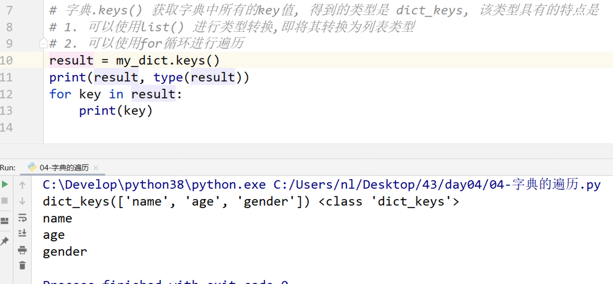
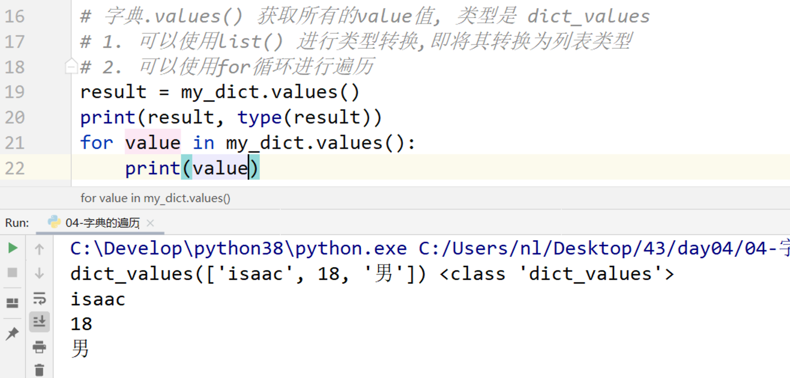
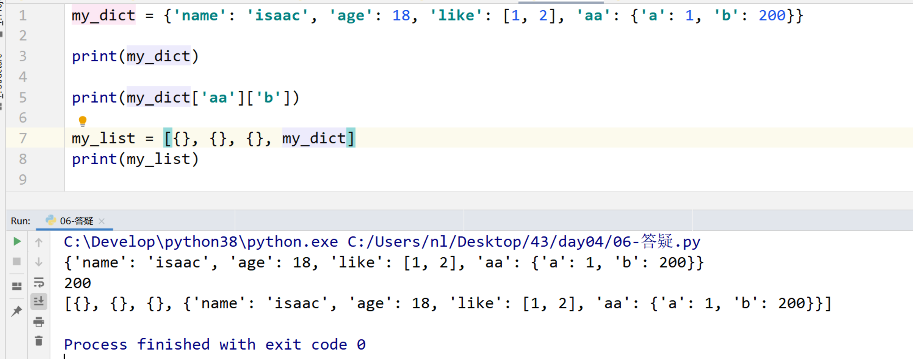
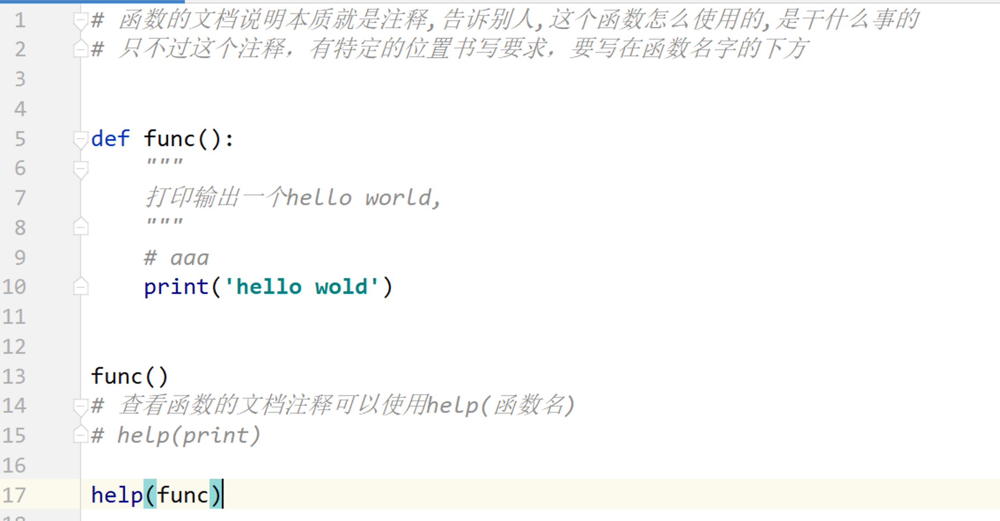
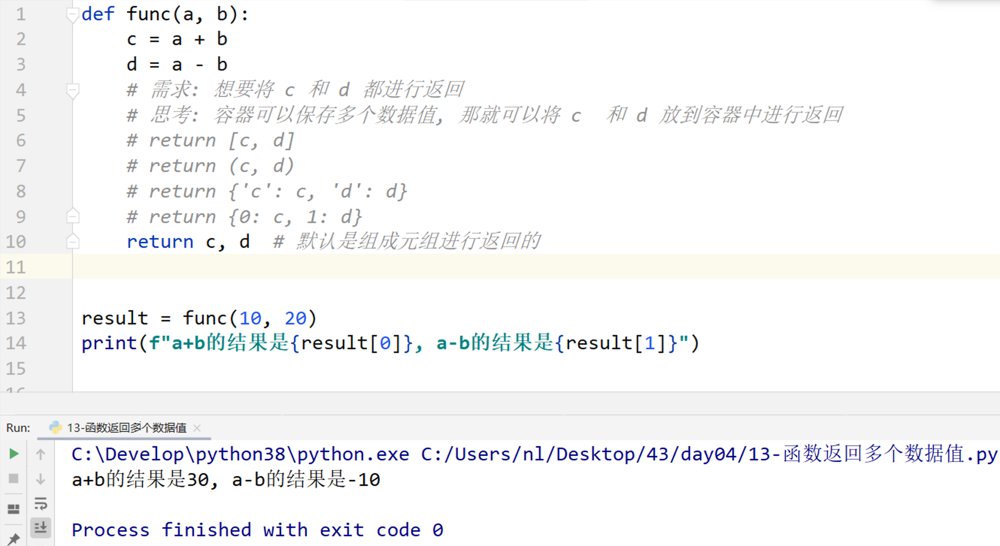
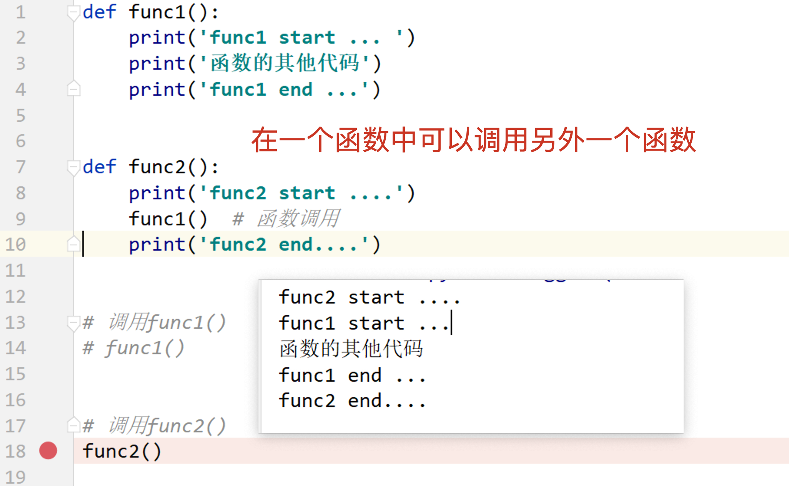

## Day04 课堂笔记

## 0. 复习反馈


## 2. 字典

### 2.1 字典的定义和访问 {}  访问: [] get() len

```python
'''
字典是无序的,通过下标取值,修改值
字典 dict 定义使用 {},由键值对构成 C++ map
变量 = {key1:value1, key2:value2, key3:value3...}  key:value是一个键值对
字典的key 可以是一个字符串类型或数字类型(int float),不能是一个列表,必须是不可变类型  bool,int,float,string,tuple
value可以为任何值

my_dict[key] 获取 value值,没有key值会报错
my_dict.get(key) 使用get获取值,没有key值返回None

参数2是默认值
get(value,default)


len()获取键值对数量
'''

# 1.定义空字典
dict1 = {}
dict2 = dict()
print(dict1, type(dict1))       # {} <class 'dict'>
print(dict2, type(dict2))       # {} <class 'dict'>
print("*" * 50)


# 2.定义带数据的字典
dict3 ={'name':'Tom', 'age':18, 'hobby':['pantyhose', 'sticks', 'stocking']}
print(dict3)    # {'name': 'Tom', 'age': 18, 'hobby': ['pantyhose', 'sticks', 'stocking']}


# 访问value值,字典中没有下标概念,使用key值访问value值
print(dict3['name'])        # Tom
print(dict3['hobby'][0])    # pantyhose
#print(dict3['a'])          # key值不存在,会报错

# get方式获取不会报错,没有返回None
# get(key)
print(dict3.get('name'))    # Tom
print(dict3.get('a'))       # None

# get(value,default)
print(dict3.get('a', 'HHHH'))   # HHHH
print("*" * 50)

# 使用len获取长度,获取键值对的数量
print(len(dict3))   # 3
```


### 2.2 字典中添加和修改数据用key in

```python
'''
添加和修改都使用key值
key值存在就是修改,不存在就是添加
注意 key 值  int 1 和 float 1.0 1.00... 代表一个值


in 操作符用于判断键是否存在于字典中，如果键在字典 dict 里返回 true，否则返回 false。
not in 操作符刚好相反，如果键在字典 dict 里返回 false，否则返回 true。
'''

dict1 = {'name': 'Tom'}
# key值存在就修改
dict1['name'] = 'Jerry'
# key值不存在就添加
dict1['age'] = 18
print(dict1)            # {'name': 'Jerry', 'age': 18}
dict1[1] = 2
dict1[1.0] = 3
dict1[1.00] = 4
print(dict1)            # {'name': 'Jerry', 'age': 18, 1: 4}


# in 操作符用于判断键是否存在于字典中，如果键在字典 dict 里返回 true，否则返回 false。
# not in 操作符刚好相反，如果键在字典 dict 里返回 false，否则返回 true。
dict2 = {1:"a", 2:"b", 3:"b"}
print(1 in dict2)       # True
print(1 not in dict2)   # False
print(4 in dict2)       # False
```


### 2.3 字典中删除数据	pop	del	clear()

```python
'''
删除数据

pop(key) 取出值,返回value    删除不存在的值会报错

根据key值删除数据             删除不存在的值会报错
del my_dict[key]

直接删除字典
del my_dict

删除全部
clear()
'''

dict = {'name': 'Tom', 'age': 18, 'hobby': ['pantyhose', 'sticks', 'stocking']}

# pop(key) 取出值,返回value
name = dict.pop('name')
print(name)         # Tom
print(dict)         # {'age': 18, 'hobby': ['pantyhose', 'sticks', 'stocking']}
# dict.pop('aaa')   # 删除不存在的值会报错
print("*" * 50)


# del删除值
del dict['age']
#del dict['sex']    #删除不存在的值会报错
print(dict)         # {'name': 'Tom', 'hobby': ['pantyhose', 'sticks', 'stocking']}
print("*" * 50)


# 删除里面列表的值
hobby1 = dict['hobby'].pop()
print(hobby1)       # stocking
print(dict)         # {'hobby': ['pantyhose', 'sticks']}
print("*" * 50)


# clear删除全部
dict['sex'] = 'futa'
dict.clear()
print(dict)         # {}
print("*" * 50)


# 直接删除字典
dict = {'name': 'Tom', 'age': 18, 'hobby': ['pantyhose', 'sticks', 'stocking']}
del dict
# print(dict)       # 报错,没有它了

```


### 2.4 字典中遍历数据

```python
'''
for 循环默认遍历 key

.keys() 获取所有key, 返回类型是dict_keys
# 1.可以使用list()类型转换转换为列表类型
# 2.可以使用for循环进行遍历

.values() 获取所有的value值,返回类型是dict_values
# 1.可以使用list()类型转换转换为列表类型
# 2.可以使用for循环进行遍历

.items() 获取键值对,返回类型是dict_items,key和value组成元组
元组通过下标 0 1 获取值
或者通过拆包(结构赋值获取)
    for k,v in res:
        pass
'''
dict = {'name': 'Tom', 'age': 18, 'hobby': ['pantyhose', 'sticks', 'stocking']}


# for 循环默认遍历 key
for key in dict:
    print(key)
    print(dict[key])
print()
print("*" * 50)
# name
# Tom
# age
# 18
# hobby
# ['pantyhose', 'sticks', 'stocking']


# .keys() 获取所有key, 返回类型是dict_keys
# 1.可以使用list()类型转换转换为列表类型
# 2.可以使用for循环进行遍历
res = dict.keys()
print(res, type(res))           # dict_keys(['name', 'age', 'hobby']) <class 'dict_keys'>

for key in res:
    print(dict[key], end=" ")   # Tom 18 ['pantyhose', 'sticks', 'stocking']
print()
print("*" * 50)


# .values() 获取所有的value值,返回类型是dict_values
# 1.可以使用list()类型转换转换为列表类型
# 2.可以使用for循环进行遍历
res = dict.values()
print(res, type(res))           # dict_values(['Tom', 18, ['pantyhose', 'sticks', 'stocking']]) <class 'dict_values'>
for value in res:
    print(value, end=" ")       # Tom 18 ['pantyhose', 'sticks', 'stocking']
print()
print("*" * 50)


# .items() 获取键值对,返回类型是dict_items,key和value组成元组
res = dict.items()
print(res, type(res))           # dict_items([('name', 'Tom'), ('age', 18), ('hobby', ['pantyhose', 'sticks', 'stocking'])]) <class 'dict_items'>
for item in res:
    print(item[0], item[1], end=" ")        # name Tom age 18 hobby ['pantyhose', 'sticks', 'stocking']
print()
print("*" * 50)


# 拆包,就是结构赋值
for k,v in res:
    print(k,v)
# name Tom
# age 18
# hobby ['pantyhose', 'sticks', 'stocking']

```

#### 1. for 循环直接遍历字典, 遍历的是字典的 key 值


#### 2. 字典.keys() 



#### 3. 字典.values()



#### 4. 字典.items()


### 2.5 enumerate 函数

```php
'''
enumerate 主要针对列表
找到列表的下标和值,使用遍历查找出来

'''
list = ['a', 'b', 'c', 'd', 'e']

for i in list:
    # index查找数据的下标,里面填写值就可以
    print(list.index(i), i)
# 0 a
# 1 b
# 2 c
# 3 d
# 4 e

# 直接使用enumerate()获取下标和列表
for j in enumerate(list):
    print(j)
# (0, 'a')
# (1, 'b')
# (2, 'c')
# (3, 'd')
# (4, 'e')
```


### 2.6 公共方法

- `+`  支持 字符串、列表、元组进行操作， 					得到一个新的容器		不支持字典
- `* 整数` 复制， 支持 字符串、列表、元组进行操作， 得到一个新的容器        不支持字典
- `in/not in`  判断存在或者是不存在，支持 字符串、列表、元组、字典进行操作， 
    - 注意： ==如果是字典的话，判断的是 key 值是否存在或不存在==
- `max/min` 对于字典来说，比较的字典的 key值的大小
  - 返回容器中的最大/最小值
  - a < z  A < Z  A < a

```php
'''
+           支持 字符串、列表、元组进行操作， 得到一个新的容器              不支持字典
* 整数       复制n份， 支持 字符串、列表、元组进行操作 得到一个新的容器       不支持字典
in/not in   判断存在或者是不存在，支持 字符串、列表、元组、字典进行操作，
                注意： 如果是字典的话，判断的是 key 值是否存在或不存在
max/min     返回容器中的最大/最小值
                对于字典来说，比较的字典的 key值的大小
                a < z  A < Z  A < a
'''

str1 = 'My name is '
str2 = 'Tom'
print(str1 + str2)          # My name is Tom
print(str2 * 5)             # TomTomTomTomTom
print('To' in str2)         # True
print(max(str1))            # y 按照字母顺序排序
print(min(str2))            # y 按照字母顺序排序
print("*" * 50)             # T  大写字母小于小写字母


list1 = ['a', 'b', 1]
list2 = [1, 2]
print(list1 + list2)        # ['a', 'b', 1, 1, 2]
print(list2 * 5)            # [1, 2, 1, 2, 1, 2, 1, 2, 1, 2]
print(1 not in list2)       # False
print(max(list2))           # 2 不同类型不能比较
print(min(list2))           # 1
print("*" * 50)


dict1 = {'a': 10, 'b': 0, 'c': 90}
dict2 = {'a': 10, 'd': 45, 'e': -90}
# print(dict1 + dict2)  字典不能相加
# print(dict1 * 5)      报错
# in 按照 key 查找
print('a' in dict1)     # True
print(10 in dict1)      # False
print(max(dict1))       # c
print(min(dict1))       # a
```


### 总结答疑

```python 
1. 在字典中可以包含列表，列表中能包含字典吗？
可以的， 列表 元组可以存放任意类型的数据，同样，字典中的 valu也可以是任意的类型，字典也可以作为字典的 value 值。
```

```php
'''
在字典中可以包含列表，列表中能包含字典吗？
可以的， 列表 元组可以存放任意类型的数据，同样，字典中的 valu也可以是任意的类型，字典也可以作为字典的 value 值。
'''

dict = {'name': 'Tom', 'age': 18, 'hobby': ['pantyhose', 'sticks', 'stocking']}

list = [
    {'name': 'Tom', 'age': 18, 'hobby': ['pantyhose', 'sticks', 'stocking']},
    {'name': 'Jerry', 'age': 14, 'hobby': ['kuwa', 'siwa']},
    {'name': 'Uncle', 'age': 60, 'hobby': ['leotard', 'tights']}
]

for i in list:
    print(i['name'], i['age'])
    for h in i['hobby']:
        print(h, end=" ")
    print()

# Tom 18
# pantyhose sticks stocking 
# Jerry 14
# kuwa siwa 
# Uncle 60
# leotard tights 
```




## 函数

```python
print()  打印输出
input()  输入
len()    求容器长度的
...
函数可以实现一个具体的功能
```

### 函数的定义和调用


### 函数的文档说明




### 书写带参数的函数

> 好处： 可以使函数代码更加通用，适用更多的场景


### 局部变量

```python
局部变量的作用域（作用范围）： 当前函数的内部
局部变量的生存周期：在函数调用的时候被创建，函数调用结束之后，被销毁（删除）

局部变量只能在当前函数的内部使用，不能在函数的外部使用。
```


### 全局变量global

```python 
'''
全局变量： 就是在函数外部定义的变量。
在函数内部可以访问全局变量的值，
不止直接修改全局变量, 如果想要修改全局变量的值，需要使用 global 关键字引用 php要使用 global 引入才能访问和修改,不使用global声明的变量是一个新的局部变量
C语言直接使用或修改即可,不用使用global引用
'''
num = 100

def func():
    # 使用global引入全局变量,直接定义的话是一个局部变量,要在使用之前引用,不然报错
    global num
    print(num)      # 可以直接使用
    # 要修改就要使用 global 引入
    num = 200
    print(num)      # 200

func()


age = 15


def func1():
    # 这样赋值是相当于新建了一个局部变量,不影响全局变量
    age = 16    


def func2():
    print(age)


func1()
func2() # 15
```


### 返回值

```python
在函数中定义的局部变量，或者通过计算得出的局部变量， 想要在函数外部访问和使用，此时就可以使用 return 关键字，将这个返回值返回
```


### return 返回多个数据值

```python
'''
使用一个return 返回多个值,默认返回的元组,可以返回列表,字典等
函数遇到return 就会停止执行,可以直接 return  后面没有任何值,调用返回的是 None,不写返回值也是返回 None
'''


def func(a, b):
    # 返回列表
    return [a + b, a - b]
print(func(4, 5))    # [9, -1]


def func1(a, b):
    # 返回元组
    return a + b, a - b
print(func1(3, 6))   # (9, -3)


def func2(a, b):
    # 返回字典
    return {"sum": a + b, "subtract": a - b}
print(func2(8, 5))   # {'sum': 13, 'subtract': 3}


# 函数遇到return 就会停止执行,可以直接 return  后面没有任何值
def func3():
    a = 10
    return

print(func3())  # None
```



```python 
1. return 关键字后边可以不写数据值， 默认返回 None
def func():
    xxx
    return   # 返回 None，终止函数的运行的

2. 函数可以不写 return，返回值默认是 None

def func():
    xxx
    pass

```


### 函数的嵌套调用



