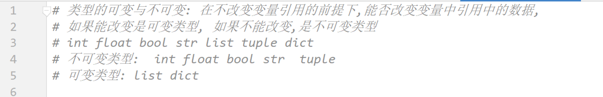

## day05 课堂笔记

## 0. 复习


```python
标识符规则: 由字母,数字和下划线组成,不能以数字开头
变量名不能和关键字重名.
关键字是系统定义好的标识符,具有特殊的作用.
数据类型: int(整型) float(浮点型) str(字符串类型) bool(布尔类型, True False) list(列表) tuple(元组)  dict(字典)
    type() 函数可以查看变量的数据类型
输入: input()  --> str  类型转换 
输出: print()  %s--字符串  %d -- int  %f--float    %--%%
    f-string {变量}

逻辑运算符
	and  逻辑与 一假为假
	or   逻辑或 一真为真
	not  逻辑非 取反
比较运算符
	==  != 

判断 if elif  else 
循环 while
	for xx in 容器/range():
        pass
    range(a, b, step)  [a, b) 之间的整数
	break 终止循环
    continue 跳过本次循环,继续下次循环
    循环 else 结构: 循环不是被 break 终止的时候会执行 else 中的代码
                        
str: 下标 切片 
list: insert append extend ...                         
tuple: 元组中的数据不能修改 查询的方法  index()
dict: key:value 键值对的形式   

函数:
定义: 使用 def  关键字, 
def 函数名(形参列表):
    函数代码
    return 数据                    
    pass                    

函数调用,才会执行函数中的代码
函数名(实参列表) 
局部变量: 在函数内部定义的变量,只能在当前函数内部使用, 如果想要将这个变量在函数外部使用, ①可以 return 将这个变量返回  ② 使用 global,将其变为全局变量
全局变量: 在任意地方可以访问,想要在函数内部修改全局变量的值,使用 global 声明                        
```

## 1.函数传参的两种形式[掌握]

```python
'''
1.位置传参,按照位置进行自动排序

2.关键字传参,指定实参传递给哪个形参,注意点: 关键字必须是函数的形参名

3.混合使用,先写位置传参,在写关键字传参,参数不能重复

'''


def func(a, b, c):
    print(a + b + c)


# 1.位置传参,按照位置进行自动排序
func(1, 2, 3)           # 6


# 2.关键字传参,指定实参传递给哪个形参,注意点: 关键字必须是函数的形参名
func(b=1, a=6, c=15)    # 22


# 3.混合使用,先写位置传参,在写关键字传参,参数不能重复
func(2, b=2, c=6)       # 10
#func(c=1, 2, 3)    先写关键字就报错
```


## 2. 函数形参

### 2.1 缺省参数(默认参数)


### 2.2 不定长参数

```python
注意点: 函数定义中的 args 和 kwargs可以是任意的形参变量,不过习惯使用 args 和 kwargs.
```

```python
'''
在形参前面加上一个*,该形参变为不定长形参,可以接受所有的位置实参,类型是元组         没有参数名字
在形参前边加上两个**.改形参变为不定长字典形参,可以接受所有的关键字实参,类型是字典   有参数名字
'''


def func(*args, **kwargs):
    print(args)
    print(kwargs)
    print("*" * 50)


func(1, 4, 6, 2, 65, 3)
# (1, 4, 6, 2, 65, 3)
# {}


func(a=1, b=2, c=3)
# ()
# {'a': 1, 'b': 2, 'c': 3}


func(4, 'a', a=1, b=2, c=3)


# (4, 'a')
# {'a': 1, 'b': 2, 'c': 3}


# 简单应用 求和功能


def add(*args, **kwargs):
    sum = 0
    for i in args:
        sum += i

    # 遍历dict的values
    for i in kwargs.values():
        sum += i

    return sum


res = add(1, 2, 3, 4, a=5, b=6, c=7)
print(res)  # 28
```


### 2.3 函数形参的完整格式

```python
'''
顺序
普通参数,不定长元组参数,默认参数(放在*args前面的话,默认值就没有意义了),不定长字典参数(默认参数也是键值对,要是放在**wkargs后面就永远都是默认值了)
a, *args, b=0, **kwargs
'''

# 先普通,再默认参数
def func1(a, b=0):
    pass


# 先普通,再默认参数,再*args,默认参数没法再适用面默认值了
def func2(a, b=0, *args):
    print('a', a)
    print('b', b)
    print(args)
    print('*' * 50)
func2(1,2,3,4)
# a 1
# b 2
# (3, 4)


# 先普通,再*args,再默认参数
def func3(a, *args, b=0):
    print('a', a)
    print('b', b)
    print(args)
    print('*' * 50)

# 这样b使用默认值,其他都给了*args
func3(1, 2, 3)
# a 1
# b 0
# (2, 3)

# 使用关键字传参,可以让b有值
func3(1, 2, b=3)
# a 1
# b 3
# (2,)


# 普通参数,不定长元组参数,默认参数,不定长字典参数(默认参数也是键值对,要是放在**wkargs后面就永远都是默认值了)
def func4(a, *args, b=0, **kwargs):
    print('a', a)
    print('b', b)
    print(args)
    print(kwargs)
    print('*' * 50)


func4(1,2,b=4,c=5)
# a 1
# b 4
# (2,)
# {'c': 5}


```


## 3. 拆包[掌握]

- 注意点: 容器中元素数据的个数需要和变量的个数保持一致.
- JS中的结构不用满足数量一致,不要的值使用逗号占位,还能设置默认值,不过对象解构要使用和对象相同的变量名
- list拆包获取的值
- dict拆包获取的key

```python
'''
组包: 将多个数据值给一个变量
拆包: 将容器中的数据分别给到多个变量,变量数量和数据数量一致
list拆包获取的值
dict拆包获取的key
es6中的数组和对象结构类似,不过不要求数量相等,不要的地方可以使用逗号占位,还可以使用默认值
let info1 = ['Mr Lee', 100, '男'];
let [name1, age1, gender1] = info1;
//3. 数组也能用() ,防止重复声明问题
([name3, age3, gender3] = ['Miss Liu', 102, '女']);
//4. 数组层次也需要匹配
let [name4, [age4, gender4]] = ['Mr.Qian', [15, 'male']];
//5. 用逗号作为占位符不赋值
let [, , gender5] = ['Mr.Lee', 100, '男'];
//6. 在变量解构时，可以在数组的元素中设置一个默认值；
let [name6, age6, gender6 = 'female'] = ['Miss.Zhang', 11];
//7. 还有一种...var 的语法，可以将没有赋值的内容都赋值给这个变量,形成一个数组；
let [name7, ...other7] = ['Mr Hai', 100, 'fff'];

//对象解构
let obj8 = {
    name8: 'Me',
    age8: 100
};
let { name8, age8 } = obj8; //赋值的变量名要和对象中的名字相同
//4. 如果不想要对象属性名作为解构变量，可以通过键值对的方式更改变量名；  前边是原名,后面的是自定义名字
let obj11 = {
    name11: 'Aca',
    age11: 526
};
let { name11: MyName, age11: MyAge } = obj11;
//5. 对象解构不需要的部分不需要占位
let obj12 = {
    name12: 'SSSS',
    age12: 156
};
//只要age不要姓名
let { age12 } = obj12;
'''

# 组包: 将多个数据值给一个变量
a = 1, 2, 3
print(a)            # (1, 2, 3)


def func():
    return 1, 2     # 组包


# 拆包
x, y, z  =a
print(x, y, z)      # 1 2 3
x, y = func()
print(x, y)         # 1 2


# list拆包
[a, b] = [10, 20]
print(a, b)         # 10 20
a, b = [30, 40]
print(a, b)         # 30 40


# dict拆包获取key值
name, age = {'name':'Tom', 'age':5}
print(name, age)    # name age


# 交换两个变量的值
a = 11
b = 22
[a, b] = [b, a]
print(a, b)         # 22 11
```


### 拆包补充 使用 *args和 **kwargs 获取list和dict

```python
'''
拆包使用 * , 类似于ES6中的 [...array]
将列表中的每一个数据当做位置参数进行传递
list = [1, 2, 3, 4, 5, 6]
*list       通过 *args获取

将字典进行传递
一个 * 传递的是key
*dict,      通过 *args获取
两个 * 传递的是键值对
+**dict     通过 **kwargs获取

'''

def func(*args, **kwargs):
    print('args', args)
    print('kwargs', kwargs)
    print('*' * 50)


list = [1, 2, 3, 4, 5, 6]
dict = {'a': 7, 'c': 8, 'b': 9, 'd': 10}


# 列表拆包使用 * , 类似于ES6中的 [...array]
# 将列表中的每一个数据当做位置参数进行传递
func(*list)
# args (1, 2, 3, 4, 5, 6)
# kwargs {}


# 直接使用字典会报错
#func(dict1)

# 一个 * 传递的是key
func(*dict)
# args ('a', 'c', 'b', 'd')
# kwargs {}


# 两个 * 传递的是键值对
func(**dict)
# args ()
# kwargs {'a': 7, 'c': 8, 'b': 9, 'd': 10}
```


## 4. 引用[理解]

```python
'''
Python可以使用 id() 查看变量的引用,可以认为id值是内存地址的别名
Python数据传递的是引用(其他语言是复制出新的一份出来),不过修改的时候就是新的地址了


python中全局变量可以再函数中直接使用,不过对比不可变类型(bool,int,float,string,tuple),不能被修改,除非用global引入
    对于可变类型(list,set,dict),可以修改里面的值,但是不能直接 = 赋值,除非使用global
函数参数没法修改不可变类型的值,只能修改可变类型里面的值,python本身就是引用传值,所以没有其他引用了

C++中全局变量可以直接被函数修改,不用global
变量直接传递给函数没有改变,要使用指针或引用,对比数组直接改变值了,因为传递的就是指针

php中全局变量和数组只有在函数中使用global引入才会被修改,
函数参数要使用引用传递才能修改变量和数组中的值


C++ 引用
    int a = 10;
    //取地址
    cout << &a << endl;     //0x62fe1c
    //指针, &a取地址
    int *b = &a;
    cout << b << endl;      //0x62fe1c
    cout << *b << endl;     //10
    //引用
    int &c = a;
    cout << c << endl;      //10

'''


# 将数据10 存储到变量a中,本质是将数据10所在的内存引用地址保存到变量a中
a = 1
# 将变量a中的内存引用地址保存到b中
b = a
#将a,b中引用存储的值打印出来
print(a, b)             # 1 1
print(id(a), id(b))     # 1451540900144 1451540900144

# 重新赋值之后指向的地址就不同了
b = 2
print(a, b)             # 1 2
print(id(a), id(b))     # 2536584603952 2536584603984
print('*' * 50)


# list也是引用传递
# 变量存储了list的引用地址
# 引用中每一个值存放的都是引用数据的地址
list1 = [1, 2, 3]
list2 = list1
print(list1, id(list2)) # [1, 2, 3] 2149354580928
print(list2, id(list2)) # [1, 2, 3] 2149354580928
print('*' * 50)

# 添加数据之后,两个引用都会变
list1.append(4)
list2[2] = 5
print(list1, id(list2)) # [1, 2, 5, 4] 2000888539712
print(list2, id(list2)) # [1, 2, 5, 4] 2000888539712
```


---


## 5. 可变与不可变类型

```python
'''
类型的可变与不可变: 在不改变变量引用的前提下,能否改变变量中引用的数据
如果能改变时可变类型,不能改变就是不可变类型

不可变类型: bool int float str tulip(元组中放列表,就能改列表中的内容了)
可变类型:   list dict set

python中的内存优化,对于不可变类型进行的,值相同,存放数据位置就相同
'''

num1 = 10
num2 = num1
num2 = num1 + num2
print(num1, num2)       # 10 20


float1 = 10.2
float2 = float1
float2 = float2 + 1
print(float1, float2)   # 10.2 11.2


# list可变类型
list1 = [1, 2, 3]
list2 = list1
list2[0] = 99
print(list1, list2)     # [99, 2, 3] [99, 2, 3]


# dict可变类型
dict1 = {'name': 'Tom', 'age': 18}
dict2 = dict1
dict2['name'] = 'Jerry'
print(dict1, dict2)         # {'name': 'Jerry', 'age': 18} {'name': 'Jerry', 'age': 18}


# python中的内存优化,对于不可变类型进行的,值相同,存放数据位置就相同
a = 15
b = 15
print(id(a) == id(b))      # 1994114099952 1994114099952   地址相同,python中的内存优化,对于不可变类型进行的

tuple1 = (1, 2)
tuple2 = (1, 2)
print(id(tuple1) == id(tuple2))   # True    不过在终端中就是false了
                            # 终端中有小整数概念 -5~255,如果是小整数,使用相同的引用地址,如果不是,会开辟新的内存空间


# list 和 dict 没有内存优化
list3 = [1, 2, 3]
list4 = [1, 2, 3]
print(id(list3) == id(list4))   # False


tuple3 = [1, 2, [3, 4]]
tuple3[2][0] = 11
print(tuple3)               # [1, 2, [11, 4]]   值变了,但是修改的不是元组中的数据,元组存放的是列表地址,存放的不是数据
```



 

## 6. 引用做函数参数注意点

```python
'''

函数传递的参数也是引用,
传递不可变类型不会改变原值,因为新值和旧值不同,引用不同了
传递可变类型会改变原值,list和dict中值也会被改变

直接使用全局变量,不可变类型不会被改变,除非使用global引入; 可变类型会被修改

+= 对于列表来说,类似于列表的extend方法,不会改变变量的引用地址,字典没有 +=
'''

# 直接传递不可变类型,不会改变原值
num = 18
def func(a):
    a = a + 1
func(num)
print(num)  # 18


list1 = [1, 2, 3]
dict1 = {'name': 'Tom'}


# 传递引用的list和dict会被修改
def func1(a, b):
    a.append(4)
    b['name'] = 'Jerry'
    b['age'] = 5

func1(list1, dict1)
print(list1)        # [1, 2, 3, 4]
print(dict1)        # {'name': 'Jerry', 'age': 5}
print("*" * 50)


# 直接使用全局变量,不可变类型不会被改变; 可变类型会被修改
# 不使用global可以添加修改值,因为list中存放的是地址,可以直接修改,要修改list本身才要用 global,加上global也不会报错
list2 = [7, 9]
def func2():
    # 这个不算修改list,直接 = 赋值才是修改,要用global
    list2[0] = 15
    list2.append(10)
func2()
print(list2)    # [15, 9, 10]
print("*" * 50)


def func3():
    global list2
    list2 = [0, 0, 0]

func3()
print(list2)
print("*" * 50) #不加global [15, 9, 10]   加了global [0, 0, 0]


#  += 对于列表来说,类似于列表的extend方法,不会改变变量的引用地址,字典没有 +=
def func4(a):
    a += a

list3 = [1, 2, 3]
func4(list3)
print(list3)    # [1, 2, 3, 1, 2, 3]
```


## 7. 函数应用: 学生管理系统

```python
'''
1.添加
2.删除
3.修改
4.查询单个信息
5.查询所有信息
6.退出
'''


# 学生列表,下面直接使用即可,不用global引入,因为没有重新赋值,只是添加修改值
stu_list = []


def show_menu():
    '''
    展示菜单
    '''
    print('1.添加学生')
    print('2.删除学生')
    print('3.修改学生')
    print('4.查询单个信息')
    print('5.查询所有信息')
    print('6.退出')


def insert_student():
    '''
    添加学生信息
    '''
    # 1.获取学生信息
    name = input('请输入姓名:')

    for stu in stu_list:
        if stu['name'] == name:
            print('*****学生信息存在*****')
            return

    age = input('请输入年龄:')
    gender = input('请输入性别:')
    # 2.将学生信息添加到字典
    stu_dict = {'name': name, 'age': int(age), 'gender': gender}
    # 3.将字典添加到列表,不需要global,因为是添加,不是完整赋值
    stu_list.append(stu_dict)
    print('学生信息添加成功')


def show_all_info():
    '''
    显示所有学生信息
    '''
    if len(stu_list):
        print('姓名\t年龄\t性别')
        for stu in stu_list:
            print(stu['name'], '\t', stu['age'], '\t', stu['gender'])
    else:
        print('没学生')


def remove_student():
    # 1.获取学生姓名
    name = input('请输入要删除的学生的名字:')
    # 2.判断学生信息是否存在
    for stu in stu_list:
        # 3.学生信息存在,直接删除
        if stu['name'] == name:
            # 直接删除字典即可
            stu_list.remove(stu)
            print("*****删除成功*****")
            return
    # 4.学生信息不存在,直接结束
    else:
        print('*****该学生信息不存在*****')


def modify_student():
    # 1.获取学生姓名
    name = input('请输入要修改的学生的名字:')
    # 2.判断学生信息是否存在
    for stu in stu_list:
        # 3.学生信息存在,修改
        if stu['name'] == name:
            stu['age'] = input('请输入新的年龄:')
            stu['gender'] = input('请输入新的性别:')
            return
    # 4.学生信息不存在,直接结束
    else:
        print('*****该学生信息不存在*****')


def search_student():
    # 1.获取学生姓名
    name = input('请输入要显示的学生的名字:')
    # 2.判断学生信息是否存在
    for stu in stu_list:
        # 3.学生信息存在,修改
        if stu['name'] == name:
            print(stu['name'], '\t', stu['age'], '\t', stu['gender'])
            return
    # 4.学生信息不存在,直接结束
    else:
        print('*****该学生信息不存在*****')


def main():
    while True:
        show_menu()
        opt = input('请输入编号:')

        if opt == "1":
            insert_student()
        elif opt == "2":
            remove_student()
        elif opt == "3":
            modify_student()
        elif opt == "4":
            search_student()
        elif opt == "5":
            show_all_info()
        elif opt == "6":
            print('欢迎下次使用')
            break
        else:
            print('输入有误,请再次输入')
            continue  # 不用再按回车

        input('*****请按回车键继续*****')


main()
```

```python
增删改查操作
存储学生信息: 
    姓名
    年龄
    班级
    性别
    ...
    {'name': 'isaac', 'age': 18, ...}

存储所有的学生信息:
    列表: [{}, {}, {}, ....]

功能菜单,业务框架.
```


### 搭建业务框架

```python
def show_menu():
    print('1. 添加学生')
    print('2. 删除学生')
    print('3. 修改学生信息')
    print('4. 查询单个学生信息')
    print('5. 查询所有的学生信息')
    print('6. 退出系统')


while True:
    show_menu()
    opt = input('请输入用来选择的操作编号:')
    if opt == '1':
        print('1. 添加学生')
    elif opt == '2':
        print('2. 删除学生')
    elif opt == '3':
        print('3. 修改学生信息')
    elif opt == '4':
        print('4. 查询单个学生信息')
    elif opt == '5':
        print('5. 查询所有的学生信息')
    elif opt == '6':
        print('欢迎下次使用本系统......')
        break
    else:
        print('输入有误,请再次输入')
        continue

    input('...... 回车键继续操作.......')

```


### 添加学生信息

```python 
1. 通过 input 函数获取学生的信息, 姓名, 年龄, 性别
2. 将学生信息转换为字典进行保存
3. 将这个学生字典添加的列表中
代码优化:
    假设学生的名字都不能重复,在添加学生的时候,进行判断,如果学生名字已经存在,则不添加.
```


### 删除 /修改/查询学生信息

```python
都使用 name 对学生进行判断

1. 使用 input 获取要删除 /修改/查询 的学生姓名
2. 判断学生信息是否存在
3. 学生存在,对学生进行 删除 /修改/查询 操作
4. 学生信息不存在,直接结束
```


