## Day06 课堂笔记

## 复习


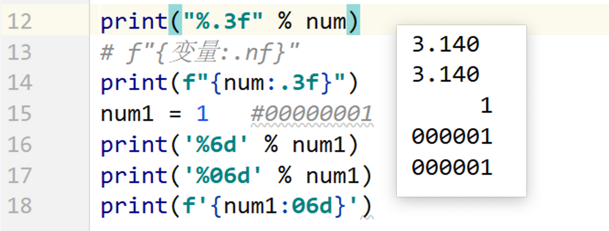


## 递归函数[理解]

递归: 函数自己嵌套调用自己.

>已知：A 比 B 大 2 岁，B比 C 大 2 岁，... , F 年龄为 18 岁，
>
>求 A 的年龄。
>
>知道第一个人的年龄是 18 岁
>
>后边每个人比前边那个人大 2 岁
>
>后边一个人的年龄 = 前边那个人的年龄 + 2
>
>num  = (num -1) + 2

| A（6） | B（5） | C（4） | D（3） | E（2） | F（1） |
| ------ | ------ | ------ | ------ | ------ | ------ |
| 28     | 26     | 24     | 22     | 20     | 18     |

==递归函数的形成条件:==

1. ==函数自己调用自己==
2. ==函数必须有一个终止条件==

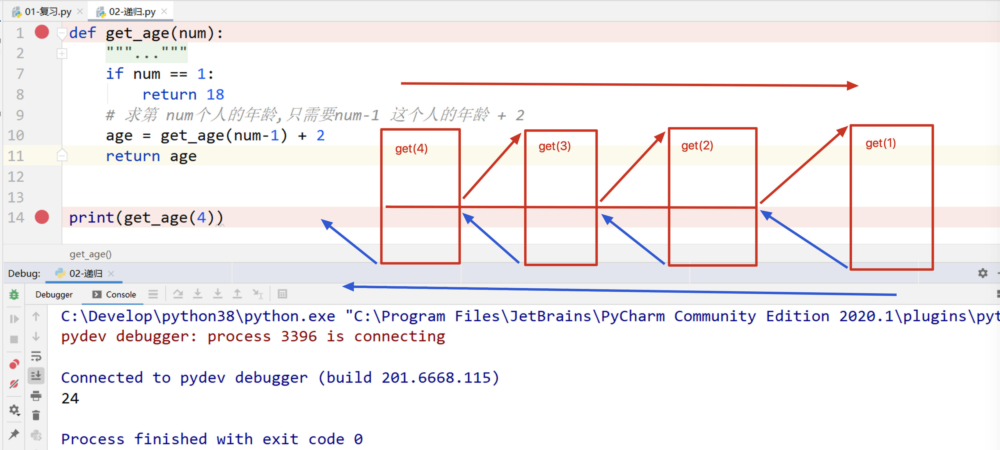

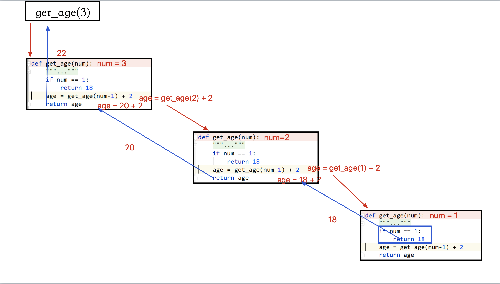


## 匿名函数

使用 `lambda` 关键字定义的函数就是匿名函数

```python
变量名 = lambda [参数列表]：表达式
(lambda [参数列表]：表达式)()
```
```python
'''
使用 lambda 关键字定义的函数就是匿名函数

变量名 = lambda [参数列表]：表达式
匿名函数自调用
(lambda [参数列表]：表达式)()

1.匿名函数中不能使用if语句,while语句,for循环,只能编写单行的表达式,或函数调用,普通函数都可以
2.匿名函数中返回结果不用return,表达式的运行结果就是返回结果
3.匿名函数也可以不返回结果,如: lambda : print('hello world')

'''


# 1.无参无返回值
def func1():
    print('普通函数,无参,无返回值')


lambda1 = lambda: print('匿名函数,无参,无返回值')
# 函数自调用
(lambda: print('匿名函数,无参,无返回值'))()

func1()             # 普通函数,无参,无返回值
lambda1()           # 匿名函数,无参,无返回值
print('*' * 50)


# 2.有参,无返回值
def func2(name):
    print('普通函数,有参,无返回值',name)

lambda2 = lambda name: print('匿名函数,有参,无返回值',name)
func2('Tom')        # 普通函数,有参,无返回值 Tom
lambda2('Jelly')    # 匿名函数,有参,无返回值 Jelly
print('*' * 50)


# 3.无参,有返回值
def func3():
    return '普通函数,无参,有返回值'

lambda3 = lambda: '普通函数,无参,有返回值'
print(func3())       # 普通函数,无参,有返回值
print(lambda3())     # 普通函数,无参,有返回值
print('*' * 50)


# 4.有参,有返回值
def func4(*args):
    return args[0] + args[1]

lambda4 = lambda *args: args[0] + args[1]

print(func4(1, 3))      # 4
print(lambda4(1, 3))    # 4
```


1. 无参数无返回值

   ```python
   def 函数名()：
     函数代码
   
   lambda:函数代码
   ```

2. 无参数有返回值

   ```python
   def 函数名()：
   	return 1 + 2
   
   lambda: 1 + 2
   ```
   
3. 有参数无返回值

   ```python
   def 函数名(a, b):
     print(a, b)
     
     
   lambda a, b: print(a, b)
   ```

   

4. 有参数有返回值

   ```python
   def 函数名(a, b):
     return a + b
   
   
   lambda a, b: a + b
   ```


###  匿名函数的应用场景 -- 作为函数的参数使用

```python
'''
匿名函数作为函数的参数使用

'''


def calc(num1, num2, func):
    '''
    四则运算
    :param num1:    数字2
    :param num2:    数字1
    :param func:    函数,要进行的云散
    :return:        运算结果
    '''
    return func(num1, num2)


print(calc(2, 3, lambda x, y: x + y))       # 5
print(calc(2, 3, lambda x, y: x - y))       # -1
print(calc(2, 3, lambda x, y: x * y))       # 6
print(calc(2, 3, lambda x, y: x / y))       # 0.666667
```

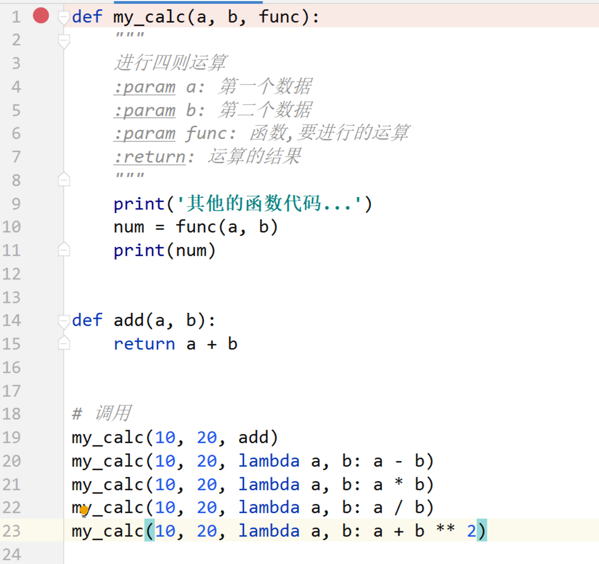

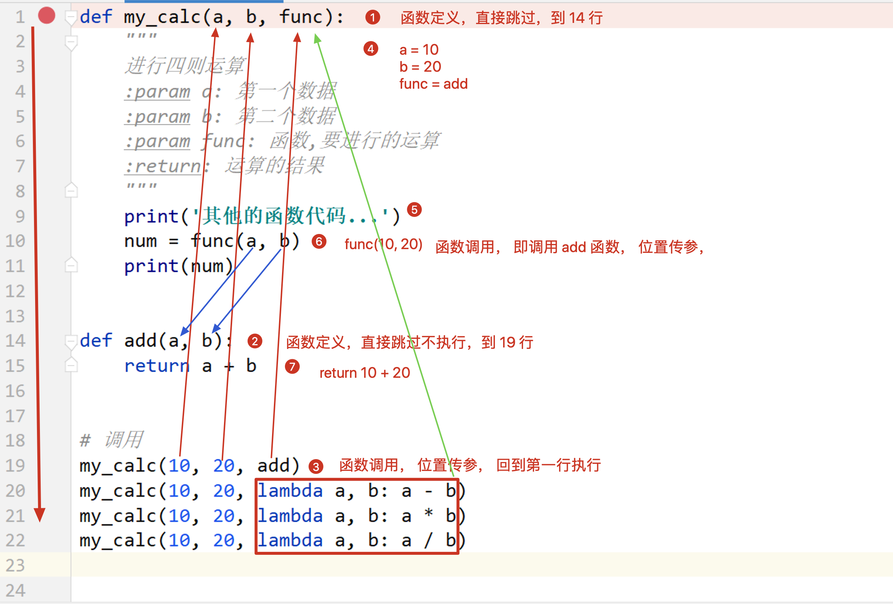

### lambda 函数作为函数参数(列表中字典排序)(扩展)

```python
'''
x是形参,是列表中的每一个数据
list.sort(key=lambda x: (排序规则1,排序规则2...)
list.sort(key=lambda x: x['name'])
list.sort(key=lambda x: (x['age'], x['name']))
'''


list = [1, 4, 3, 5, 67, 7]
list.sort()
print(list)


# 列表中是字典类型
list = [{'name': 'd', 'age': 19},
         {'name': 'b', 'age': 16},
         {'name': 'a', 'age': 16},
         {'name': 'c', 'age': 20}]

# sort参数有key:key形参,传递函数,指定规则;  reverse:翻转排序
# x是形参,是列表中的每一个数据
list.sort(key=lambda x: x['name'])
print(list)                         # [{'name': 'a', 'age': 16}, {'name': 'b', 'age': 16}, {'name': 'c', 'age': 20}, {'name': 'd', 'age': 19}]

list.sort(key=lambda x: x['age'])
print(list)                         # [{'name': 'a', 'age': 16}, {'name': 'b', 'age': 16}, {'name': 'd', 'age': 19}, {'name': 'c', 'age': 20}]

#写两个参数,当第一个排序相同,按照第二个排序
list.sort(key=lambda x: (x['age'], x['name']))
print(list)                         # [{'name': 'a', 'age': 16}, {'name': 'b', 'age': 16}, {'name': 'd', 'age': 19}, {'name': 'c', 'age': 20}]


list = ['a', 'bc', 'abc', 'def', 'ghi']
list.sort()
print(list)                         # ['a', 'abc', 'bc', 'def', 'ghi']
# 列表中字符段长度
#list.sort(key=lambda x: len(x), reverse=True)
# 简写,直接写 len 即可
list.sort(key=len, reverse=True)
print(list)                         # ['abc', 'def', 'ghi', 'bc', 'a']
```

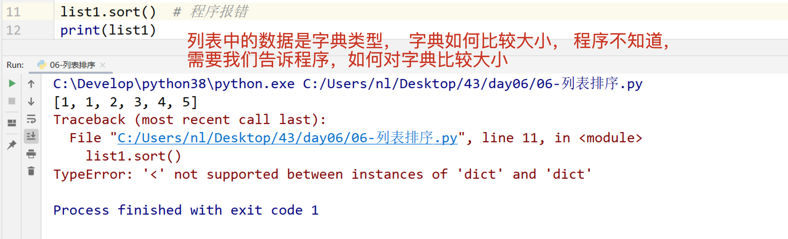

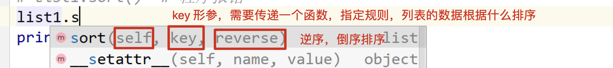


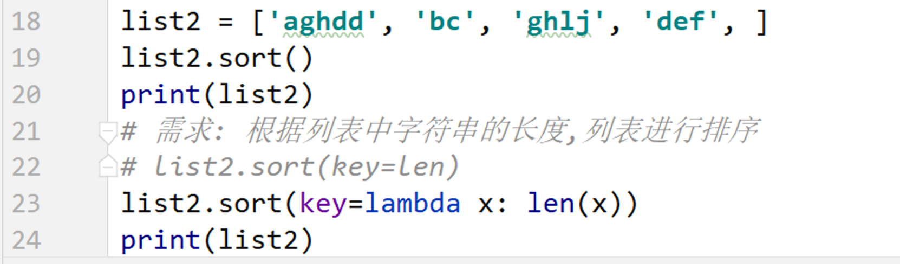

## 列表字典推导式

```python
'''
列表推导式,为了快速生成一个列表
1. 变量 = [生成数据的规则 for 临时变量 in xxx ]
    每循环一次,就会创建一个数据

2. 变量 = [生成数据的规则 for 临时变量 in xxx if xxx]
    每循环一次,并且if条件为True,就会创建一个数据

3. 变量 = [生成数据的规则 for 临时变量 in xxx for j in xxx]
    第二个for循环执行一次,就生成一次数据    生成数量是  i * j


字典推导式
1. 变量 = {key规则:value规则 for 临时变量 in xxx }

2. 变量 = {key规则:value规则 for 临时变量 in xxx if xxx }

3. 变量 = [key规则:value规则 for 临时变量 in xxx for j in xxx]
   dict3 = {i: j for i in range(3) for j in range(3)}   生成数量是3,因为key值相同就修改数据了
'''


# 列表推导式
# 1. 变量 = [生成数据的规则 for 临时变量 in xxx ]
#     每循环一次,就会创建一个数据
list1 = [i for i in range(5)]
print(list1)        # [0, 1, 2, 3, 4]


list2 = ['hello' for i in range(5)]
print(list2)        # ['hello', 'hello', 'hello', 'hello', 'hello']


list3 = [f'num:{i+1}' for i in list1]
print(list3)        # ['num:1', 'num:2', 'num:3', 'num:4', 'num:5']
print('*' * 50)


# 2. 变量 = [生成数据的规则 for 临时变量 in xxx if xxx]
#     每循环一次,并且if条件为True,就会创建一个数据
list4 = [i for i in range(10) if i % 2 == 0]
print(list4)        # [0, 2, 4, 6, 8]
print('*' * 50)


# 3. 变量 = [生成数据的规则 for 临时变量 in xxx for j in xxx]
#     第二个for循环执行一次,就生成一次数据
list5 = [(i,j) for i in range(3) for j in range(2)]
print(list5)        # [(0, 0), (0, 1), (1, 0), (1, 1), (2, 0), (2, 1)]
print('*' * 50)


# 字典推导式
# 1. 变量 = {key规则:value规则 for 临时变量 in xxx }
dict1 = {i: i+1 for i in range(3)}
print(dict1)        # {0: 1, 1: 2, 2: 3}
print('*' * 50)


# 2. 变量 = {key规则:value规则 for 临时变量 in xxx if xxx }
dict2 = {i: i+1 for i in range(15) if i % 3 == 0}
print(dict2)        # {0: 1, 3: 4, 6: 7, 9: 10, 12: 13}
print('*' * 50)


# 3. 变量 = [key规则:value规则 for 临时变量 in xxx for j in xxx]
dict3 = {i: j for i in range(3) for j in range(3)}
print(dict3)        # {0: 2, 1: 2, 2: 2}
print('*' * 50)


dict4 = {f"{i}{j}": j for i in range(3) for j in range(3)}
print(dict4)        # {'00': 0, '01': 1, '02': 2, '10': 0, '11': 1, '12': 2, '20': 0, '21': 1, '22': 2}
```

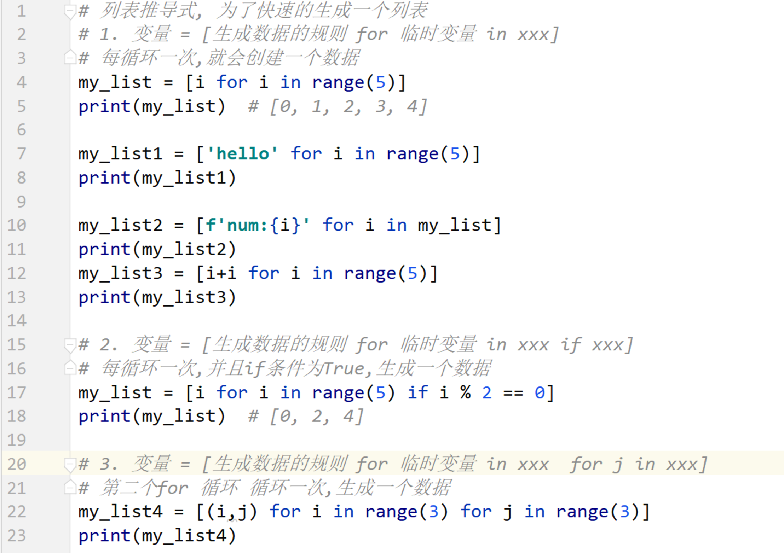

## 集合-set

```python
'''
集合,set,使用 {单纯地数据}
1.集合中的数据必须是不可变类型 bool,int,float,string,tuple
2.集合是可变类型
3.集合是无序的,不能使用下标,数据添加顺序和输出顺序是否一致(和C++中自动排序不同)
4.集合中的数据没有重复,可以去重

添加 add(值)

删除指定元组  remove(值)

从尾部随机删除,没有参数 pop()

清空 clear()

修改数据,先删除remove,再添加add


列表去重
list1 = [1, 3, 4, 5, 1, 4, 3, 0]
list2 = list(set(list1))


集合,列表,元组可以互相进行转换
'''

# set1 = {1, 2, [3, 5]} 报错
set1 = {1, 2, 5.1, 56, 1, 'aaa', True, (1, 4)}
print(set1, type(set1))             # {1, 2, 'aaa', 5.1, 56, (1, 4)} <class 'set'>  顺序不和输入不同

# 删除指定元组  remove(值)
set1.remove(5.1)                    # {1, 2, 56, 'aaa', (1, 4)}
print(set1)

# 从尾部随机删除,没有参数 pop()
res = set1.pop()
print(res)                          # 1
print(set1)                         # {2, 56, 'aaa', (1, 4)}

# 添加 add(值)
set1.add(15)
print(set1)                         # {2, 56, 'aaa', (1, 4), 15}

# 清空 clear()
set1.clear()
print(set1)                         # set()

# 修改数据,先删除remove,再添加add
print('*' * 50)


list1 = [1, 3, 4, 5, 1, 4, 3, 0]
list2 = list(set(list1))
print(list2)                        # [0, 1, 3, 4, 5]
```

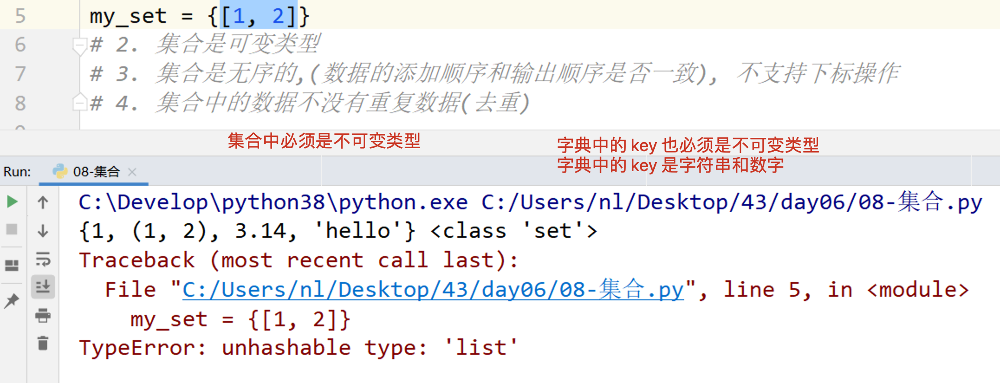

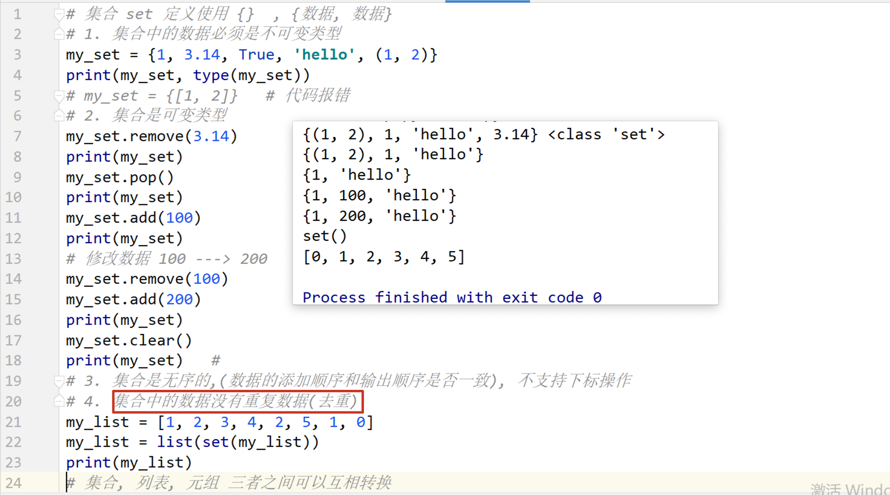


## 文件操作

文件的作用: 可以永久的保存数据.

文件在硬盘中存储的格式是二进制. 

1. 打开文件
2. 读写文件
3. 关闭文件

### 读文件-r

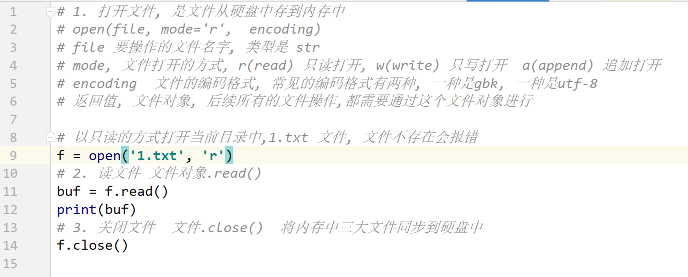

### 写文件-w

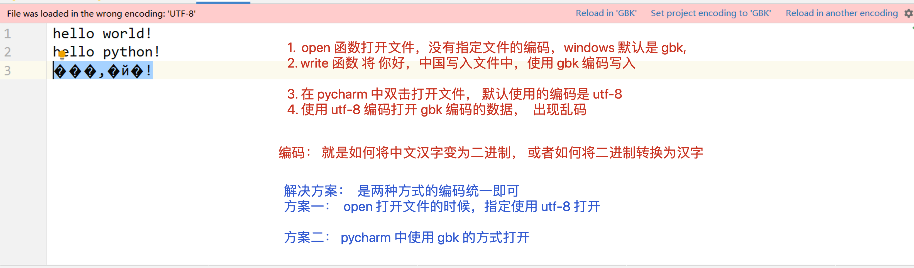

   

### 追加文件-a

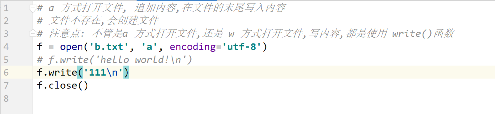