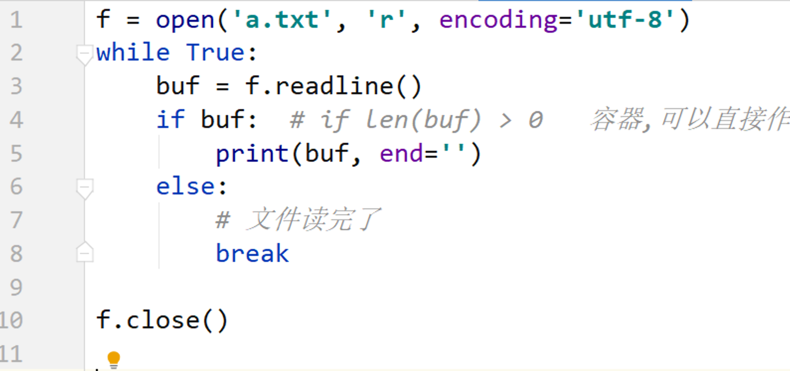
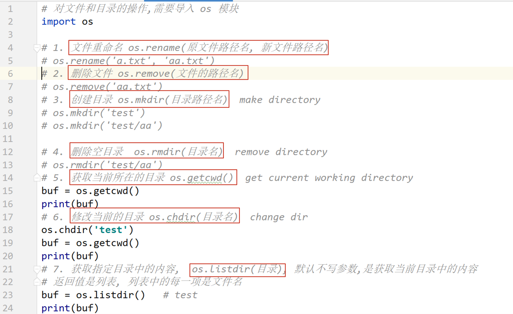

## Day07 课堂笔记

## 复习


```python
递归函数一般都是有参数.
num = 10
def func():
    global
    if num == 1:
        return 
    num = num -1
    func()
       
    
my_list = [20, 30] 
print(my_list)

def func(a):
    a += 20,  # 列表, += , extend 即 a.extend(20,)  # str list tuple dict 
    
func(my_list)
print(my_list)  # [20, 30, 20]

可迭代: 能使用 for 循环的就是可迭代的
```

## 1. 文件读操作

### read([n]) n代表字节数

```python
'''
def read(self, n: int = ...)
n: 一次性读取多少字节的内容,默认不写读取全部内容

读写文件
    一次读取文件中的所有内容,返回文件内容
    文件对象.read(n)    # n: 一次性读取多少字节的内容,默认不写读取全部内容
        buff = f.read()
'''

f = open('文件/1.txt', 'r', encoding='utf-8')


# n: 一次性读取多少字节的内容,默认不写读取全部内容
res = f.read(3)
print(res)          # 111
print('*' * 20)
res = f.read(3)     # 换行和22
print(res)


f.close()
```


### 按行读取readline[s]

```python
'''
一次读取一行内容
文件对象.readline()

一次读取所有行,返回值是列表,每一项都是一行内容
文件对象.readlines()

'''

f = open('文件/1.txt', 'r', encoding='utf-8')

res = f.readline()  # 111
print(res)
res = f.readline()  # 222
print(res)


# 一次读取所有行,返回值是列表,每一项都是一行内容
res = f.readlines()
print(res)           # ['333\n', '444\n', '555']

# 去除换行符
res = [i.strip() for i in res]  

print(res)          # ['333', '444', '555']

f.close()
```


## 模拟读取大文件

```python 
read()  一次读取全部的内容
read() 读到文件末尾会返回空
```
```python
'''
read() 一次读取全部内容
read() 读到文件末尾会返回None
'''

# 有换行的大文件可以一行一行读
f = open('文件/1.txt', 'r', encoding='utf-8')
while True:
    buf = f.readline()
    if buf: # 有数据为True,没数据是False
        print(buf, end="")
    else:
        break
print('*' * 50)
f.close()


# 没有换行的文件
f = open('文件/2.txt', 'r', encoding='utf-8')
while True:
    buf = f.read(10)
    if buf: # 有数据为True,没数据是False
        print(buf, end=" ")
    else:
        break
```




### 补充: 计算机中的大小

```python 
计算机只认识 0 和 1 , 
进制: 
    二进制, 只有 0 和 1 组成,逢二进一
    十进制, 0 1 2 3 4 5 6 7 8 9 , 逢十进一
    十六进制, 0 1 2 3 4 5 6 7 8 9 A B C D E F 逢十六进一
计算机最小的单位是 bit(位), 只有两个数据值 0 和 1 
字节: 是计算机中基本的储存单位 byte 
    1 byte = 8 bit
1KB = 1024 byte
1MB = 1024 KB
1GB = 1024 MB
1TB = 1024 GB
...

100Mbits  200Mbits
12.5MB/s  25MB/s
```


## 文件打开模式

```python
文本文件: txt, .py .md  能够使用记事本打开的文件
二进制文件: 具有特殊格式的文件, mp3 mp4 rmvb avi png jpg 等
    
文本文件可以使用 文本方式打开文件,也可以使用二进制的方式打开文件

二进制文件,只能使用二进制的方式打开文件
二进制打开方式如下: 不管读取,还是书写,都需要使用二进制的数据
rb wb  ab
注意点: 不能指定 encoding 参数
```


| 访问模式 | 说明                                                         |
| :------- | :----------------------------------------------------------- |
| r        | 以只读方式打开文件。文件的指针将会放在文件的开头。这是默认模式。 |
| w        | 打开一个文件只用于写入。如果该文件已存在则将其覆盖。如果该文件不存在，创建新文件。 |
| a        | 打开一个文件用于追加。如果该文件已存在，文件指针将会放在文件的结尾。也就是说，新的内容将会被写入到已有内容之后。如果该文件不存在，创建新文件进行写入。 |
| rb       | 以二进制格式打开一个文件用于只读。文件指针将会放在文件的开头。这是默认模式。 |
| wb       | 以二进制格式打开一个文件只用于写入。如果该文件已存在则将其覆盖。如果该文件不存在，创建新文件。 |
| ab       | 以二进制格式打开一个文件用于追加。如果该文件已存在，文件指针将会放在文件的结尾。也就是说，新的内容将会被写入到已有内容之后。如果该文件不存在，创建新文件进行写入。 |
| r+       | 打开一个文件用于读写。文件指针将会放在文件的开头。           |
| w+       | 打开一个文件用于读写。如果该文件已存在则将其覆盖。如果该文件不存在，创建新文件。 |
| a+       | 打开一个文件用于读写。如果该文件已存在，文件指针将会放在文件的结尾。文件打开时会是追加模式。如果该文件不存在，创建新文件用于读写。 |
| rb+      | 以二进制格式打开一个文件用于读写。文件指针将会放在文件的开头。 |
| wb+      | 以二进制格式打开一个文件用于读写。如果该文件已存在则将其覆盖。如果该文件不存在，创建新文件。 |
| ab+      | 以二进制格式打开一个文件用于追加。如果该文件已存在，文件指针将会放在文件的结尾。如果该文件不存在，创建新文件用于读写。 |

## 应用-文件备份

```python
'''
1. 用只读的方式,打开文件
2. 读取文件内容
3. 关闭文件
4. 只写的方式,打开新文件
5. 将 第 2 步读取的内容写入新文件
6. 关闭新文件

思考:
    1. 如果文件比较大,循环读取文件
    2. 复制备份的文件可能是 txt 文件,可能是 二进制文件,  ---> 使用二进制方式打开文件比较好
    r   w   a
    rb  wb  ab
'''
# 输入文件名
filename = input('请输入要备份的文件名:')

f = open(filename, 'rb')
buf = f.read()
f.close()

# 根据原文件名找到后缀和文件名
index = filename.rfind('.')
# 文件后缀
suffix = filename[index::]     # .txt
# 文件名
name = filename[:index:]
# 新文件名
new_filename = name + '.备份' + suffix

print(new_filename)     # 输入: 文件/1.txt   输出: 文件/1.备份.txt


f = open(new_filename, 'wb')
f.write(buf)
f.close()
```


## 文件和文件夹的操作

```python
'''
对文件和目录的操作,需要导入os模块
1.文件[夹]重命名   os.rename(原文件路径名,新文件路径名)
    文件不存在会报错

  创建文件使用 open(路径名,'w')  w模式不存在文件就会创建
2.删除文件    os.remove(文件路径名)
    文件不存在会报错

3.创建目录    os.mkdir(目录路径名) make directory
    目录存在会报错
    新建多层目录要保证外层目录存在

4.删除空目录   os.rmdir(目录路径名) remove directory
    目录不为空和不存在都报错

5.获取当前所在的目录  os.getcwd()  get current working directory


6.修改当前的目录     os.chdir(目录名)  change dir
    目录不存在会报错

7.获取指定目录中的内容 os.listdir(目录)   默认不写参数获取当前路径名
  返回值是列表,列表中的每一项是文件名


8.判断文件是否存在 os.path.exists(文件路径)
    存在返回True,不存在返回False
'''
import os


# 1.文件[夹]重命名   os.rename(原文件路径名,新文件路径名)
# 文件不存在会报错
#os.rename('文件/4.txt', '文件/4.txt')


# 2.删除文件    os.remove(文件路径名)
# 文件不存在会报错
#os.remove('文件/4.txt')


# 3.创建目录    os.mkdir(目录路径名) make directory
# 目录存在会报错
#os.mkdir('dir')
# 在dir目录中再创建一个目录,前提是dir目录存在
#os.mkdir('dir/a')


# 4.删除空目录   os.rmdir(目录路径名) remove directory
# 目录不为空和不存在都报错
#os.rmdir('dir/a')


# 5.获取当前所在的目录  os.getcwd()  get current working directory
dir = os.getcwd()
print(dir)      # D:\Python\Pycharm\01\code\07


# 6.修改当前的目录     os.chdir(目录名)  change dir
# 目录不存在会报错
os.chdir('文件')
dir = os.getcwd()
print(dir)      # D:\Python\Pycharm\01\code\07\dir


# 7.获取指定目录中的内容 os.listdir(目录)   默认不写参数获取当前路径名
#   返回值是列表,列表中的每一项是文件名
os.chdir('../')
res = os.listdir()
print(res)
# ['122文件的读操作read([n]).py', '123文件按行读取readline[s].py'...
os.chdir('文件')
res = os.listdir()
print(res)
os.chdir('../')
# ['1.txt', '2.txt', '3.m', '4.txt', 'back.txt', 'forward.txt']


# 8.判断文件是否存在 os.path.exists(文件路径)
exists = os.path.exists('文件/1.txt')
print(exists)   # True
```



## 应用-批量修改文件名


## 学生管理系统文件版

```python
学生管理系统
{'name': 'isaac', 'age': 18, 'gender': m}

[{}, {}]
需要将所有的学生信息保存的到文件中.最简单的的方法,是将整个列表保存到文件中
'[{}, {}, {}]'   
w

'[{}, {}, {}]'   ---> [{}, {}, {}]
eval()
```


```python
'[{}, {}, {}]'   ---> eval('[{}, {}, {}]')
stu_list 
```


## 面向对象

### 概念介绍[了解]

==面向对象和面向过程,是两种编程思想.== 编程思想是指对待同一个问题,解决问题的套路方式.

- 面向过程: 注重的过程,实现的细节.亲力亲为.
  - 函数

- 面向对象: 关注的是结果,  偷懒.
  - 封装, 继承 和多态(三大技术)


### 类和对象[理解]

类和对象,是面向对象中非常重要的两个概念

- 类
  - 类是泛指的,指代多个, 是由对的抽象来的
  - 在代码中, 是通过关键字`class`定义的
- 对象
  - 对象是特指的,指代一个,是具体存在的
  - 在代码中, 对象是由类创建的

### 类的组成

- 类名
- 属性: 特性, 变量
  - 一个类的属性有很多,值关注需要使用的,没有用到的不用管
- 方法: 行为, 函数

### 类的抽象

- 名词提炼法
- 所见即所得

### 类的定义

```python
随后的代码,使用狗类进行演示说明
类名: Dog(狗类)
属性:
    姓名 name
    年龄 age
    ....
方法:
    吃  eat()
    玩  play()
    .....
```


### 创建对象

在代码中,对象是由类创建的.

```python
'''
创建对象 不用new
变量 = 类名()

调用类方法
对象.方法名()

通过对象调用方法,不需要传递实参值,python解释器会自动将对象作为实参值传递给self形参,
如果是通过类名.方法() 调用则python解释器就不会自动传递实参值,需要手动self


python不允许同名函数,参数不同也不行
'''


class Dog(object):
    def play(self):
        print('小狗快乐的拆家中')

    # python不允许同名函数,参数不同也不行
    # def play(self, name):
    #     pass

    def eat(self, food):
        print(f'吃{food}')


dog = Dog()
print(id(dog))      # 2547036228288
dog.play()          # 小狗快乐的拆家中
dog.eat('狗肉')      # 吃狗肉


dog1 = Dog()
print(id(dog1))     # 2547036228240
```

