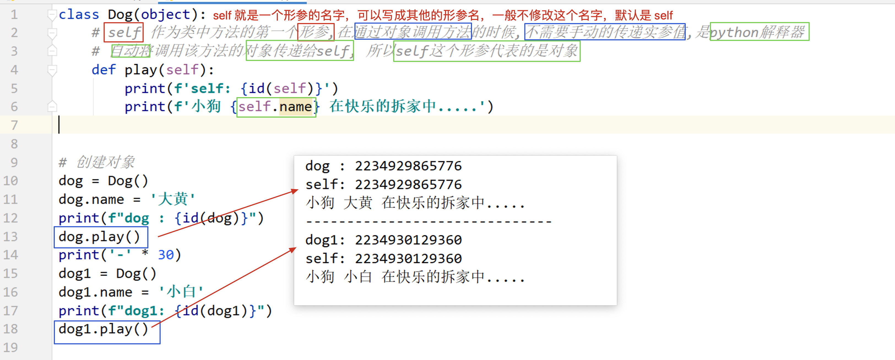

## Day08 课堂笔记

## 0. 复习和反馈


```python
单选 多选
代码题

while True: pass  使用场景,在书写代码的时候,不确定循环一共执行多少次,即不知道循环在什么时候结束, 具体结束的时间,在运行代码的过程中才能确定,在代码中进行 if 判断,如果条件不满足,就使用 break,终止循环

my_list = list()  # 创建列表类对象
my_dict = dict()  # 创建字典类对象
my_tuple = tuple()  # 创建元组类对象
-------
class 类名(object):
    def 函数名(self):
        pass
```


## 1. 类外部添加和获取对象属性

```python
'''
python,js,php可以再类外添加(删除)属性
不同对象之间的属性值没关联
直接使用 . 即可,没有就添加,有就修改
dog.name = '汪汪'
dog.age = 2

删除属性
del 对象.属性
'''

class Dog(object):
    def play(self):
        print('小狗咬人了')

dog = Dog()

# 外部给对象添加属性
dog.name = '汪汪'
dog.age = 2
print(dog.name, f'{dog.age}岁')  # 汪汪 2岁


# 修改属性值
dog.age = -1
print(dog.name, f'{dog.age}岁')  # 汪汪 -1岁


dog1 = Dog()
dog1.sex = 'male'
print(dog1.sex)


# 删除数据
del dog1.sex
```


## 2. 类内部操作属性

```python
'''
python self 在类内操作属性
    self 作为类中方法的第一个形参,在通过对象调用方法的时候,不需要手动的传递实参值,
    是python解释器自动调用该方法的对象传递给self,所以self指的是对象本身

    self是形参名字,可以改成别的名字,一般不改


C++ 和 php 中使用的是 this 操作内部属性,C++中可以省略它
    php中 self 和 static 调用静态属性和方法,他俩差异在下面

    php中 self和static区别
        在函数引用上，self与static的区别是：对于静态成员函数，self指向代码当前类，static指向调用类；
        对于非静态成员函数，self抑制多态，指向当前类的成员函数，static等同于this，动态指向调用类的函数。
        parent、self、static三个关键字联合在一起看挺有意思，分别指向父类、当前类、子类，有点“过去、现在、未来”的味道。

'''

class Dog(object):
    def play(self):
        print(f'self:{id(self)}')

    def show_name(self):
        print(f'name is {self.name}')

dog = Dog()
print(id(dog))      #      1506201209536
dog.play()          # self:1506201209536    self指的是对象本身,其他语言一般使用this
dog.name = '小明'
dog.show_name()     # name is 小明

```



## 3. 魔法方法

```bash
在 python 的类中,有一类方法,这类方法以 `两个下划线开头` 和`两个下划线结尾`, 并且在`满足某个特定条件的情况下,会自动调用`. 这类方法,称为魔法方法

如何学习魔法方法:
1. 魔法方法在什么情况下会自动调用
2. 这个魔法方法有什么作用
3. 这个魔法方法有哪些注意事项
```

### `__init__()` [掌握]

```python
'''
在 python 的类中,有一类方法,这类方法以 `两个下划线开头` 和`两个下划线结尾`, 并且在`满足某个特定条件的情况下,会自动调用`. 这类方法,称为魔法方法

作用:
	1. 用来给对象添加属性,给对象属性一个初始值(构造函数)
	2. 代码的业务需求,每创建一个对象,都需要执行的代码可以写在 `__init__ `中
注意点: 如果 __init__ 方法中,有出了 self 之外的形参,那么在创建的对象的时候,需要给额外的形参传递实参值 `类名(实参)`

php中是 __construct__(){}

C++中构造函数是 类名(){}    根据参数不同可以设置多个构造函数 太牛逼了
     析构函数是 ~类名(){}  析构函数不能有参数
'''

class Dog(object):
    def __init__(self, name, age):
        self.name = name
        self.age = age

    def show_info(self):
        print(f'My name is {self.name}, age is {self.age}')


# 传递实参值
dog = Dog('小明', 18)
dog.show_info()

```


### `__str__()`[掌握]

```python
'''
调用时机:
	1. print(对象), 会自动调用 __str__ 方法, 打印输出的结果是 __str__ 方法的返回值
	2. str(对象)  类型转换,将自定义对象转换为字符串的时候, 会自动调用
应用:
	1. 打印对象的时候,输出一些属性信息
	2. 需要将对象转换为字符串类型的时候
注意点:
	方法必须返回一个字符串,只有 self 一个参数,不然就报错

没有定义 __str__ 默认print(对象)和str(对象)会输出对象的引用地址
'''

class Dog(object):
    
    
    def __init__(self, name, age):
       self.name = name
       self.age = age


    # print(对象) 和 str(对象) 会调用,对象转换为字符串
    # 参数只能由 self, 必须返回字符串
    def __str__(self):
        return f'敢打印我就鲨了你,name is {self.name},age is {self.age}'


# 没有定义 __str__ 默认print(对象)输出对象的引用地址


dog = Dog('大黄', 2)
print(dog)      # 敢打印我就鲨了你,name is 大黄,age is 2
res = str(dog)
print(res)      # 敢打印我就鲨了你,name is 大黄,age is 2
```


### `__del__()`[理解]

```python
'''
析构函数
调用时机:
	对象在内存中被销毁删除的时候(引用计数为 0)会自动调用 __del__ 方法
	1. 程序代码运行结束,在程序运行过程中,创建的所有对象和变量都会被删除销毁
	2. 使用 del 变量 , 将这个对象的引用计数变为 0.会自动调用 __del__ 方法
应用场景:
	对象被删除销毁的时候,要书写的代码可以写在 __del__中.一般很少使用

引用计数: 是 python 内存管理的一种机制, 是指一块内存,有多少个变量在引用(JS也是这样)
    1. 当一个变量,引用一块内存的时候,引用计数加 1
    2. 当删除一个变量,或者这个变量不再引用这块内存.引用计数减 1
    3. 当内存的引用计数变为 0 的时候,这块内存被删除,内存中的数据被销毁


C++ 析构函数 ~类名(){}  析构函数不能有参数
'''

class Dog(object):


    def __init__(self, name, age):
        self.name = name
        self.age = age

    def __del__(self):
        print('删除了')


dog = Dog('Tom', 18)
dog1 =dog
del dog     # 只删除它不会调用,因为dog1指向的也是这个对象

del dog1   # 删除了  注释了它也能输出,因为脚本结束也会执行
```


## 案例: 烤地瓜

```bash
封装的小套路:
1. 根据文字的描述信息,确定对象,对象有什么,就是属性
2. 根据文字的描述信息, 对象能干什么,就是方法
3. 根据文字的描述信息, 确定方法怎么书写
```

```python
类名: 地瓜类 Potato
属性:
    状态 status='生的'
    烧烤总时间 total_time = 0
方法:
    def cook(self, 烧烤时间):
        计算烧烤的总时间
        修改地瓜的状态的
        pass
    输出信息  __str__()
    定义属性  __init__() 
```


### 烤地瓜-调料版

```python
'''
    字符串,join(列表)
    可以将列表使用字符串分隔开,返回一个字符串
'''


class Potato(object):
    def __init__(self):
        self.status = "生的"
        self.status = ''
        self.total_time = 0
        self.seasoning = []

    def cock(self, time):
        # 计算总时间
        self.total_time += time
        # 修改地瓜状态
        if self.total_time < 3:
            self.status = "生的"
        elif self.total_time < 6:
            self.status = "不熟"
        elif self.total_time < 8:
            self.status = '熟了'
        else:
            self.status = '糊了'


    def add(self, *args):
        '''
        添加调料
        '''
        for i in args:
            self.seasoning.append(i)


    def __str__(self):
        if self.seasoning:
            # 字符串.join(列表), 列表使用字符串连接
            temp = ','.join(self.seasoning)

            return f"地瓜状态: {self.status},烧烤总时间:{self.total_time}分钟,调料: {temp}"
        else:
            return f"地瓜状态: {self.status},烧烤总时间:{self.total_time}分钟,没调料"


potato = Potato()
print(potato)       # 地瓜状态: 生的,烧烤总时间:0分钟,没调料
potato.cock(4)
potato.add('油')
print(potato)       # 地瓜状态: 不熟,烧烤总时间:4分钟,调料: 油
potato.cock(3)
potato.add('孜然')
print(potato)       # 地瓜状态: 熟了,烧烤总时间:7分钟,调料: 油,孜然
potato.cock(2)
potato.add('辣椒', '胡椒')
print(potato)       # 地瓜状态: 糊了,烧烤总时间:9分钟,调料: 油,孜然,辣椒,胡椒


```


## 案例: 搬家具

```python
'''

'''

class Furniture(object):
    name = ''
    area = 0


    def __init__(self, name, area):
        self.name = name
        self.area = area


    def __str__(self):
        # 家具类型和占地面积
        return f"家具类型是{self.name},家具面积{self.area}平方米"


# 别墅
class Villa(object):


    def __init__(self, address, area):
        self.address = address
        self.area = area
        self.free_area = area   # 房子剩余面积
        self.furniture = [] 

    def add_furniture(self, *args):
        '''
        添加家具
        :param args: 必须是家具类对象
        '''
        for i in args:
            if self.free_area > i.area:
                # 添加家具
                self.furniture.append(i)
                # 更新剩余家具
                self.free_area -= i.area
                print(f"添加{i.name}成功")
            else:
                print(f"添加{i.name}失败")


    def __str__(self):
        if self.furniture:
            # 获取名字列表
            temp = [f"{i.name},面积是{i.area}平方米" for i in self.furniture]
            # 拼接字符串
            temp = ','.join(temp)
            return f"房子地址是{self.address},房子面积是{self.area}平方米,家具有{temp}"
        else:
            return f"房子地址是{self.address},房子面积是{self.area}平方米,没家具"


bed = Furniture("双人床", 6)
#print(bed)             # 家具类型是双人床,家具面积6平方米
desk = Furniture("桌子", 5)
chair = Furniture("椅子", 3)


villa = Villa('AAA',13)
print(villa)            # 房子地址是AAA,房子面积是13平方米,没家具

villa.add_furniture(bed, desk, chair)
# 添加双人床成功
# 添加桌子成功
# 添加椅子失败
print(villa)            # 房子地址是AAA,房子面积是13平方米,家具有双人床,面积是6平方米,桌子,面积是5平方米


```


## 魔术方法 `__repr__()`

```python
'''
直接打印列表,输出的是里面的值,而将自己的对象放进列表,打印的却是地址
原因是自己的类中没有定义 __repr__ 方法

repr方法和str方法非常类似,也是必须返回一个字符串,然后在打印容器时就能正确输出值了

如果没有定义 __str__ 只定义了 __repr__, 在触发 __str__ 的时候就会调用 __repr__

'''

# 列表中存储了3个字符串对象
list1 = ['hello', 'python', 'cpp']
print(list1)    # ['hello', 'python', 'cpp']    直接输出值,而不是地址


class Dog(object):


    def __init__(self, name, age):
        self.name = name
        self.age = age


    def __str__(self):
        return f"{self.name},{self.age}岁"


    # repr方法和str方法非常类似,也是必须返回一个字符串,然后在打印容器时就能正确输出值了
    def __repr__(self):
        return f"{self.name}"


list2 = [Dog('a', 1), Dog('b', 2)]
print(list2)    # [<__main__.Dog object at 0x000001F0A3B20FD0>, <__main__.Dog object at 0x000001F0A3B20F10>]
```

