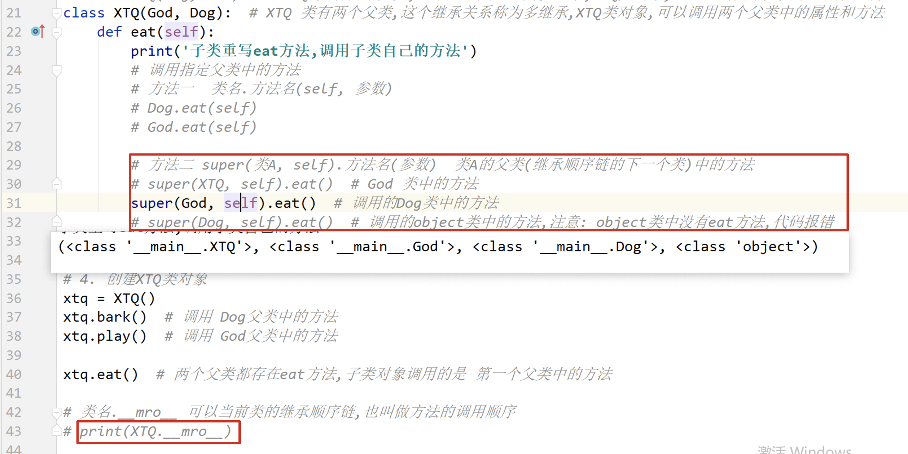
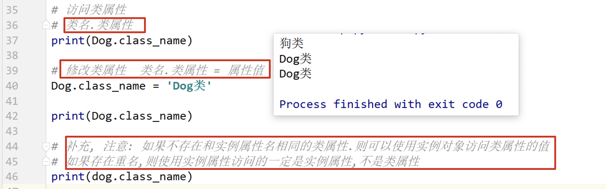

## day09 课堂笔记

## 0.复习和反馈


## 1. 继承的基本语法[掌握]

```python
'''
子类能用父类的属性和方法

继承语法
class 子类(父类):

self在子类调用子类属性和方法,在父类调用父类和方法,
php 在函数引用上，self与static的区别是：对于静态成员函数，self指向代码当前类，static指向调用类；
    对于非静态成员函数，self抑制多态，指向当前类的成员函数，static等同于this，动态指向调用类的函数。
'''


class Animal(object):

    def __init__(self):
        self.name = 'Animal'

    def speak(self):
        print(self.name)


class Dog(Animal):

    def __init__(self):
        super().__init__()
        self.name = 'dog'


# self在子类调用子类属性和方法,在父类调用父类和方法,php中self调用父类静态属性和方法,而static调用静态属性和方法
animal = Animal()
animal.speak()  # Animal
dog = Dog()
dog.speak()  # Dog

```


## 2. 单继承和多层继承[理解]


## 3. 子类重写父类的同名方法[掌握]

```python
'''
重写: 子类定义和父类名字相同的方法.
为什么重写: 父类中的方法,不能满足子类对象的需求,所以要重写.
重写之后的特点: 子类对象调用子类自己的方法,不再调用的方法,父类对象调用父类自己的方法.


/**
 * php注意事项
 *
 * 注意
 * (1)  PHP没有同名函数,所以子类出现同名函数就是重写,C++和C#出现同名函数算是隐藏,使用了virtual或abstract才是重写
 *      PHP子类方法重写父类方法不能比父类更严格,即父类方法如果是public,子类方法必须是public;父类方法如果是protected,子类方法可以使public或protected
 *      C++中没有这条规则
 *      C#使用virtual/abstract和override重写时不能修改访问修饰符
 *
 * (2)  PHP7要求被重写的方法必须与父类保持参数一致(数量和类型)
 *      C++中没有这条规则
 *      C#使用virtual/abstract和override重写时也要参数一致(数量和类型),不是重写就没问题
 *      C#使用覆盖不是重写,(父类无参数,子类有参数)不给参数调用父类方法,给参数调用子类方法
 */

'''


class Dog(object):


    def __init__(self):
        self.name = 'Dog'


    def bark(self):
        print("汪汪汪")


class Xiao_tian_quan(Dog):


    def __init__(self):
        super().__init__()
        self.name = "哮天犬"

    def bark(self):
        print("吼吼吼")


# 重写后父类调用自己的方法,子类调用子类自己的方法
dog = Dog()
dog.bark()                          # 汪汪汪

xiao_tian_quan = Xiao_tian_quan()
xiao_tian_quan.bark()               # 吼吼吼
```


## 4. 子类调用父类的同名方法[掌握]

```python
'''
通过对象调用方法,不需要传递实参值,python解释器会自动将对象作为实参值传递给self形参,
如果是通过类名.方法() 调用则python解释器就不会自动传递实参值,需要手动self

方法1: 父类名.方法名(self)  必须要有self
    Dog.bark(self, 其他参数)

方法2  父类名(参数).方法名() 不推荐使用
    Dog().bark()  这个函数没实参

方法3 super(类A, self).方法名(参数)   调用类A的父类(继承顺序链的下一个类)中的方法
    super(Xiao_tian_quan,self).bark()

方法4: super().方法名(参数)  方法3的简写
        super().bark()

/**
 * C++中子类调用父类同名方法
 *
 * 访问子类同名成员,直接访问即可
 * 访问父类同名成员,需要加作用域
 *      class Son
 *      class Son : public Base
 *      通过子类对象访问父类中同名成员属性  s1.Base::m_A
 *      通过子类对象调用父类同名函数       s2.Base::func();
 *      调用父类中的重载函数              s2.Base::func(10);
 *   如果子类中出现和父类同名的函数成员函数,子类的同名成员会隐藏掉父类中所有的同名函数(重载函数也会被影藏)
 *   要用Base::方式访问父类中的重载函数
 *
 * 静态成员和非静态成员出现同名,处理方式一样
 * 静态成员:静态数据:所有对象共享同一份数据;类内声明,类外初始化;编译阶段分配内存
 *        静态成员函数:所有对象共享同一份数据;访问静态成员变量
 *      访问子类同名成员,直接访问即可
 *      访问父类成员,需要加作用域
 *
 *  s.m_A        === Son::m_A        s.func()       == Son::func()         //子类
 *  s.Base::m_A  === Son::Base::m_A  s.Base::func() == Son::Base::func()   //父类
 *                   前一个::是通过类名Son方式访问,第二个::是访问Sase作用域下的m_A
 */

 /**
  * php使用 parent::父类方法() 调用父类方法,无论静态,动态都使用parent::
  *
'''


class Dog(object):
    def __init__(self):
        self.name = 'Dog'


    def bark(self):
        print("汪汪汪")


class Xiao_tian_quan(Dog):
    
    
    def __init__(self):
        super().__init__()
        self.name = "哮天犬"


    def bark(self):
        print("吼吼吼")


    def see_host(self):
        # 调用子类自己的方法
        self.bark()


    # 子类调用父类方法
    def see_hosts(self):
        # 方法1: 父类名.方法名(self, 其他参数), self必须有
        Dog.bark(self)

        # 方法2:  父类名(参数).方法名() 不推荐使用
        #Dog().bark()

        # 方法3: super(当前类, self).方法名(参数)   调用当前类的父类中的方法
        super(Xiao_tian_quan,self).bark()

        # 方法4: super().方法名(参数)  方法3的简写
        super().bark()


xiao_tian_quan = Xiao_tian_quan()
xiao_tian_quan.see_host()   # 吼吼吼

# 子类调用父类方法
xiao_tian_quan.see_hosts()
# 汪汪汪
# 汪汪汪
# 汪汪汪
```


## 5. 继承中的 init [掌握]

```python
'''
python中子类会继承父类的构造函数,字符串输出函数等,php也会继承构造函数
重写之后子类要调用父类的构造方法,给对象添加从父类继承的属性,
子类init方法中的形参,一般都写父类的形参,在写父类的形参

def __init__(self, name, color):
    # 子类要调用父类构造函数
    #Dog.__init__(self, name)
    #super(XTQ, self).__init__(name)
    super().__init__(name)
    self.color = color


/**
 * C++子类继承不能继承父类的构造函数,
 * C#子类继承不能继承父类的构造函数
 * PHP子类可以继承父类的构造和析构方法(php中构造方法是普通方法,遵循普通方法规律)
 *      要注意继承时父类的构造方法的初始化也对子类有效
 */
class Vehicle {
public:
    //父类构造方法有参数
    Vehicle(string name) {
        m_Name = name;
    }

    string m_Name;
};

class Car : public Vehicle {
public:

    /**
     * 子类要这样写才不会出错,要把子类的参数传给父类
     */
    Car(string name) : Vehicle(name) {
        m_Name = name;
    }
};
'''


class Dog(object):


    def __init__(self, name):
        self.name = name
        self.age = 0


    def __str__(self):
        return f"名字为:{self.name},年龄为:{self.age}"


class XTQ(Dog):


    def __init__(self, name, color):
        # 子类要调用父类构造函数
        #Dog.__init__(self, name)
        #super(XTQ, self).__init__(name)
        super().__init__(name)
        self.color = color


    def __str__(self):
        return f"名字为:{self.name},年龄为:{self.age},毛色为:{self.color}"


# 没有重写父类的构造函数和字符串输出函数
# xtq = XTQ('小黄')
# print(xtq)  # 名字为:小黄,年龄为:0


# 重写父类的构造函数
xtq = XTQ('小黄', '白色')
print(xtq)
# 名字为:小黄,年龄为:0,毛色为:白色
```


## 6. 多继承[理解]

如果一个类有两个及以上的父类,就把这种继承关系称为多继承.

```python
'''
class 子类(父类1, 父类2)
class XTQ(God, Dog)

两个父类出现同名方法,子类对象调用的是第一个继承父类中的方法


/**
 * C++允许一个类继承多个类
 * 语法 class 子类 : 继承方式 父类1 , 继承方式,父类2...
 * 多继承可能会引发父类中有同名成员出现,需要加作用域加以区分   s1.Base1::m_A     s1.Base2::m_A
 * C++实际开发中不建议使用多继承
 */
'''


class God(object):


    def play(self):
        print('在云中飘...')


    def eat(self):
        print('吃仙桃')


class Dog(object):


    def bark(self):
        print('汪汪叫')


    def eat(self):
        print('吃骨头')


# 多继承
class XTQ(God, Dog):
    pass


xtq = XTQ()
# 这个方法只有God类中有
xtq.play()  # 在云中飘...

# 这个方法只有Dog类中有
xtq.bark()  # 汪汪叫

# 这个方法两个父类都有 调用的是前边继承的类内的方法
xtq.eat()   # 吃仙桃
```


```python
'''
类名.__mro__ 查看当前类的继承顺序链,也叫作方法的调用顺序
	顺序 子类,继承类1,继承类2...object

重写方法,在重写方法中调用父类方法
方法1 父类.方法(self, 其他参数)  建议这个


方法2 super(类A,self).方法(参数)  调用类A的父类(继承顺序链的下一个类)中的方法


super().方法(参数)  这个方法没有指定父类,因此会默认调用第一个继承类


/**
 * C++允许一个类继承多个类
 * 语法 class 子类 : 继承方式 父类1 , 继承方式,父类2...
 * 多继承可能会引发父类中有同名成员出现,需要加作用域加以区分   s1.Base1::m_A     s1.Base2::m_A
 * C++实际开发中不建议使用多继承
 */
'''

class God(object):


    def play(self):
        print('在云中飘...')


    def eat(self):
        print('吃仙桃')


class Dog(object):


    def bark(self):
        print('汪汪叫')


    def eat(self):
        print('吃骨头')


# 多继承
class XTQ(God, Dog):
    def eat(self):
        print('吃狗肉')

        # 方法1  父类.方法(self, 其他参数)
        God.eat(self)

        # 方法2 super(类A,self).方法(参数)  调用类A的父类(继承顺序链的下一个类)中的方法
        super(XTQ, self).eat()
        super(God, self).eat()
        super().eat()


xtq = XTQ()
xtq.eat()   # 吃狗肉
# 吃狗肉       print('吃狗肉')
# 吃仙桃       God.eat(self)
# 吃仙桃       super(XTQ, self).eat()  调用 XTQ 下一个类的方法
# 吃骨头       super(God, self).eat()  调用 GOd 下一个类的方法
# 吃仙桃       super().eat()           调用第一个类的方法


#类名.__mro__ 查看当前类的继承顺序链,也叫作方法的调用顺序
print(XTQ.__mro__)  # (<class '__main__.XTQ'>, <class '__main__.God'>, <class '__main__.Dog'>, <class 'object'>)
```



## 7. 私有属性和方法权限[理解] `__名字`

```bash
'''
对象.__dict__  查看对象具有的属性,类型是字典,key是属性名,value是属性值
print(xw.__dict__)  # {'_People__ICBC_money': 0}

类.__dict__  查看类具有的属性,类型是字典,key是属性名,value是属性值


就是其他语言的 private
python中的私有本质是修改属性/方法的名字,在属性/方法前面添加 _类名 前缀,如 _People__ICBC_money

访问权限控制: 在什么地方可以使用和操作.
私有权限:
	定义: 在方法和属性前加上两个下划线, 就变为私有.  __sex_hobby
	1. 不能在类外部通过对象直接访问和使用, 只能在类内部访问和使用
	2. 不能被子类继承,
公有: 不是私有的,就是公有的.
'''

# 定义People类,定义属性 money ,不能随意被修改,要用合法方法修改
class People(object):


    def __init__(self):
        self.__ICBC_money = 0


    def setMoney(self, money):
        self.__ICBC_money = money


    def get_money(self):
        print(f"钱:{self.__ICBC_money}")


xw = People()
print(xw.__dict__)  # {'_People__ICBC_money': 0}

# 添加公有属性,不是修改私有属性
xw.__ICBC_money = 200
print(xw)           # 钱:0,虽然上面添加了100,但是那是新添加的公有属性,不是类内的私有属性
print(xw.__dict__)  # {'_People__ICBC_money': 0, '__ICBC_money': 200}


xw.setMoney(100)
xw.get_money()      # 钱:100
print(xw.__dict__)  # {'_People__ICBC_money': 100, '__ICBC_money': 100}

# 查看类的属性
print(People.__dict__)
```


```python
'''
函数名前面加上两个下划线改为私有方法
python中的私有本质是修改属性/方法的名字,在属性/方法前面添加 _类名 前缀,如 _People__ICBC_money
'''

class Dog(object):
    def born(self):
        '''生小狗,生一个小狗,休息30天'''
        print("生了一个小狗")
        self.__sleep()


    def __sleep(self):
        print("休息30天")


dog = Dog()
#dog.__sleep()   # 报错

print(dog.__dict__)     # {}
```


## 8. 类属性[理解]

```python
'''
对象(实例对象): 通过class类实例化来的,这个对象称为实例对象
    实例对象定义的属性称为 实例属性,
        通过实例对象或者通过self 定义的属性都称为实例属性
    实例属性: 每个对象都存在一份,并且值可能是不一样的


类(类对象): 通过class定义的,又称为类对象;类对象是python解释器在创建类的时候自动创建的
作用
    1: 通过类对象定义实例对象,
    2: 类对象可以保存属性信息,这些属性称为类属性

    在类内部,方法外部定义的对象就成为类属性
    类属性在内存中只有一份

访问类属性
    类名.类属性

修改类属性
    类名.类属性 = 属性值

如果不存在和实例属性同名的类属性,则可以使用实例对象访问类属性的值(只能访问,不能修改);
如果存在重名,则使用实例属性访问的一定是实例属性,不是实例属性

类属性在类内的方法中可以使用 self 之类的访问

实例对象自己用: 实例属性
实例对象一起用: 类属性
'''


class Dog(object):
    # 类属性
    class_name = "狗类"


    def __init__(self, name, age, class_name):
        # 定义的都是实例属性
        self.name = name
        self.age = age
        self.class_name = class_name


dog = Dog("阿黄", 18, 'miao')

# 打印dog对象的属性
print(dog.class_name)   # 狗类
print(dog.__dict__)     # {'name': '阿黄', 'age': 18}     没有类属性


# 查看类的属性
print(Dog.__dict__)     # ... 'class_name': '狗类', ...


# 访问类属性
print(Dog.class_name)   # 狗类
Dog.class_name = "Dog"
print(Dog.class_name)   # Dog


# 重新赋值之后有对象属性和类属性
dog.class_name = 'Miao'
print(dog.class_name)   # Miao
print(dog.__dict__)     # {'name': '阿黄', 'age': 18, 'class_name': 'Miao'}
print(Dog.__dict__)     # # ... 'class_name': 'Dog', ...


# 如果不存在和实例属性同名的类属性,则可以使用实例对象访问类属性的值(只能访问,不能修改);
# 如果存在重名,则使用实例属性访问的一定是实例属性,不是实例属性

```




## 9. 类方法

```python
'''
实例方法: 类中定义的方法就是实例方法
    第一个参数为self,表示实例对象

类方法: 使用 @classmethod 装饰的方法称为类方法
    第一个参数是 cls, 代表类对象自己,调用时不需要手动传递,python解释器会自动传递


通过 对象.类方法() 调用
通过 类名.类方法() 调用


1.在方法中使用了实例属性,该方法必须是实例方法
2.不需要使用实例属性,需要使用类属性,可以定义为类方法
'''


class Dog(object):

    # 类方属性(类似静态属性)
    class_name = "狗类"


    def __init__(self, name, age):
        self.name = name
        self.age = age


    def play(self):
        print(f"小狗{self.name}在快乐的玩耍")


    # 实例方法,没有用到实例属性,所以可以定义为类方法
    def get_class0(self):
        return self.class_name


    # 类方法
    @classmethod
    def get_class1(cls):    # cls 代表类对象自己,调用时不需要手动传递,python解释器会自动传递
        return cls.class_name


dog = Dog("大黄", 15)
print(dog.get_class0())     # 狗类


# 可以通过 对象.类方法() 调用
print(dog.get_class1())     # 狗类

# 通过 类名.类方法() 调用
print(Dog.get_class1())     # 狗类	
```


## 10. 静态方法[掌握]

```python
'''
实例方法: 类中定义的方法就是实例方法
    第一个参数为self,表示实例对象

类方法: 使用 @classmethod 装饰的方法称为类方法
    第一个参数是 cls, 代表类对象自己,调用时不需要手动传递,python解释器会自动传递

    通过 对象.类方法() 调用
    通过 类名.类方法() 调用

静态方法: 使用 @staticmethod 装饰的方法,静态方法对参数没有特殊要求,有无都行

    通过 对象.类方法() 调用
    通过 类名.类方法() 调用
    
    
1.在方法中使用了实例属性,该方法必须是实例方法
2.不需要使用实例属性,需要使用类属性,可以定义为类方法
3.不需要使用实例属性,不需要使用类属性,可以定义静态方法

'''


class Dog(object):

    # 类方属性(类似静态属性)
    class_name = "狗类"


    def __init__(self, name, age):
        self.name = name
        self.age = age


    def play(self):
        print(f"小狗{self.name}在快乐的玩耍")


    # 实例方法,没有用到实例属性,所以可以定义为类方法
    def get_class0(self):
        return self.class_name


    # 类方法
    @classmethod
    def get_class1(cls):    # cls 代表类对象自己,调用时不需要手动传递,python解释器会自动传递
        return cls.class_name


    # 静态方法
    @staticmethod
    def show():
        print("这是一个dog类")


# 静态方法
Dog.show()              # 这是一个dog类

# 类方法
print(Dog.get_class1()) # 狗类

dog = Dog("大白", 16)
dog.show()              # 这是一个dog类
print(dog.get_class1()) # 狗类
print(dog.get_class0()) # 狗类
```


## 11. 多态[理解]

```python
'''
传入父类对象,但是也能传入子类对象,得到不同的结果
1.子类继承父类
2.子类重写父类方法
3.通过对象调用这个方法

python中多态可以没有继承,叫鸭子类型,

'''


class Dog(object):


    def __init__(self, name):
        self.name = name


    def play(self):
        print(f"{self.name}正在玩耍")


class XTQ(Dog):


    # 重写父类方法
    def play(self):
        print(f"{self.name}在天上追云彩")


class Cat(object):


    def __init__(self, name):
        self.name = name


    def play(self):
        print(f"{self.name}在玩毛线")


# 参数是父类,可以传入父类或子类,分别调用不同方法
def play_with_dog(obj_dog):
    obj_dog.play()


dog = Dog("小明")
play_with_dog(dog)  # 小明正在玩耍


xtq = XTQ("哮天犬")
play_with_dog(xtq)  # 哮天犬在天上追云彩


# cat不继承Dog类,但是也能调用
cat = Cat("喵喵喵")
play_with_dog(cat)  # 喵喵喵在玩毛线
```


```python
鸭子类型 
```

