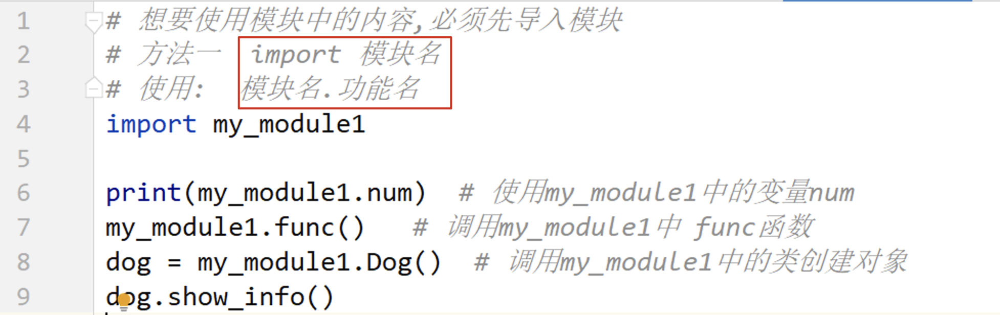
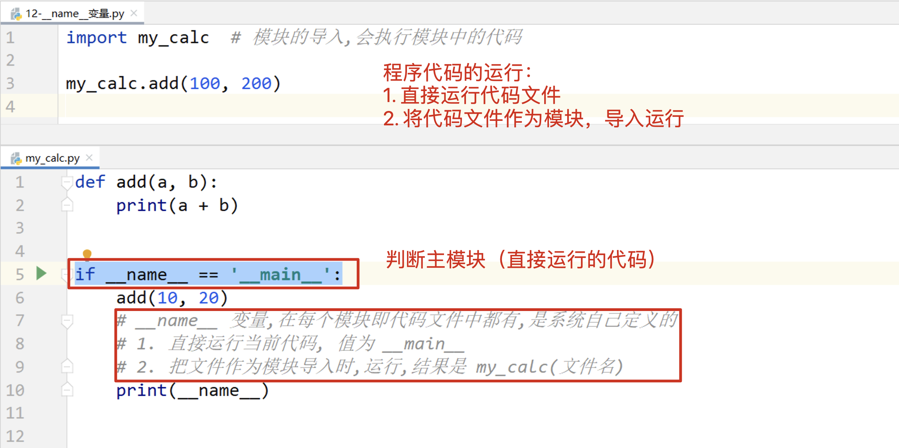
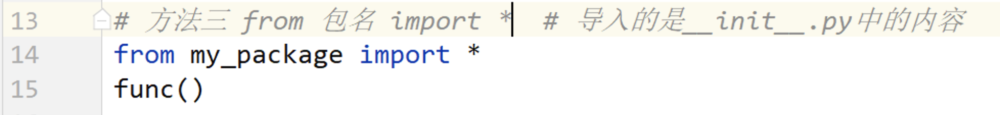
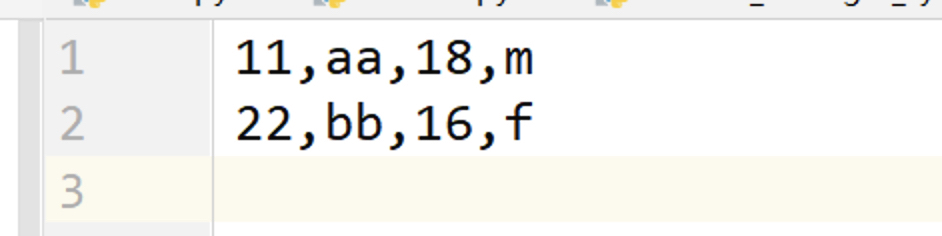

## day03 课堂笔记
[toc]

## 0. 复习和反馈

```python 
实例属性：
	类外部： 实例对象.属性名 = 属性值
    类内部： self.属性 = 属性值 （__init__）

类属性：
	类内部，方法外部直接定义的变量，就是类属性
    
实例方法：
	直接定义的方法
    def 方法名(self):
        # 方法使用了实例属性
        self.属性
        pass 
类方法：
	@classmethod 
    def 方法名(cls):
        类名.类属性
        cls.类属性
        pass
静态方法：
	@staticmethod 
    def 方法名():
        pass
```


## 1. 异常的概念[了解]

```bash
异常的组成:
`异常类型`: `异常具体的描述信息`
```


## 2. 捕获单个异常[掌握]

```python
'''

try:
    可能发生异常的代码
excerpt 异常的类型:
    发生异常执行的代码

'''

print("其他的代码")
num = input("请输入一个数字:")

try:
    res = 10 / int(num)
    print("计算得到的结果是:" + str(res))
except ZeroDivisionError:
    """只能捕获单个异常,捕获不为0时的异常"""
    print("傻逼啊你,除0???")


print("其他的代码")
```


## 3. 捕获多个异常[掌握]

```python
'''
写法1:
try:
    可能发生异常的代码

excerpt (异常的类型1,异常的类型2...):
    发生异常执行的代码


写法2
try:
    可能发生异常的代码

excerpt 异常的类型1:
    发生异常1执行的代码

excerpt 异常的类型2:
    发生异常2执行的代码
...

'''

# 写法1
print("其他的代码")
num = input("请输入一个数字:")

try:
    res = 10 / int(num)
    print("计算得到的结果是:" + str(res))

except (ZeroDivisionError,ValueError):
    """多个异常"""
    print("傻逼啊你,除0或者输入的不是数字???")


print("==================")


# 写法2
num = input("请输入一个数字:")

try:
    res = 10 / int(num)
    print("计算得到的结果是:" + str(res))

except ZeroDivisionError:
    print("傻逼啊你,除0???")

except ValueError:
    print("傻逼啊你,不输入正确的数字???")
```


## 4. 打印异常信息[掌握]

```python
'''

try:
    可能发生异常的代码

excerpt 异常的类型 as 变量:
    print(变量)


'''


# 写法1
print("其他的代码")
num = input("请输入一个数字:")

try:
    res = 10 / int(num)
    print("计算得到的结果是:" + str(res))

except (ZeroDivisionError,ValueError) as error:
    print(error)
    # division by zero
    # invalid literal for int() with base 10: 'a'
```


## 5. 捕获所有的异常[掌握]

```python
try:
    可能发生异常的代码
except:   # 缺点, 不能获取异常的描述信息
    发生异常执行的代码
    
    
==============
try:
    可能发生异常的代码
except Exception as e:
    发生异常执行的代码
    print(e)
    pass

# Exception 是常见异常类的父类,
ZeroDivisionError --> ArithmeticError --> Exception --> BaseException  ---> object
ValueError --> Exception --> BaseException  ---> object
```


## 6. 异常的完整结构[掌握]

```python
try:
    可能发生异常的代码
except Exception as e:
    发生异常执行的代码
    print(e)
else:
    代码没有发生异常,会执行
finally:
    不管有没有发生异常,都会执行
```
```python
'''
try:
    可能发生异常的代码
excerpt Exception as e:
    发生异常执行的代码
    print(e)

else:
    代码没有发生异常才执行

finally:
    不管有没有发生异常都会执行
    
'''

print("其他的代码")
num = input("请输入一个数字:")

try:
    res = 10 / int(num)
    print("计算得到的结果是:" + str(res))

except Exception as error:
    print(error)

else:
    print("没有发生异常else中会执行")

finally:
    print("不管有没有异常finally中都会执行")


print("外部不受影响,都会执行")
```


## 7. 异常的传递[理解]

```python
是 python 异常处理的底层机制,是原理层面上的,不需要我们自己写代码实现,是 python 已经实现好的.

异常传递: 当一行代码发生异常之后,会向外层将这个异常进行传递,指导被捕获或者程序报错为止.
1. try 嵌套
2. 函数嵌套
```
```python
'''
发生异常,会向外层进行传递,知道被捕获或者程序报错为止
内层程序发生的代码会向外层传递,直到被捕获

'''
num = input("请输入数字:")


try:
    try:
        a = int(num)
    except ZeroDivisionError:
        # 故意写错异常类型 查看异常的向上传递过程
        print("发生异常")
    finally:
        print("我都执行了")

    num = 10 / a
    print(f"计算结果:<<{num}>>")
except Exception as e:
    print(e)

print("=" * 50)


def func1():
    print('-------1-------')
    num = int(input("请输入数字:"))
    num = 10 / num
    print(num)
    print('-------2-------')


def func2():
    print('-------3-------')
    func1()
    print('-------4-------')

try:
    print('-------5-------')
    func2()
    print('-------6-------')
except Exception as e:
    print('-------7-------')
    print(e)
    print('-------8-------')

# 出了错误,后面的都不执行了,直接执行except
# -------5-------
# -------3-------
# -------1-------
# 请输入数字:0
# -------7-------
# division by zero
# -------8-------
#
# 没有错误,依次输出
# -------5-------
# -------3-------
# -------1-------
# 请输入数字:1
# 10.0
# -------2-------
# -------4-------
# -------6-------
```


## 8. 抛出自定义异常[理解]

```python 
程序代码为什么会报错?
因为不符合语法, 因为 python 的作者在代码中使用了 if 判断,如果除数为 0 ,就会在代码中抛出异常错误,
抛出异常:
    raise 异常对象  # 当程序代码遇到 raise 的时候,程序就报错了
    
异常对象 = 异常类(参数)  

抛出自定义异常:
    1. 自定义异常类,继承 Exception 或者 BaseException 
    2. 选择书写,定义 __init__方法,定义__str__ 方法
    3. 在合适的时机抛出异常对象即可
```
```python
'''
程序代码为什么会报错?
因为不符合语法, 因为 python 的作者在代码中使用了 if 判断,如果除数为 0 ,就会在代码中抛出异常错误,
抛出异常:
    raise 异常对象  # 当程序代码遇到 raise 的时候,程序就报错了


异常对象 = 异常类(参数)

抛出自定义异常:
    1. 自定义异常类,继承 Exception 或者 BaseException
    2. 选择书写,定义 __init__方法,定义__str__ 方法
    3. 在合适的时机抛出异常对象即可

'''

# 定义异常类 密码长度不足
class PasswordLengthError(Exception):
    pass
    # def __str__(self):
    #     return "xxx"


# 等同于系统提供定义函数
def get_password():
    password = input("请输入密码:")
    if(len(password)) >= 6:
        print("密码长度合格")
    else:
        # 抛出异常 抛出自定义异常对象
        raise PasswordLengthError("密码长度不足6位")
        # PasswordLengthError: 密码长度不足6位

get_password()
```


## 模块

```python 
import random
random.randint(a, b)  产生[a,b] 之间的随机整数, 包含 b的
import os
 
python 就是一个 python 代码文件,是别人已经写好的代码文件,文件中的函数类以及变量,我们都可以使用.

使用模块的好处:  直接使用别人已经实现好的功能,
```

### 模块的制作

```python
模块就是一个 python 文件
制作一个模块,其实就是定义一个 python 代码文件
注意点: 模块的名字要遵循标识符的规则(由字母,数字和下划线组成,不能以数字开头)
    
模块中可以定义变量,定义函数,定义类
```

### 模块的导入

```python 
想要使用模块中的内容,必须先导入模块 
注意点: 如果导入的是自己书写的模块,使用的模块和代码文件需要在一个目录中,不然要写路径
注意: 如果存在同名方法会被替换
```
```python
'''
注意: 如果存在同名方法会被替换

方法1
引入全部
引入:    import 模块名
使用:    模块名.功能名


方法2
引入具体功能
引入: form 模块名 import 功能名
使用: 功能名


方法3
将模块中所有功能全部引入 不建议用
引入: from 模块名 import *
使用: 功能名


as 起别名  使用as之后别名就不能使用了,可以对模块,属性,方法,对象起别名
'''


# 方法1
# 引入:    import 模块名
# 使用
import my_module1
# 调用
print(my_module1.num)            # 1
my_module1.func()                # # my_module1 func
dog = my_module1.Dog('小黄')
my_module1.Dog.show_info()       # my_module1 Dog class


# 方法2
# 引入: form 模块名 import 功能名
from my_module2 import func     # my_module2 func
func()


# 方法3
# 引入: from 模块名 import *
from my_module3 import *
print(num)                      # 3


# as 起别名  使用as之后别名就不能使用了,可以对模块,属性,方法,对象起别名
import my_module3 as mm1

mm1.func()                      # my_module3 func

from my_module2 import num as number
print(number)                   # 2

```




### 模块中的变量 `__all__`

my_module4

```python
'''
__all__变量,可以在每个代码模块中定义,类型是元组(推荐),列表
作用: 影响from 模块名 import * 导入行为,另外两种导入行为不受影响
1.如果没有定义 __all__ 变量,模块中的所有功能都可以被导入
2.如果定义 __all__ 变量,只能导入变量中定义的内容

另外两种导入行为不受影响

里面必须写字符串
__all__ = ["num", "func"]
'''

__all__ = ["num", "func"]


num = 4


def func():
    print("my_module4 func")


class Dog(object):
    def __init__(self, name):
        self.name = name

    @staticmethod
    def show_info():
        print("my_module4 Dog class")
```

my_module4

```python
'''
__all__变量,可以在每个代码模块中定义,类型是元组(推荐),列表
作用: 影响from 模块名 import * 导入行为,另外两种导入行为不受影响
1.如果没有定义 __all__ 变量,模块中的所有功能都可以被导入
2.如果定义 __all__ 变量,只能导入变量中定义的内容

另外两种导入行为不受影响

里面必须写字符串
__all__ = ["num",]
'''

from my_module4 import *

print(num)
func()
dog = Dog()
```


### 模块中的变量 `__name__`

my_module5

```python
'''
__name__ 变量,在每个模块即代码块文件中都有,是系统自己定义的

模块的导入,会执行模块中的代码

每个python模块（python文件）都包含内置的变量 __name__，当该模块被直接执行的时候，__name__ 等于文件名（包含后缀 .py ）；
如果该模块 import 到其他模块中，则该模块的 __name__ 等于模块名称（不包含后缀.py）。
而 “__main__” 始终指当前执行模块的名称（包含后缀.py）。进而当模块被直接执行时，__name__ == 'main' 结果为真。

通俗的理解：当*.py文件被直接运行时，if __name__ ==’__main__'之下的代码块将被运行；
当.py文件以模块形式被导入时，if __name__ == '__main__'之下的代码块不被运行。

'''

def add(a, b):
    print(a + b)

print(__name__)         # __main__  被引入时打印 my_module5, 说明被引入和自己执行 __name__ 代表的内容不同


if __name__ == '__main__':
    add(10, 20)         # 30

    #1. 直接运行当前代码,值为 __main__
    #2. 把文件作为模块导入时,运行,结果是 文件名
    print(__name__)     # __main__
```

182模块`__name__`变量

```python
'''
__name__ 变量,在每个模块即代码块文件中都有,是系统自己定义的

模块的导入,会执行模块中的代码

每个python模块（python文件）都包含内置的变量 __name__，当该模块被直接执行的时候，__name__ 等于文件名（包含后缀 .py ）；
如果该模块 import 到其他模块中，则该模块的 __name__ 等于模块名称（不包含后缀.py）。
而 “__main__” 始终指当前执行模块的名称（包含后缀.py）。进而当模块被直接执行时，__name__ == 'main' 结果为真。

通俗的理解：当*.py文件被直接运行时，if __name__ ==’__main__'之下的代码块将被运行；
当.py文件以模块形式被导入时，if __name__ == '__main__'之下的代码块不被运行。

'''

import my_module5   # 模块的导入,会执行模块中的代码


# my_module5 
# 这一行是my_module5中 print(__name__) 打印的,
# 而单独运行 my_module5 时,打印的是 __main__ , 说明自己运行和被引入是 __name__ 代表内容不同,通过 if 判断来进行执行代码

my_module5.add(100, 200)    # 300
```





### 模块的注意点

```python
'''
模块注意点:
    自己定义的模块名字,不要和系统中你要使用的模块名字相同

搜索模块顺序 当前目录 --> 系统目录  ---> 程序报错

查看模块查找顺序
import sys
print(sys.path)

'''

import random


a = random.randint(1, 5)
print(a)


# 查看模块查找顺序
import sys
print(sys.path)
```


## 包

```python
包: 功能相近或者相似的模块放在一个目录中,并在目录中定义一个 __init__.py 文件,这个目录就是包
```
```python
'''
包: 功能相近或者相似的模块放在一个目录中,并在目录中定义一个 __init__.py 文件,这个目录就是包

导入模块
    方法1  import 包名.模块名

    方法2  from 包名 import 模块名

导入功能
    方法3  from 包名.模型 import 功能

    方法4  from 包名.模型 import *

导入 __init__.py中的内容
    方法5  from 包名 import *

as 起别名  使用as之后别名就不能使用了,可以对模块,属性,方法,对象起别名
'''

# 方法1  import 包名.模块名
import package184.my_module1 as mm1

print(mm1.num)  # 10
mm1.func()      # 184 my_module1 func


# 方法2  from 包名 import 模块名
from package184 import my_module1
my_module1.func()


# 方法3  from 包名.模型 import 功能
from package184.my_module2 import func
func()          # 184 my_module2 func


# 方法4  from 包名.模型 import *
from package184.my_module2 import *
print(num)      # 20


# 方法5  from 包名 import *  导入的是 __init__.py中的内容
from package184 import *
func()          # package184 init func
```




## 学生管理系统-面向对象版

```python
面向对象: 编程思想. 偷懒

对象 = 管理系统类()
对象.start() 
========
管理系统类
类名: StudentManagerSystem
属性: 
    所有学生信息
    学生列表 = []
    学生字典 = {'学号': 一个学生对象, }
方法: 增删改查 显示菜单信息, 

学生: 字典
类名: Student
属性:
    姓名 name
    年龄 age
    性别 gender
    学号 stu_id
方法: 
    init
    str
```

### 面向对象开发的一般方式

```python
1. 一个类作为一个 python 文件 
2. 定义一个 main.py 作为程序代码的启动文件

=====
代码文件的组成:
    student.py   # 定义 Student 类
    student_manager_system.py  # 定义管理系统类
    main.py  # 作为程序的启动代码
```

### 搭建框架代码

### 实现添加学生的功能

```python 
1. 使用 input 获取学生的信息
2. 使用学生信息,创建学生对象
3. 将学生对象添加的字典中
```


### 删除/修改/查询 学生

```python
1. 使用 input 输入学生学号
2. 判断学生信息是否存在
3. 存在进行操作
```

### 保存

```python 
{'11': 对象, '22': 对象}
{'11': 0x100, '22': 0x200}
str({'11': 0x100, '22': 0x200})

把具体的学生信息保存到文件中
11,aa,18,m
22,bb,16,f

for x in {}.values():
    pass
```


### 读取



```python 

读取文件,一行内容就是一个学生信息
readlines 读取所有行
['11,aa,18,m\n', '22,bb,16,f\n']
将列表中的每一项数据转换为对象
Student(id, name, age, gender)
'11,aa,18,m\n'.strip()  ==> '11,aa,18,m'.split() ===> [11,aa,18,m]
```

