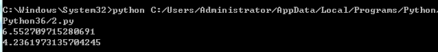
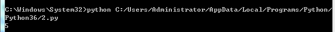
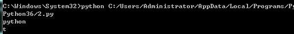
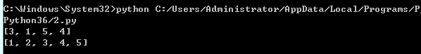

# random模块          

Python中的random模块用于生成随机数。

下面具体介绍random模块的功能：

## 1.random.random() 0到1的随机浮点数

 用于生成一个0到1的随机浮点数：0<= n < 1.0

```python
import random  
a = random.random()
print (a)  
```


 

## 2.random.uniform(a,b)  指定范围浮点数

用于生成一个指定范围内的随机符点数，两个参数其中一个是上限，一个是下限。如果a > b，则生成的随机数n: b <= n <= a。如果 a <b， 则 a <= n <= b。

```python
import random  
print(random.uniform(1,10))  
print(random.uniform(10,1)) 
```

 

 

## 3.random.randint(a, b) 指定范围整数

用于生成一个指定范围内的整数。其中参数a是下限，参数b是上限，生成的随机数n: a <= n <= b

```python
import random  
print(random.randint(1,10))  
```



 


## 4.random.randrange([start], stop[, step]) 范围选取一个

从指定范围内，按指定基数递增的集合中 获取一个随机数。

random.randrange(10, 30, 2)，结果相当于从[10, 12, 14, 16, ... 26, 28]序列中获取一个随机数。

random.randrange(10, 30, 2)在结果上与 random.choice(range(10, 30, 2) 等效。

```python
import random  
print(random.randrange(10,30,2)) 
```


 

## 5.random.choice(sequence) 选择一个

random.choice从序列中获取一个随机元素。其函数原型为：random.choice(sequence)。

参数sequence表示一个有序类型。这里要说明 一下：sequence在python不是一种特定的类型，而是泛指一系列的类型。list, tuple, 字符串都属于sequence。

```python
import random  
lst = ['python','C','C++','javascript']  
str1 = ('I love python')  
print(random.choice(lst))
print(random.choice(str1))  
```



 

## 6.random.shuffle(x[, random]) 打乱

用于将一个列表中的元素打乱,即将列表内的元素随机排列。

```python
import random
p = ['A' , 'B', 'C', 'D', 'E' ]
random.shuffle(p)  
print (p)  
```


 

## 7.random.sample(sequence, k) 取样

从指定序列中随机获取指定长度的片断并随机排列。注意：sample函数不会修改原有序列。

```python
import random   
lst = [1,2,3,4,5]  
print(random.sample(lst,4))  
print(lst) 
```



 