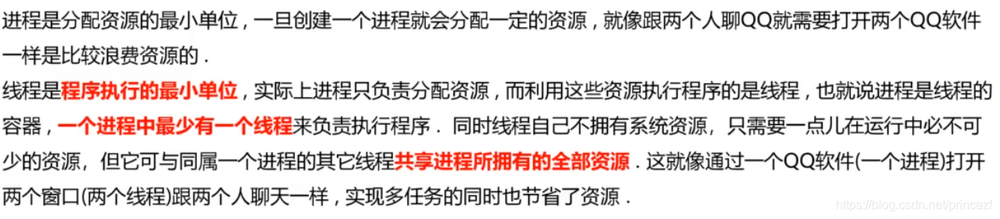
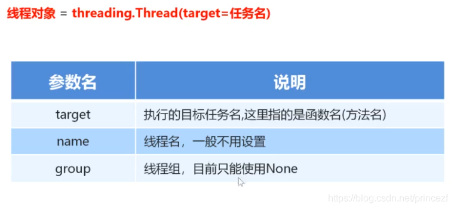

# 1 线程的介绍

- 实现多任务的另一种形式
- 线程是程序执行的最小单位
- 同属一个进程的多个线程共享进程所拥有的全部资源



# 2 线程的创建步骤

1. 导入线程包

    `import threading`

2. 通过线程类创建进程对象

    `线程对象 = threading.Thread()`

3. 启动线程执行任务

    `线程对象.start()`

# 3 通过线程类创建线程对象

参数:

- target: 目标任务名,可以用函数名
- name: 线程名,一般不用设置
- group: 线程组,目前只能使用None



# 4 单任务和多任务简单例子

## 使用多线程实现多任务

```python
'''
# 创建多任务               函数名
t1 = threading.Thread(target=sing)

# 启动多线程
t1.start()

# 等待子线程执行完毕
t1.join()
'''

import threading
import time


def sing():
    for i in range(3):
        print("唱歌。。。")
        time.sleep(0.5)


def dance():
    for i in range(3):
        print("跳舞。。。")
        time.sleep(0.5)


if __name__ == '__main__':
    start = time.time()

    # 创建多任务                  函数名
    t1 = threading.Thread(target=sing)
    t2 = threading.Thread(target=dance)

    # 多线程下run方法启动相当于直接调用函数，并没有真正意义上使用多线程，这一点我们可以通过pid看的出来。而start启动却是真正意义上调用了多线程，同样我们可以通过pid看的出来
    # t1.run()

    # 启动多线程
    t1.start()
    t2.start()

    # 等待子线程执行完毕
    t1.join()
    t2.join()

    print('Interval:', time.time() - start)
    # 唱歌。。。
    # 跳舞。。。
    # 唱歌。。。
    # 跳舞。。。
    # 唱歌。。。
    # 跳舞。。。
    # Interval: 1.5247292518615723
```

# 5 进程执行带有参数的任务

传递参数:

- **args:  以元组的方式给执行任务传参**
    - **注意: (1,) 元组一个数据也要加逗号**
- **kwargs: 以字典方式给执行任务传参**

注意事项:

- 元组传参一定要和参数顺序一致
- 字典方式传参时字典的key要和参数名一致

```python
'''
传递参数:
    args:   以元组的方式给执行任务传参
        注意: (1,) 元组一个数据也要加逗号
    kwargs: 以字典方式给执行任务传参
'''

import threading
import time


def sing(name: str, num: int):
    for i in range(num):
        print(f"{name}在唱歌。。。")
        time.sleep(0.5)


def dance(name: str, num: int):
    for i in range(num):
        print(f"{name}跳舞。。。")
        time.sleep(0.5)


if __name__ == '__main__':
    # 以元组形式传参                                  (1,) 元组一个数据也要加逗号
    s1 = threading.Thread(target=sing, args=('Yuki', 3))

    # 以字典形式传参
    d1 = threading.Thread(target=dance, kwargs={'name': 'Nagato', 'num': 4})
    s1.start()
    d1.start()

    s1.join()
    d1.join()

    # Nagato跳舞。。。
    # Yuki在唱歌。。。
    # Yuki在唱歌。。。
    # Nagato跳舞。。。
    # Yuki在唱歌。。。
    # Nagato跳舞。。。
    # Nagato跳舞。。。
```

# 6 线程的注意点

## 主线程会等待所有的子线程执行结束在结束

```python
import time
import threading

def work():
    for i in range(10):
        print("工作中。。。。")
        time.sleep(0.2)

if __name__ == '__main__':
    work_process = threading.Thread(target=work)
    work_process.start()

    time.sleep(1)
    print("主线程执行结束")

    # 工作中。。。。
    # 工作中。。。。
    # 工作中。。。。
    # 工作中。。。。
    # 主进程执行结束    # 主进程会等待所有的子进程执行结束在结束,所以下面会继续执行子进程
    # 工作中。。。。
    # 工作中。。。。
    # 工作中。。。。
    # 工作中。。。。
    # 工作中。。。。
    # 工作中。。。。
```

## 设置守护主进程

**主进程结束后不会再继续执行子进程中剩余的工作**

```python
'''
默认情况下 主线程会等待所有的子进程执行结束在结束,下面会继续执行子线程(就继续打印)
不想这样的话就设置守护进程,主线程结束后会停止所有子进程
daemon=True
'''

import time
import threading


def work():
    for i in range(10):
        print("工作中。。。。")
        time.sleep(0.2)


if __name__ == '__main__':
    # 设置守护进程,主线程结束后会停止所有子进程
    work_process = threading.Thread(target=work, daemon=True)
    # 两种写法相同
    # work_process.daemon = True

    work_process.start()

    time.sleep(1)
    print("主线程执行结束")
    # 默认情况下 主线进程会等待所有的子进程执行结束在结束,下面会继续执行子线程(就继续打印)

    # 工作中。。。。
    # 工作中。。。。
    # 工作中。。。。
    # 工作中。。。。
    # 工作中。。。。
    # 主进程执行结束
```

# 7 线程之间的执行顺序

无序，由CPU调度决定某个线程先执行

## 获取当前的线程信息

> 通过current_thread方法获取线程对象
>
> current_thread = threading.current_thread()
>
> 通过current_thread对象可以知道线程的相关信息,例如被创建的顺序
>
> print(current_thread)

```python
'''
无序，由CPU调度决定某个线程先执行
'''

import threading
import time


def task():
    '''打印当前线程对象'''
    time.sleep(1)
    print(threading.current_thread())


if __name__ == '__main__':

    for i in range(5):
        sub_thread = threading.Thread(target=task)
        sub_thread.start()

# 执行顺序不同
#  类型    名字       状态    
# <Thread(Thread-4, started 22180)>
# <Thread(Thread-3, started 4284)>
# <Thread(Thread-1, started 3164)>
# <Thread(Thread-2, started 13848)>
# <Thread(Thread-5, started 17216)>
```

# 8 进程和线程对比

## 8.1 关系对比

1. 线程是依附在进程里面的，没有进程就没有线程
2. 一个进程默认提供一条线程，进程可以创建多个线程

## 8.2 区别对此

1. 创建进程的资源开销要比创建线程的资源开销要大
2. 进程是操作系统资源分配的基本单位，线程是CPU调度的基本单位
3. 线程不能够独立执行，必须依存在进程中

## 8.3 优缺点对比

进程优缺点：

- 优点：可以用多核
- 缺点：资源开销大

线程优缺点：

- 优点：资源开销小
- 缺点：不可用多核