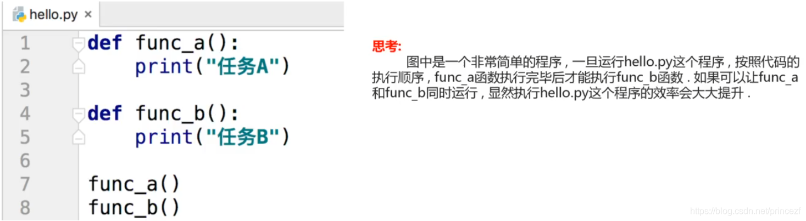
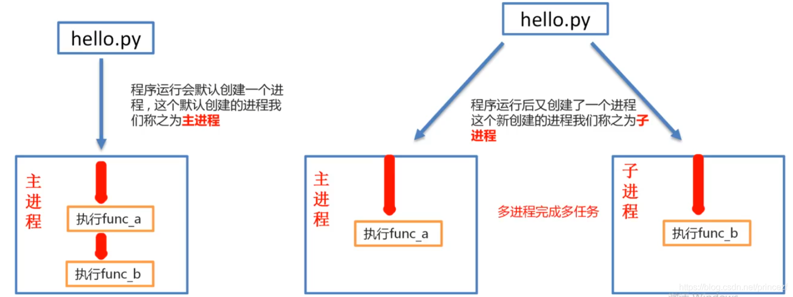
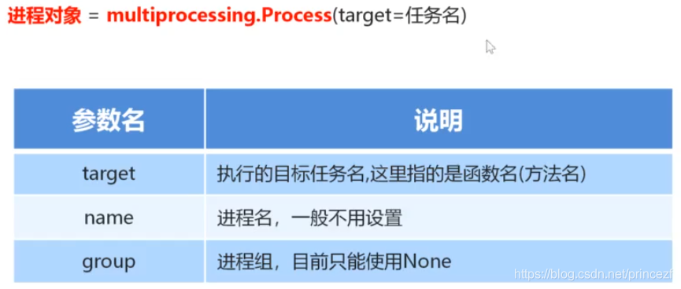
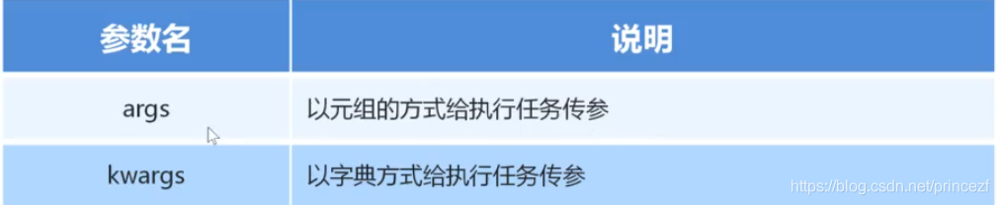

# 1 进程的概念：

进程是资源分配的最小单位，他是操作系统进行资源分配和调度运行的基本单位。通俗理解：一个正在运行的一个程序就是一个进程。例如：正在运行的qq、wechat等，它们都是一个进程。

----

# 2 多进程的作用





----

# 3 进程的创建步骤

1. 导入进程包

    `import multiprocessing`

2. 通过进程类创建进程对象

    `进程对象 = multiprocessing.Process()`

3. 启动进程执行任务

    `进程对象.start()`
    
    **多进程下run方法启动相当于直接调用函数，并没有真正意义上使用多进程，这一点我们可以通过pid看的出来。而start启动却是真正意义上调用了多进程，同样我们可以通过pid看的出来**

----

# 4 通过进程类创建进程对象

参数:

- target: 目标任务名,可以用函数名
- name: 进程名,一般不用设置
- group: 进程组,目前只能使用None



----

# 5 单任务和多任务简单例子

## 单任务

```python
import time

def sing():
    for i in range(3):
        print("唱歌。。。")
        time.sleep(0.5)
def dance():
    for i in range(3):
        print("跳舞。。。")
        time.sleep(0.5)
if __name__ == '__main__':
    time1 = time.time()
    sing()
    dance()
    print(time.time()-time1)
```

输出结果

```python
唱歌。。。
唱歌。。。
唱歌。。。
跳舞。。。
跳舞。。。
跳舞。。。
3.0027265548706055
```

## 使用多进程实现多任务

```python

# 进程包
import multiprocessing
import time


def sing():
    for i in range(3):
        print("唱歌。。。")
        time.sleep(0.5)


def dance():
    for i in range(3):
        print("跳舞。。。")
        time.sleep(0.5)


if __name__ == '__main__':
    start = time.time()

    # 创建多任务                            函数名
    sing1 = multiprocessing.Process(target=sing)
    dance1 =  multiprocessing.Process(target=dance)

    # 多进程下run方法启动相当于直接调用函数，并没有真正意义上使用多进程，这一点我们可以通过pid看的出来。而start启动却是真正意义上调用了多进程，同样我们可以通过pid看的出来

    # 启动多进程
    sing1.start()
    dance1.start()

    # 等待子进程执行完毕
    sing1.join()
    dance1.join()

    print('Interval:', time.time() - start)    
    # 唱歌。。。
    # 跳舞。。。
    # 唱歌。。。
    # 跳舞。。。
    # 唱歌。。。
    # 跳舞。。。
    # Interval: 1.6125640869140625
```

----

# 6 进程执行带有参数的任务



传递参数:

- **args:  以元组的方式给执行任务传参**
    - **注意: (1,) 元组一个数据也要加逗号**

- **kwargs: 以字典方式给执行任务传参**

```python
'''
传递参数:
    args:   以元组的方式给执行任务传参
        注意: (1,) 元组一个数据也要加逗号
    kwargs: 以字典方式给执行任务传参

'''

# 进程包
import multiprocessing
import time


def sing(name, num):
    for i in range(num):
        print(f"{name}在唱歌。。。")
        time.sleep(0.5)


def dance(name, num):
    for i in range(num):
        print(f"{name}跳舞。。。")
        time.sleep(0.5)
        

if __name__ == '__main__':
    # 以元组形式传参                                  (1,) 元组一个数据也要加逗号
    s1 = multiprocessing.Process(target=sing, args=('Yuki', 3))

    # 以字典形式传参
    d1 = multiprocessing.Process(target=dance, kwargs={'name': 'Nagato', 'num': 4})
    s1.start()
    d1.start()
    # Nagato跳舞。。。
    # Yuki在唱歌。。。
    # Yuki在唱歌。。。
    # Nagato跳舞。。。
    # Yuki在唱歌。。。
    # Nagato跳舞。。。
    # Nagato跳舞。。。
```

## 注意事项

- 元组传参一定要和参数顺序一致
- 字典方式传参时字典的key要和参数名一致

----

# 7 获取进程编号

## 进程编号的作用：

当程序中进程的数量越来越多时，如果没有办法区分主进程和子进程还有不同的子进程，那么就无法进行有效的进程管理，为了方便管理实际上每个进程都是有自己的编号的。

## 获取进程编号的两种方式：

1. 获取当前进程编号

    `os.getpid()`

2. 获取当前父进程编号

    `os.getppid()`

```python
'''
1. 获取当前进程编号
    os.getpid()

2. 获取当前父进程编号
    os.getppid()

'''

# 进程包
import multiprocessing
import time
import os

def sing(name, num):
    print("唱歌进程的编号： ", os.getpid())             # 唱歌进程的编号：  22448
    print("唱歌进程的父进程的编号： ", os.getppid())     # 唱歌进程的父进程的编号：  7620

    for i in range(num):
        print(f"{name}在唱歌。。。")
        time.sleep(0.5)


def dance(name, num):
    print("跳舞进程的编号： ", os.getpid())             # 跳舞进程的编号：  19072  
    print("跳舞进程的父进程的编号： ", os.getppid())     # 跳舞进程的父进程的编号：  7620
    for i in range(num):
        print(f"{name}跳舞。。。")
        time.sleep(0.5)
        

if __name__ == '__main__':
    print("主进程的编号： ", os.getpid())   # 主进程的编号：  7620
    

    # 以元组形式传参                                  (1,) 元组一个数据也要加逗号
    s1 = multiprocessing.Process(target=sing, args=('Yuki', 3))

    # 以字典形式传参
    d1 = multiprocessing.Process(target=dance, kwargs={'name': 'Nagato', 'num': 4})
    s1.start()
    d1.start()
    # Nagato跳舞。。。
    # Yuki在唱歌。。。
    # Yuki在唱歌。。。
    # Nagato跳舞。。。
    # Yuki在唱歌。。。
    # Nagato跳舞。。。
    # Nagato跳舞。。。
```

输出结果：

```python
主进程的编号：  7620
唱歌进程的编号：  22448
跳舞进程的编号：  19072
唱歌进程的父进程的编号：  7620
Yuki在唱歌。。。
跳舞进程的父进程的编号：  7620
Nagato跳舞。。。
Nagato跳舞。。。
Yuki在唱歌。。。
Nagato跳舞。。。
Yuki在唱歌。。。
Nagato跳舞。。。
```

----

# 8 进程的注意点

## 主进程会等待所有的子进程执行结束在结束

```python
import time
import multiprocessing

def work():
    for i in range(10):
        print("工作中。。。。")
        time.sleep(0.2)

if __name__ == '__main__':
    work_process = multiprocessing.Process(target=work)
    work_process.start()

    time.sleep(1)
    print("主进程执行结束")
```

输出结果：

```python
工作中。。。。
工作中。。。。
工作中。。。。
工作中。。。。
主进程执行结束		# 主进程会等待所有的子进程执行结束在结束,所以下面会继续执行子进程
工作中。。。。
工作中。。。。
工作中。。。。
工作中。。。。
工作中。。。。
工作中。。。。
```

## 设置守护主进程

**主进程结束后不会再继续执行子进程中剩余的工作**

```python
'''
默认情况下 主进程会等待所有的子进程执行结束在结束,下面会继续执行子进程(就继续打印)
不想这样的话就设置守护进程,主进程结束后会停止所有子进程
daemon=True
'''

import time
import multiprocessing


def work():
    for i in range(10):
        print("工作中。。。。")
        time.sleep(0.2)


if __name__ == '__main__':
    # 设置守护主进程  daemon=True
    # 主进程结束后不会再继续执行子进程中剩余的工作
    work_process = multiprocessing.Process(target=work, daemon=True)
    # 写法2
    # work_process.daemon = True


    work_process.start()

    time.sleep(1)
    print("主进程执行结束")
    # 默认情况下 主进程会等待所有的子进程执行结束在结束,下面会继续执行子进程(就继续打印)

    # 工作中。。。。
    # 工作中。。。。
    # 工作中。。。。
    # 工作中。。。。
    # 工作中。。。。
    # 主进程执行结束
```

----

# 9 案例-多进程实现图片文件夹多任务拷贝器

需求分析：

- 目标文件夹是否存在，如果不存在就创建，存在则不创建
- 遍历源文件夹中所有文件，并拷贝到目标文件夹
- 采用进程实现多任务，并完成拷贝

实现步骤

1. 定义源文件夹所在的路径，目标文件夹所在路径
2. 创建目标文件夹
3. 通过`os.listdir`获取源目录中的文件列表
4. 遍历每个文件，定义一个函数，专门实现文件拷贝
5. 采用进程实现多任务，完成高并发拷贝

```python
'''
只需要两行即可实现多线程

sub_process = multiprocessing.Process(target=copy_file, args=(file_name, source_dir, dest_dir))
sub_process.start()
'''

import os
import multiprocessing


def copy_file(file_name, source_dir, dest_dir):
    '''
    复制文件
    file_name:  源文件名
    source_dir: 源文件夹路径
    dest_dir:   目标文件夹路径
    '''
    # 1 拼接源文件路径和目标文件路径
    source_path = os.path.join(source_dir, file_name)
    dist_path = os.path.join(dest_dir, file_name)

    # 2 打开源文件和目标文件
    with open(source_path, 'rb') as source_file:
        with open(dist_path, 'wb') as dest_file:
            # 3 循环读取源文件到目标路径
            while True:
                data = source_file.read(1024)
                if data:
                    dest_file.write(data)
                else:
                    break


if __name__ == '__main__':
    # 1 定义源文件夹和目标文件夹
    source_dir = r'D:\图片\hololive'
    dest_dir = r'C:\Users\Frostbite\Desktop\temp'

    # 2.创建目标文件夹
    try:
        os.mkdir(dest_dir)
    except:
        print("目标文件夹已经存在")    

    # 3.读取源文件夹的文件列表
    file_list = os.listdir(source_dir)
    
    for file_name in file_list:
        # 单j程模式
        # copy_file(file_name, source_dir, dest_dir)

        # 5.使用多进程实现多任务拷贝
        sub_process = multiprocessing.Process(target=copy_file, args=(file_name, source_dir, dest_dir))

        sub_process.start()

    print('拷贝完毕')
```


