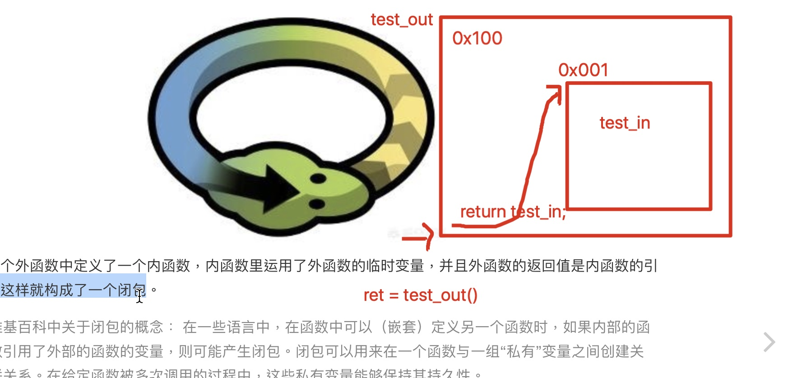
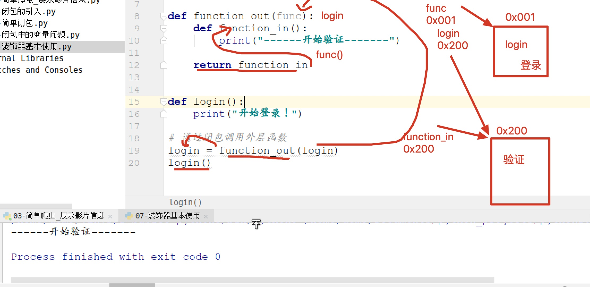
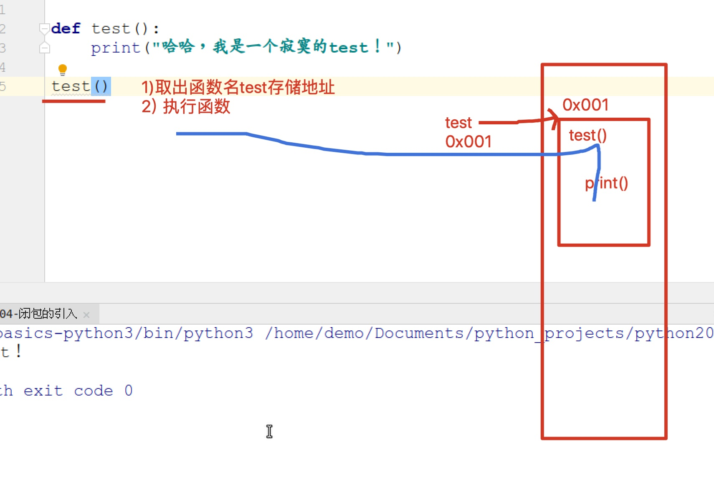
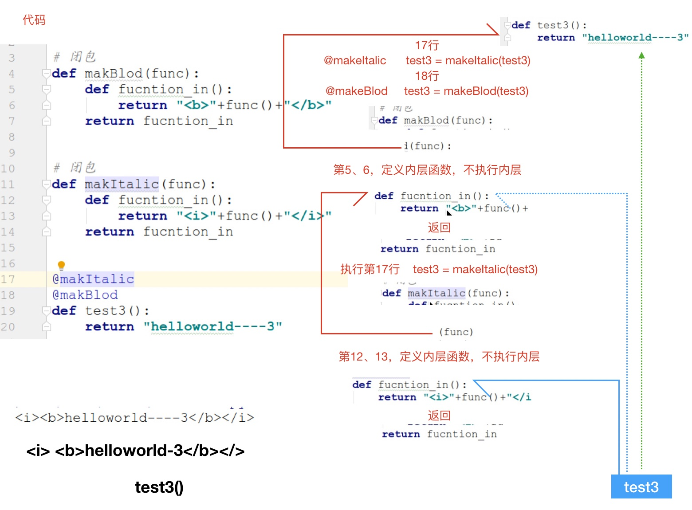

上面是数据库的,暂时不看

## 1 闭包的概念及基本使用

* 闭包的概念：在一个外函数中定义了一个内函数，内函数里运用了外函数的临时变量，并且外函数的返回值是内函数的引用。这样就构成了一个闭包。
* 闭包构成的条件：
  * 存在函数的嵌套关系
  * 内层函数引用了外层函数的临时变量
  * 外层函数返回内层函数的引用（地址）



> 闭包的基本使用



> 函数引用问题



```python
def function_out(number):
    print('1 ---- function_out ----num:', number)

    def function_in(number_in):
        print('2 ---- function_in -----num:', number)
        print('3 ---- function_in -----num_in:', number_in)

    return function_in


# 赋值给变量再调用
function_in = function_out(0)
# 1 ---- function_out ----num: 0

# 可以看出闭包可以防止外部函数的变量被释放
function_in(1)
# 2 ---- function_in -----num: 0   
# 3 ---- function_in -----num_in: 1

# 直接调用
function_out(2)(3)
# 1 ---- function_out ----num: 2   
# 2 ---- function_in -----num: 2   
# 3 ---- function_in -----num_in: 3
```


## 2 闭包中变量问题

* 内层定义了和外层同名的变量

  > 在内层定义了和外层同名的变量,无论在上面和下面,都会使用内部的,放在下部的会报错,因为找不到
  >
  > 内层优先使用内层定义的变量，即是定义的变量的代码在内层的最后面

* 解决办法：当内层存在和外层同名变量，而且内层需要使用外层定义的变量，此时应该使用 `nonlocal` 修饰

  `nonlocal 外部变量名`
  
  ```python
  '''
  如果在内层强制使用外层变量,使用nonlocal修饰变量
  不使用函数内层变量,而是使用外层函数变量
  nonlocal number 
  '''
  
  
  def function_out(number):
  
      def function_in():
          # 在内层定义了和外层同名的变量,无论在上面和下面,都会使用内部的,放在下部的会报错,因为找不到
          # 如果在内层强制使用外层变量,使用nonlocal修饰变量
          nonlocal number
          
          # number = 88
          print("function_in num=", number)
          number = 88 	# 默认下面会报错,因为上面找不到
  
      return function_in
  
  
  # 可以看出闭包可以防止外部函数的变量被释放
  function_out(10)()
  # function_in num= 88
  
  ```
  
  

## 3 装饰器入门 @ 函数名

* 装饰器的作用：**不修改源代码的基础上，给函数增加新的功能**

* 装饰器使用：

> 1 存在闭包
>
> 2 待扩展的函数(不修改改函数,但要增加功能)

* 写法：

  ```python
  @闭包的外层函数名
  def 待装饰的函数():
      pass
  ```

```python
'''
给login函数增加验证功能,不能修改源代码
将login函数传递给外部函数,在内部函数中使用它,还可以添加新功能

# 装饰器,先调用 不用手动调用闭包了
@ function_out  <--  闭包外层函数名
def login():
    print('----开始登陆----')

'''


def login():
    print('----开始登陆----')

login()
# ----开始登陆----
print('*' * 50)


def function_out(func):

    def function_in():
        print("----开始验证----")
        # 调用login
        func()

    return function_in


# 手动调用闭包
# 通过闭包调用函数
login = function_out(login)
login()
# ----开始验证----
# ----开始登陆----
print('*' * 50)


# 不赋值给变量直接调用就会多打印一行
function_out(login)()
# ----开始验证----
# ----开始验证----
# ----开始登陆----
print('*' * 50)


# 装饰器,不用手动调用闭包了
# @外层函数名
@ function_out
def login():
    print('----开始登陆----')

login()
# ----开始验证----
# ----开始登陆----
print('*' * 50)


# 外层函数不用函数名参数也能运行,但是不能使用装饰器了
def function_out():

    def function_in(func, a):
        print("----开始验证----")

        # 调用login并返回
        return func(a)

    return function_in


def login(a):
    print('----开始登陆----')
    return a + 10


res = function_out()
print(res(login, 1))
```


## 4 装饰有参数的函数

### 普通参数

> 待装饰
>
> ```python
> @函数名
> def login(num):
>     pass
> ```
>
> 装饰函数写法注意：
>
> ```python
> 
> def function_in(id, password):
> 	func(id, password)
> ```

```python
'''
参数, login使用什么参数,内部函数就使用什么函数,还要传递给内部函数调用的函数
'''


def function_out(func):

    #  这个id是login函数的参数
    def function_in(id, password):
        print("开始验证 id =", id, ',password =', password)

        # 要传递给调用的函数
        func(id, password)
        
    return function_in


# 登录函数
@ function_out
def login(id, password):
    print("开始登陆 id =", id, ',password =', password)


login(1, 1000)
# 开始验证 id = 1 ,password = 1000
# 开始登陆 id = 1 ,password = 1000
```


### 可变参数 *args, **kwargs

> 待装饰
>
> ```python
> @函数名
> def login(C):
>     pass
> ```
>
> 注意：
>
> ```python
> def function_in(*args, **kwargs):
> # 要传递给调用的函数,传递函数也要使用 * **
>     func(*args, **kwargs)
> ```
>
> 错误用法：
>
> ```python
> def function_in(*args, **kwargs):
>     func(args, kwargs)
> ```

```python
'''
# 主函数
login(1, 1000, password=999)

# 内部函数
function_in(*args, **kwargs):
	func(*args, **kwargs)
'''


def function_out(func):

    #  *args, **kwargs是login函数的参数
    def function_in(*args, **kwargs):
        print("开始验证")
        # 要传递给调用的函数,传递函数也要使用 * **
        func(*args, **kwargs)
        
    return function_in


# 登录函数
@ function_out
def login(*args, **kwargs):
    print("开始登陆")
    print("args: ", args)
    print("kwargs: ", kwargs)


login(1, 1000, password=999)
# 开始验证
# 开始登陆        
# args:  (1, 1000)
# kwargs:  {'password': 999}

```


## 5 装饰有返回值的函数 return func(参数)

* 步骤
  * 待装饰的函数必须有返回值(return)
  
  * ```python
      def function_in(参数):
          return func(参数)
      ```
  
  * ```python
      def function_in(*args, **kwargs):
          return func(*args, **kwargs)
      ```

### 普通参数有返回值

```python
'''
主函数有返回值的情况下
要在内层函数返回

def function_in(参数):
    return func(参数)
    
'''


def function_out(func):

    def function_in(id):
        print("----开始验证----")

        # 调用login并返回
        return func(id)

    return function_in


@ function_out
def login(id):
    print('----开始登陆----')
    return id + 10

res = login(5)
print(res)
# ----开始验证----
# ----开始登陆----
# 15
```

### 通用版装饰器有返回值 *args, **kwargs

```python
'''
主函数有返回值的情况下
要在内层函数返回

def function_in(参数):
    return func(参数)
'''


def function_out(func):

    def function_in(*args, **kwargs):
        print("----开始验证----")

        # 调用login并返回
        return func(*args, **kwargs)

    return function_in


@ function_out
def login(*args, **kwargs):
    print('----开始登陆----')
    print("args: ", args)
    print("kwargs: ", kwargs)
    return args[0] + 10


res = login(4, 5, id=10)
print(res)
# ----开始验证----
# ----开始登陆----
# args:  (4, 5)
# kwargs:  {'id': 10}       
# 14
```

## 6 装饰器加减乘除

```python

def func_out(func):
	def func_in(*args, **kwargs):
		return func(*args, **kwargs)
		
	return func_in


@ func_out
def add(*args, **kwargs):
	res = 0
	for i in args:
		res += i
		
	return res


@ func_out
def sub(*args, **kwargs):
	res = 0
	for i in args:
		res -= i
		
	return res


@ func_out
def mul(*args, **kwargs):
	res = 1
	for i in args:
		res *= i
		
	return res


@ func_out
def div(*args, **kwargs):
	res = 1
	for i in args:
		res /= i
		
	return res

print(add(1, 2, 3))     # 6
print(sub(1, 2, 3))     # -6
print(mul(1, 2, 3))     # 6
print(div(1, 2, 3))     # 0.16666666666666666 
```


## 7 装饰器工厂 在原装饰器上设置外部变量

* 作用：向装饰器内部传递参数

* 格式：

    ```python
    def test(path):
       def function_out(func):
       	  def function_in():
       	     p
       	  return function_in
       return function_out
    ```

* 使用：

    @test("login.py")

    > 过程解释
    >
    > test(0) 分解为2步
    >
    > 第一步:*
    >
    > ​	1 执行test(0)      --> 返回 func_out 引用
    >
    > ​	2 @ 第一步的结果   --> @func_out
    >
    > 下一步：
    >
    > ​	login = func_out(login)	

```python
'''
三层函数
@ test(0)  # 这是传递给test函数的变量,没有参数也要有括号
 过程解释
 @test(0) 分解为2步
 第一步:
    1) 执行 test(0)  -->  返回 func_out 引用
    2) @ 第一步的结果  -->  @func_out
 下一步：
    1) login = func_out(login)

'''


def test(choice):
    '''
    返回装饰器的引用,装饰器工厂,可以根据参数返回不同的装饰器
    '''
    print(choice)


    if choice == 0:
        # 装饰器
        def func_out(func):
            def func_in():
                print("----开始验证----")
                func()

            return func_in

        return func_out


    elif choice == 1:
        # 装饰器
        def func_out(func):
            def func_in():
                print("----开始注册----")
                func()

            return func_in

        return func_out


@ test(0)  # 这是传递给test函数的变量,没有参数也要有括号
# 过程解释
# @test(0) 分解为2步
# 第一步:
# 1) 执行test("0)   -->  返回 func_out 引用
# 2) @ 第一步的结果  -->  @func_out
# 下一步：
# login = func_out(login)
def login():
    print("----开始登陆----")
login()
# login.py
# ----开始验证----
# ----开始登陆----


@ test(1)  
def register():
    print("----开始登陆----")
register()
# 1
# ----开始注册----
# ----开始登陆----
```


## 8 多重装饰器

* 多重装饰器：给一个函数进行多次装饰
* **从下到上依次装饰**



```python
'''
从下到上依次装饰
先执行 makeBold, 返回值再执行 makehItalic

@ makehItalic
@ makeBold
def hello():
    pass

'''


def makeBold(func):
    """文字加粗"""
    def func_in():
        print("文字加粗")
        # 在hello前后加标签
        return "<b>" + func() + "</b>"

    return func_in


def makehItalic(func):
    """文字倾斜"""
    def func_in():
        print("文字倾斜")
        # 在hello前后加标签
        return "<i>" + func() + "</i>"

    return func_in


# 从下到上依次装饰
# 先执行 makeBold, 返回值再执行 makehItalic

@ makehItalic
@ makeBold
def hello():
    return "hello-1"


print(hello())
# 文字倾斜
# 文字加粗
# <i><b>hello-1</b></i>

# "文字倾斜"出现在"文字加粗前面", 是因为先调用了 makeBold,返回的是 func_in 函数,这个函数没有执行,
# 而是传递给了 makehItalic函数,makehItalic中的func就是传递过来的 "func_in",然后返回它自己的"func_in",
# 执行这个func_in的时候,先输出文字倾斜,在调用func, 就是makeBold中的 func_in, 所以会打印 "文字加粗",最后调用hello()函数
```

> **输出顺序为:**
>
> ```python
> 文字倾斜
> 文字加粗
> <i><b>hello-1</b></i>
> ```
>
> "文字倾斜"出现在"文字加粗前面", 是因为先调用了 makeBold,返回的是 func_in 函数,这个函数没有执行,
>
> 而是传递给了 makehItalic函数,makehItalic中的func就是传递过来的 "func_in",然后返回它自己的"func_in",
>
> 执行这个func_in的时候,先输出"文字倾斜",再调用func, 就是makeBold中的 func_in, 所以会打印 "文字加粗",最后调用hello()函数


## 9 类装饰器

* 作用：使用一个类为一个函数装饰

* 类的书写：

> 必须有两个方法
>
> 1 init 方法，必须接收 装饰器传递的参数 func
>
> 2 call方法执行,  self.func()

```python
# 装饰器类
class Test(object):

    def __init__(self,func):
        print("----init----方法")
        print("---func--", func)
        # func 是login函数的引用
        self.func = func


    def __call__(self, *args, **kwargs):
        print("----开始验证----")
        # 调用原来login的内容
        self.func()
```

* 格式：

* ```python
    @类名
    def func():
        pass
    ```

```python
'''
类装饰器
init函数要接收函数名
    __init__(self, func): 
        self.func = func
call方法里面执行func函数
    __call__():
        self.func()


类装饰器执行步骤
# 执行步骤
# 1) test = Test(login)
# 2) test(login的参数) --> 调用
def login(name):
    pass
'''


from typing import Any

# 装饰器类
class Test(object):

    # 传入函数名
    def __init__(self, func) -> None:
        super().__init__()
        print("--func--: ", func)

        # 保存函数
        self.func = func


    def __call__(self, *args: Any, **kwargs: Any) -> Any:
        print('__call__')

        # 调用函数
        return self.func(args[0])


@ Test
# 执行步骤
# 1) test = Test(login)
# 2) test(login的参数) --> 调用
def login(name):
    print("开始登陆: ", name)
    return name

res = login('Tom')
print(res)
# --func--:  <function login at 0x000002D4EDC72EA0>
# __call__
# 开始登陆:  Tom
# Tom
```

