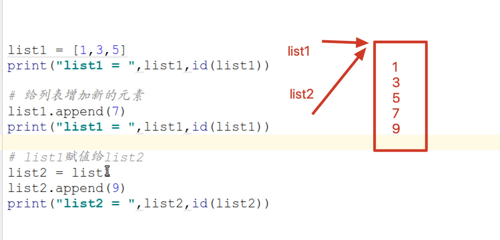

## C 内存分区

C/C++编译的程序所占用内存区域一般分为以下5个部分：

- 栈区（stack）：由编译器自动分配和释放，用来存放函数的参数、局部变量等。其操作方式类似于数据结构中的栈。
- 堆区（heap）：一般由程序员分配和释放（通过malloc/free、new/delete），若程序员没有释放，则程序结束时由操作系统回收。它与数据结构中的堆是两回事，分配方式类似于链表。
- 全局/静态区：全局变量和静态变量的存储是放在一块的，初始化的全局变量和初始化的静态变量在一块区域，未初始化的全局变量和未初始化的静态变量在相邻的另一块区域，程序结束后由操作系统回收。
- 文字常量区：存放常量值，如常量字符串等，不允许修改，程序结束后由操作系统回收。
- 程序代码区：存放函数体的二进制代码。


## 1 python中可变和不可变

* 可变类型（**mutable**），创建后可以继续修改对象的内容（值）

    > 字典，列表

* 不可变类型（**immutabel**） ，一旦创建就不可修改的对象（值）

    > 数字，字符串，元组
    >
    > 当内容发生修改，计算机重新分配一块内存空间



```python
'''
可变类型（mutable），创建后可以继续修改对象的内容（值）
    字典，列表

不可变类型（immutabel） ，一旦创建就不可修改的对象（值）
    不可变类型: 数字,字符串,元组
'''


def immutabel():
    a = 5
    print("a=", a, id(a))

    a = 6
    print("a=", a, id(a))


def mutable():
    list1 = [1, 2, 3]
    print("list1=", list1, id(list1))
    list1.append(4)
    print("list1=", list1, id(list1))

    # list1= [1, 2, 3] 1975841549448    地址相同,存储在堆区
    # list1= [1, 2, 3, 4] 1975841549448

    
if __name__ == "__main__":
    mutable()
```

## 2 深浅拷贝

* 深拷贝：

    * 会产生新的空间
    * 能够保持各自的独立性
    * 如果拷贝的对象，子对象也会拷贝（产生新的空间）

* 浅拷贝

    * 不会产生新的空间
    * 源对象和副本对象指向同一个空间
    * 如果拷贝的对象，子对象不会拷贝（不会产生新的空间）

`copy模块`

```python
import copy

copy.copy()
copy.deepcopy()
```


## 3 简单可变类型拷贝 []

* 简单可变类型的拷贝总结：

    > 简单可变类型的数据**不管深拷贝还是浅拷贝，都会产生新的空间**，而且保持各自的独立性
    >
    > 如果拷贝的是对象,连同子对象也会被拷贝

```python
'''
可变类型（mutable），创建后可以继续修改对象的内容（值）
    字典，列表
    
简单可变类型:[1, 2, 3]

简单可变类型的数据不管深拷贝还是浅拷贝，都会产生新的空间，而且保持各自的独立性
如果拷贝的是对象,连同子对象也会被拷贝


import copy
# 浅拷贝
copy.copy()
# 深拷贝
copy.deepcopy()

'''

import copy


def eq():
    '''
    直接等号赋值相当于起别名,两个变量指向相同的内存地址,会相互影响
    '''

    list1 = [1, 2, 3]


    # 直接赋值就是相同数据,一个修改了另一个也会被修改
    list2 = list1
    list2.append(4)

    print("list1=", list1, id(list1))   # list2= [1, 2, 3, 4] 1888252962760
    print("list2=", list1, id(list2))   # list2= [1, 2, 3, 4] 1888252962760

#eq()


def shallow():
    '''
    copy.copy()
    可变类型浅拷贝也会产生新的空间,能够保持各自的独立性
    '''

    list1 = [1, 2, 3]

    print('*' * 50)

    # 浅拷贝
    list2 = copy.copy(list1)
    list2.append(4)

    print("list1=", list1, id(list1))   # list1= [1, 2, 3] 1888252962760
    print("list2=", list2, id(list2))   # list3= [1, 2, 3, 4] 1888253013384

    print('*' * 50)

# shallow()


def deep():
    '''
    copy.deepcopy()
    可变类型浅拷贝产生新的空间,能够保持各自的独立性
    '''
    
    list1 = [1, 2, 3]
    
    # 深拷贝
    list2 = copy.deepcopy(list1)

    print("list1=", list1, id(list1))   # list1= [1, 2, 3] 1231290723848
    print("list2=", list2, id(list2))   # list2= [1, 2, 3] 1231290723784

    print('*' * 50)


    list2.append(4)

    print("list1=", list1, id(list1))   # list1= [1, 2, 3] 1231290723848
    print("list2=", list2, id(list2))   # list2= [1, 2, 3, 4] 1231290723784

deep()
```


## 3 复杂可变类型拷贝 [[], []]

* 复杂可变类型的深浅拷贝问题
    * 浅拷贝: 只拷贝顶层数据,里面的数据不拷贝(地址相同)
    * 深拷贝: 底层数据和底层数据都拷贝

```python
'''
可变类型（mutable），创建后可以继续修改对象的内容（值）
    字典，列表
    
复杂可变类型:[[1, 2], [3, 4]]

复杂可变类型
    浅拷贝: 只拷贝顶层数据,里面的数据不拷贝(地址相同)
    深拷贝: 底层数据和底层数据都拷贝

'''

import copy


def eq():
    '''
    直接赋值地址完全相同,修改会相互影响
    '''

    A = [1, 2]
    B = [3, 4]

    C = [A, B]
    D = C
    print("C =", C, id(C))
    print("D =", D, id(D))
    # C = [[1, 2], [3, 4]] 2604182302152
    # D = [[1, 2], [3, 4]] 2604182302152  

    D[0].append(0)
    print("C =", C, id(C))
    print("D =", D, id(D))
    # C = [[1, 2, 0], [3, 4]] 2604182302152
    # D = [[1, 2, 0], [3, 4]] 2604182302152
    print("*" * 50)

eq()


def shallow():
    '''
    复杂可变类型浅拷贝只拷贝顶层数据,里面的数据不拷贝(地址相同)
    '''

    A = [1, 2]
    B = [3, 4]

    C = [A, B]

    
    print("A =", A, id(A))                         
    print('C =', C, id(C))              
    print('C[0] =', C[0], id(C[0]))     
    # A =    [1, 2] 2381356821896
    # C = [[1, 2], [3, 4]] 2381356821960
    # C[0] = [1, 2] 2381356821896


    print("*" * 50)


    D = copy.copy(C)
    print('D =', D, id(D))              
    print('D[0] =', D[0], id(D[0]))         
    # D = [[1, 2], [3, 4]] 2381356845384   D和C的地址不同
    # D[0] = [1, 2] 2381356821896


    print("*" * 50)

    # 底层数据共享内存
    A.append(8)
    D[0].append(9)
    print("A =", A, id(A))      
    print('D[0] =', D[0], id(D[0]))  
    # A =    [1, 2, 8, 9] 2381356821896     底层数据共享内存
    # D[0] = [1, 2, 8, 9] 2381356821896

    print("*" * 50)

#shallow()


def deep():
    '''
    复杂可变类型深拷贝底层数据和底层数据都拷贝
    '''

    A = [1, 2]
    B = [3, 4]

    C = [A, B]


    D = copy.deepcopy(C)
    print('D =', D, id(D))  
    print("A =", A, id(A)) 
    print('D[0] =', D[0], id(D[0]))         
    # D = [[1, 2], [3, 4]] 2135454820296
    # A =    [1, 2] 2135454870984       A,D[0] 地址不相同,数据不影响
    # D[0] = [1, 2] 2135454871176


    print("*" * 50)

    
    A.append(8)
    D[0].append(9)
    print("A =", A, id(A))      
    print('D[0] =', D[0], id(D[0]))  
    # A =    [1, 2, 8] 2135454870984    地址不相同,数据不影响
    # D[0] = [1, 2, 9] 2135454871176

#deep()
```


## 4 简单不可变类型拷贝 (1, 2, 3)

* 简单不可变类型
    * **不管深浅拷贝,都不会开辟新的内存空间,都是引用内存地址(因为内容始终不可变)**

```python
'''
不可变类型（immutabel） ，一旦创建就不可修改的对象（值）
    不可变类型: 数字,字符串,元组

数字,字符串不用讨论

简单不可变类型 (1, 2, 3)

简单不可变类型,不管深浅拷贝,都不会开辟新的内存空间,都是引用内存地址(因为内容始终不可变)

'''
import copy


def shallow():
    '''
    等号赋值和浅拷贝完全相同
    '''  
    a = (1, 2, 3)
    b = a

    print('a = ', a, id(a))
    print('b = ', b, id(b))
    # a =  (1, 2, 3) 1955263312376
    # b =  (1, 2, 3) 1955263312376


    c = copy.copy(a)
    print('a = ', a, id(a))
    print('c = ', c, id(c))
    # a =  (1, 2, 3) 1955263312376
    # c =  (1, 2, 3) 1955263312376

# shallow()


def deep():
    '''
    等号赋值和深拷贝完全相同
    '''  
    a = (1, 2, 3)
    b = a

    print('a = ', a, id(a))
    print('b = ', b, id(b))
    # a =  (1, 2, 3) 2176753567784
    # b =  (1, 2, 3) 2176753567784


    c = copy.deepcopy(a)
    print('a = ', a, id(a))
    print('c = ', c, id(c))
    # a =  (1, 2, 3) 2176753567784
    # c =  (1, 2, 3) 2176753567784

deep()

```


## 5 复杂不可变类型拷贝 ((), ()) ([], []) 

* 复杂不可变类型的拷贝问题
    * 浅拷贝，直接引用
    * 深拷贝，看数据具体是可变还是不可变的，如果**数据是可变的，会产生新的空间**，保持数据的独立性

```python
'''
不可变类型（immutabel） ，一旦创建就不可修改的对象（值）
    不可变类型: 数字,字符串,元组

复杂不可变类型: ((), (), ()) ([], [], []) 

复杂不可变类型拷贝:
    浅拷贝,直接引用,和 = 赋值相同
    深拷贝,看数据具体是可变还是不可变的.如果数据是可变的,会产生新的空间,保持数据的独立性

'''
import copy


def shallow():
    '''
    浅拷贝,直接引用,和 = 赋值相同
    '''
    a = [1, 2]
    b = [3, 4]
    c = (a, b)

    d = c

    print("c=", c, id(c))
    print("d=", d, id(d))
    # c= ([1, 2], [3, 4]) 2445094076616
    # d= ([1, 2], [3, 4]) 2445094076616

    e = copy.copy(c)
    e[0].append(5)
    print("c=", c, id(c))
    print("e=", e, id(e))
    # c= ([1, 2, 5], [3, 4]) 2445094076616
    # e= ([1, 2, 5], [3, 4]) 2445094076616


    print("a =", a, id(a))
    print("c[0] =", c[0], id(c[0]))
    print("e[0] =", e[0], id(e[0]))
    # a = [1, 2, 5] 2445094120840
    # c[0] = [1, 2, 5] 2445094120840
    # e[0] = [1, 2, 5] 2445094120840

# shallow()


def deep():
    '''
    深拷贝,看数据具体是可变还是不可变的.如果数据是可变的,会产生新的空间,保持数据的独立性
    '''
    a = [1, 2]
    b = [3, 4]
    c = (a, b)

    d = copy.deepcopy(c)
    print("c=", c, id(c))
    print("d=", d, id(d))
    # c= ([1, 2], [3, 4]) 3105036200200
    # d= ([1, 2], [3, 4]) 3105036200776

    print("a =", a, id(a))
    print("c[0] =", c[0], id(c[0]))
    print("d[0] =", d[0], id(d[0]))
    # a =    [1, 2] 3105036201416   a和c[0] 相同,因为是直接使用的
    # c[0] = [1, 2] 3105036201416
    # d[0] = [1, 2] 3105036150728   c和d不同,是因为深拷贝

    d[0][0] = 10
    print("a =", a, id(a))
    print("c[0] =", c[0], id(c[0]))
    print("d[0] =", d[0], id(d[0]))
    # a =    [1, 2] 3105036201416   a和c[0] 相同,因为是直接使用的
    # c[0] = [1, 2] 3105036201416
    # d[0] = [10, 2] 3105036150728  c和d不同,是因为深拷贝

deep()
```


## 6 切片拷贝

> 切片拷贝：  

- 简单可变类型和不可变类型:   切片是**深拷贝**,产生的地址不同,两者不会影响	   list1 = [1, 2, 3, 4]
- 复杂可变类型:   **切片对于顶层是深拷贝,对于底层是复制内存地址**  list1 = [[1, 2], [3, 4]]
    - 和"复杂可变类型浅拷贝"很像
- 复杂不可变类型: 切片是**浅拷贝**,地址相同                          tuple1 = ([1, 3], [3, 4])

```python
'''
简单可变类型和不可变类型,切片是深拷贝,产生的地址不同,两者不会影响   list1 = [1, 2, 3, 4]

复杂可变类型,切片对于顶层是深拷贝,对于底层是复制内存地址 list1 = [[1, 2], [3, 4]]

复杂不可变类型,切片是浅拷贝,地址相同                 tuple1 = ([1, 3], [3, 4])
'''

def simpleSection():
    '''
    简单可变类型和不可变类型,切片是深拷贝,产生的地址不同,两者不会影响
    '''
    
    list1 = [1, 2, 3, 4, 5, 6, 7]
    list2 = list1[1:3]
    print(list2)    # [2, 3]

    # 不会影响源数据
    list2[0] = 22
    print(list1) # [1, 2, 3, 4, 5, 6, 7]  

    list3 = list1[:]

    print("list1 =", list1, id(list1))
    print("list3 =", list3, id(list3))
    # list1 = [1, 2, 3, 4, 5, 6, 7] 2711859391624
    # list3 = [1, 2, 3, 4, 5, 6, 7] 2711859391944

#simpleSection()


def complexSection1():
    '''
    复杂可变类型,切片对于顶层是深拷贝,对于底层是复制内存地址
        和"复杂可变类型浅拷贝"很像
    '''

    a = [1, 2]
    b = [11, 22]

    # 
    c = [a, b]

    # 切片拷贝
    d = c[:]

    print('c =', c, id(c))     
    print('d =', d, id(d))
    # c = [[1, 2], [11, 22]] 2419485426376
    # d = [[1, 2], [11, 22]] 2419485426312

    print('a =', a, id(a))     
    print('c[0] =', c[0], id(c[0]))     
    print('d[0] =', d[0], id(d[0]))
    # a = [1, 2] 2419485404296
    # c[0] = [1, 2] 2419485404296
    # d[0] = [1, 2] 2419485404296

complexSection1()


def complexSection2():
    '''
    复杂不可变类型,切片是浅拷贝,地址相同
    '''

    a = [1, 2]
    b = [11, 22]

    # 
    c = (a, b)

    # 切片拷贝
    d = c[:]

    print('c =', c, id(c))     
    print('d =', d, id(d))
    # c = ([1, 2], [11, 22]) 1908155640072
    # d = ([1, 2], [11, 22]) 1908155640072

# complexSection2()

```


## 7 字典拷贝

> 字典是**复杂不可变类型,是浅拷贝** dict1 = {'age': 10}
>
> 字典是**复杂可变类型,是浅拷贝** dict1 = {"age": [1, 2]}

```python
'''
字典自带 copy 方法

字典是简单不可变类型,是深拷贝 dict1 = {'age': 10}

字典是复杂可变类型,是浅拷贝   dict1 = {"age": [1, 2]}
'''


def simpltDict():
    '''
    字典是简单不可变类型,是深拷贝
    '''

    dict1 = {'age': 10}

    dict2 = dict1.copy()

    print("dict1 =", dict1, id(dict1))     
    print("dict2 =", dict2, id(dict2))  
    # dict1 = {'age': 10} 2544252235136
    # dict2 = {'age': 10} 2544252235640


    dict2['age'] = 11

    print("dict1 =", dict1, id(dict1))     
    print("dict2 =", dict2, id(dict2))  
    # dict1 = {'age': 10} 2544252235136
    # dict2 = {'age': 11} 2544252235640     只会影响自己,是深拷贝

simpltDict()


def complexDict():
    '''
    字典是复杂可变类型,是浅拷贝
    '''

    dict1 = {"age": [1, 2]}

    dict2 = dict1.copy()

    print("dict1 =", dict1, id(dict1))     
    print("dict2 =", dict2, id(dict2))     
    # dict1 = {'age': [1, 2]} 1700771016064     地址不同
    # dict2 = {'age': [1, 2]} 1700771016136 

    dict2['age'][0] = 11

    print("dict1 =", dict1, id(dict1))     
    print("dict2 =", dict2, id(dict2))     
    # dict1 = {'age': [11, 2]} 1700771016064    地址不同,不过里面的列表相同,说明里面的内容是浅拷贝
    # dict2 = {'age': [11, 2]} 1700771016136

# complexDict()
```


