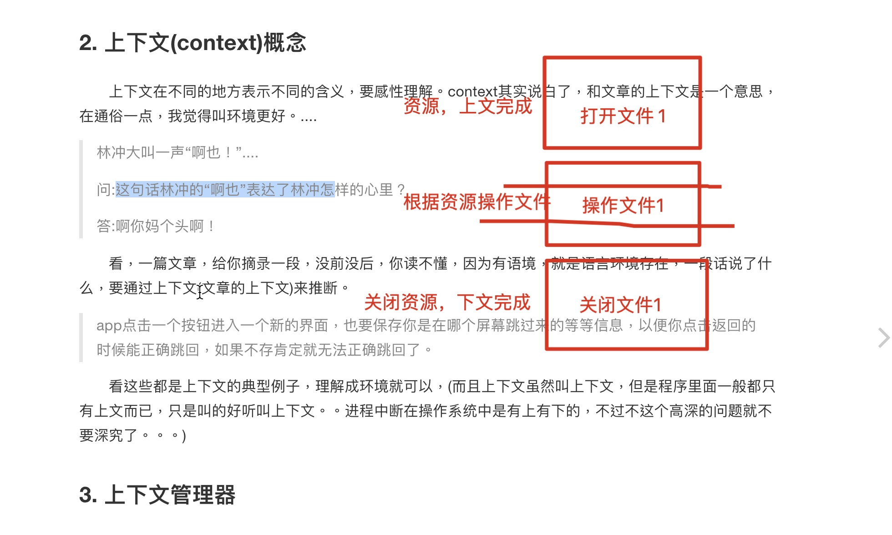
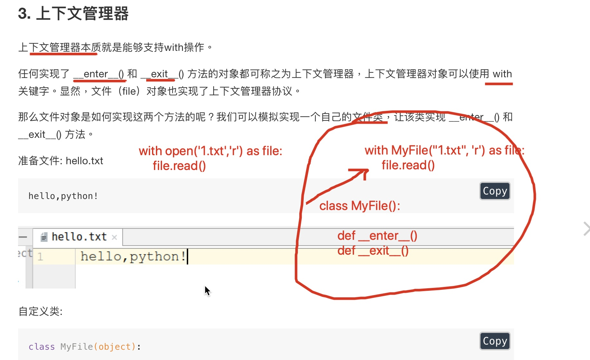
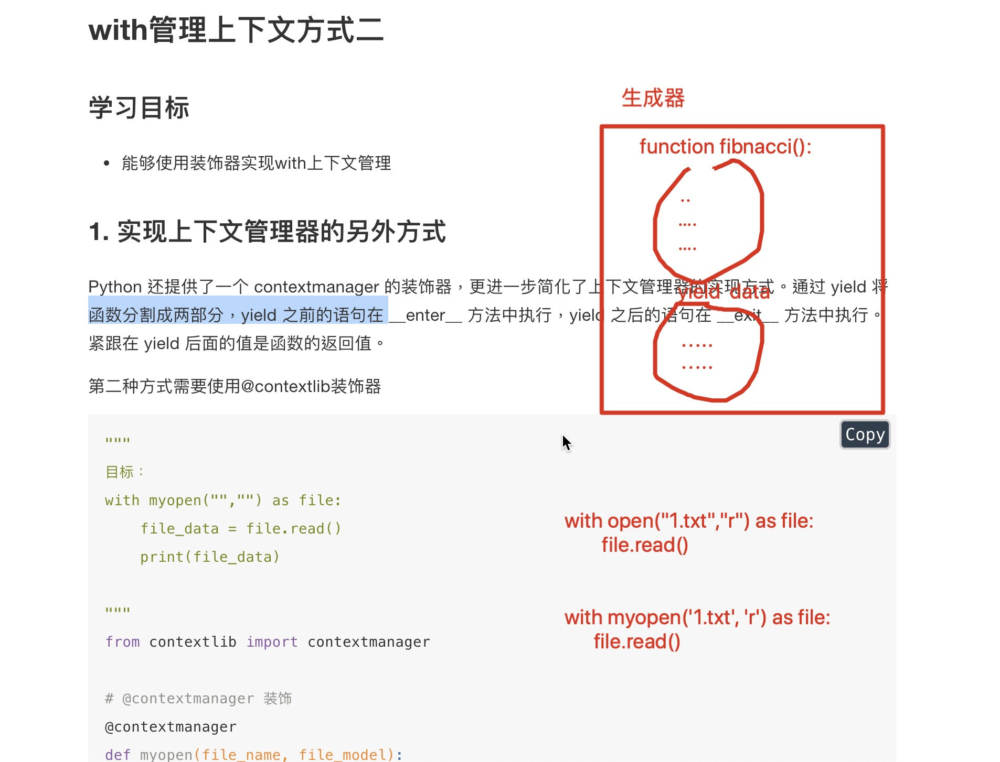

# 1 上下文



## 自定义上下文管理器 `__enter__() __exit__()`



# 2 with管理上下文方式一

* 上下文：以 with open 来说，打开文件在上文      关闭文件在下文

* 上下文管理器：

    * `__enter__ ` 上文方法
    * `__exit__` 下文方法

* 自定义一个满足满足上下文管理器的 类

    ```python
    '''
    自定义上下文管理器实现文件操作 满足 with操作
    类: MyFile()
    类方法:
        __init__()   接收参数,并且初始化
        __enter__()  上文方法  with开始调用
        __exit__()   下文方法  with结束调用
    
    with MyFile('hello.txt', 'r') as file
    
    '''
    import os
    import sys
    os.chdir(sys.path[0])
    
    
    class MyFile(object):
        def __init__(self, file_name, mode='r', encoding='utf-8') -> None:
            self.file_name = file_name
            self.mode = mode
            self.encoding = encoding
    
    
        # 上文方法 with开始调用
        def __enter__(self):
            print("进入上文")
            self.file = open(self.file_name, self.mode, encoding=self.encoding)
            return self.file
    
    
        # 下文方法 with结束调用 必须有四个参数
        def __exit__(self, exc_type, exc_val, exc_tb):
            print("进入下文")
            self.file.close()
    
    
    with MyFile('hello.txt', 'r', 'utf-8') as file:
        lines = file.readlines()
        print(lines)
        # 进入上文
        # ['nihao,zaima\n', 'buhao,zaijian']
        # 进入下文
    
    ```

# 2 with管理上下文方式二 contextmanager



* 通过装饰器 @ contextmanager 实现上下文管理

    ```python
    @ contextmanager
    def 函数():
    	pass
    ```

    

    ```python
    '''
    思路:
        def myopen(file_name, mode, encoding):
            上文(打开资源)
            yield
            下文(关闭资源)
    
    
        装饰器装饰函数的步骤:
            1.导入模块
                from contextlib import contextmanager
            2.开始装饰
    
    
    
    yield可以返回值,并暂停函数
    
    yield 的作用就是把一个函数变成一个 generator，带有 yield 的函数不再是一个普通函数，
    Python 解释器会将其视为一个 generator，调用 fab(5) 不会执行 fab 函数，而是返回一个 iterable 对象！
    在 for 循环执行时，每次循环都会执行 fab 函数内部的代码，执行到 yield b 时，fab 函数就返回一个迭代值，
    下次迭代时，代码从 yield b 的下一条语句继续执行，而函数的本地变量看起来和上次中断执行前是完全一样的，于
    是函数继续执行，直到再次遇到 yield。
    '''
    import os
    import sys
    os.chdir(sys.path[0])
    
    
    from contextlib import contextmanager
    
    
    # 用它装饰,让函数有 __enter__ 和 __exit__ 方法
    @ contextmanager
    def myopen(file_name, mode='r', encoding='utf-8'):
        print("进入上文")
        # 1.打开文件
        file = open(file_name, mode, encoding=encoding)
    
        # 2.返回资源
        yield file      # 返回数据,暂停函数执行
    
    
        # 下文
        # 3.关闭资源
        print("进入下文")
        file.close()
    
    
    with myopen('hello.txt', mode='r', encoding='utf-8') as file:
        data = file.read()
        print(data)
    
    # 进入上文
    # nihao,zaima
    # buhao,zaijian
    # 进入下文
    ```

    