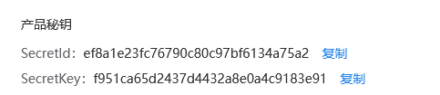
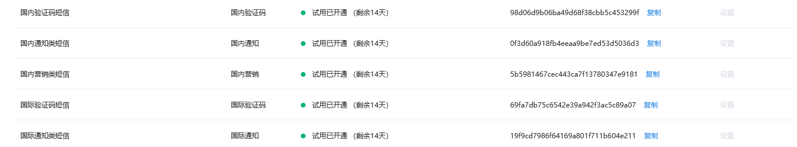

```
secretID： ef8a1e23fc76790c80c97bf6134a75a2
secretKey：f951ca65d2437d4432a8e0a4c9183e91
国内验证码短信bid ：98d06d9b06ba49d68f38cbb5c453299f
国内通知类短信bid ：0f3d60a918fb4eeaa9be7ed53d5036d3 
```





# 1.短信息发送：

> [文档](https://support.dun.163.com/documents/2018101001?docId=436710603760996352)

短信发送端口:   https://sms.dun.163.com/v2/sendsms

验证码校验接口: https://sms.dun.163.com/v2/verifysms


# 2.登录权限的验证

> 只要走center路由，判断用户是否是登录状态，如果用户登录了，可以正常显示页面，如果用户没有登录
> 则自动跳转到登录页面进行登录，登录之后才可以进行查看。

## 钩子函数：中间件

> 直接应用在app上
>
> 没写明app

```python
before_first_request	# 第一次之前
before_request			# 每次之前
after_request			# 每次之后
teardown_request 		# after之后
```

> 应用到蓝图
>
> 写明app

```python
before_app_first_request	# 第一次之前
before_app_request			# 每次之前
after_app_request			# 每次之后
teardown_app_request		# after之后
```

### before_app_first_request

```python
# 钩子函数
# 第一次被请求调用
@user_bp.before_app_first_request   # 蓝图的方法中有app, app自身的不用再加上app
def first_request():
    #print('before_app_first_request')
    pass

```

### before_app_request

```python
# 每次请求之前调用
@user_bp.before_app_request
def before_request():
    # 得到请求路径
    path = request.path
    # print(path) # /user/
    if path in required_login_list:
        id = session.get('uid')
        # 没有登录
        if not id:
            return redirect(url_for('user.login'))
        else:
            user = User.query.get(id)
            # 放在本次请求的对象中
            g.user = user
```

### after_app_request 要有response参数和返回值

```python
# 每次请求之后调用,对response做处理
@user_bp.after_app_request
def after_request(response: Response): # 参数必须有response,因为前面的函数会传递过来
    # 处理response
    response.set_cookie('a', 'test', 60)
    return response
```

### teardown_app_request 要有response参数和返回值

```python
# 在after之后,也有参数
@user_bp.teardown_app_request
def teardown_app_request(response: Response):
    print('teardown_app_request')
    return response
```


# 3 flask.g

> 本次请求的一个对象

```python
from flask import g

user = User.query.get(id)
g.user = user
```


```python
# 每次请求
@user_bp.before_app_request
def before_request():
    # 得到请求路径
    path = request.path
    # print(path) # /user/
    if path in required_login_list:
        id = session.get('uid')
        # 没有登录
        if not id:
            return redirect(url_for('user.login'))
        else:
            user = User.query.get(id)
            # 放在本次请求的对象中
            g.user = user

# 紧接着就能获取了
# 用户中心
@user_bp.route('/center')
def center():
    #                                               g是本次请求的对象,在before_app_request中获取了用户,这里不用在获取了
    return render_template('user/center.html', user=g.user)
```

