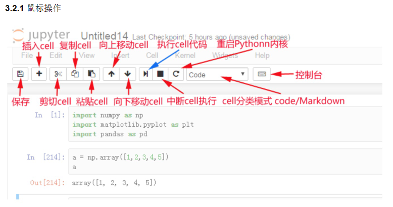
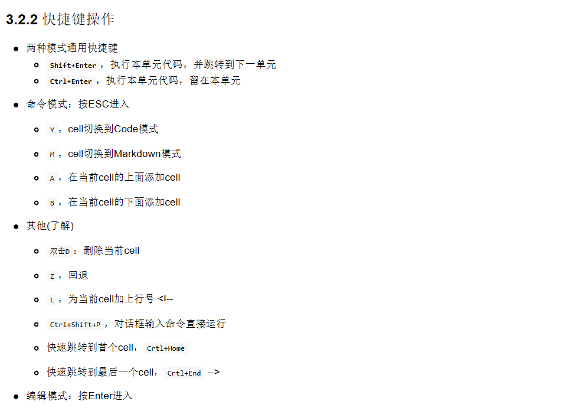

# 1 Jupyter Notebook的使用
## a 虚拟环境中安装

```sh
pip install jupyter
```


## b 界面启动、创建文件

环境搭建好后，本机输入jupyter notebook命令，会自动弹出浏览器窗口打开Jupyter Notebook
进入虚拟环境

```sh
jupyter notebook
```

本地notebook的默认URL为：http://localhost:8888
想让notebook打开指定目录，只要进入此目录后执行命令即可

# 2 执行

Shift+Enter，执行本单元代码，并跳转到下一单元
Ctrl+Enter，执行本单元代码，留在本单元

# 3 cell操作
> 什么是cell？

cell：一对In Out会话被视作一个代码单元，称为cell
cell行号前的 * ，表示代码正在运行
Jupyter支持两种模式：


> 编辑模式（Enter）

命令模式下 回车Enter 或 鼠标双击 cell进入编辑模式
可以操作cell内文本或代码，剪切／复制／粘贴移动等操作


> 命令模式（Esc）

按 Esc 退出编辑，进入命令模式
可以操作cell单元本身进行剪切／复制／粘贴／移动等操


## 鼠标操作




## 快捷键操作




# Shift+Tab 参数提示

