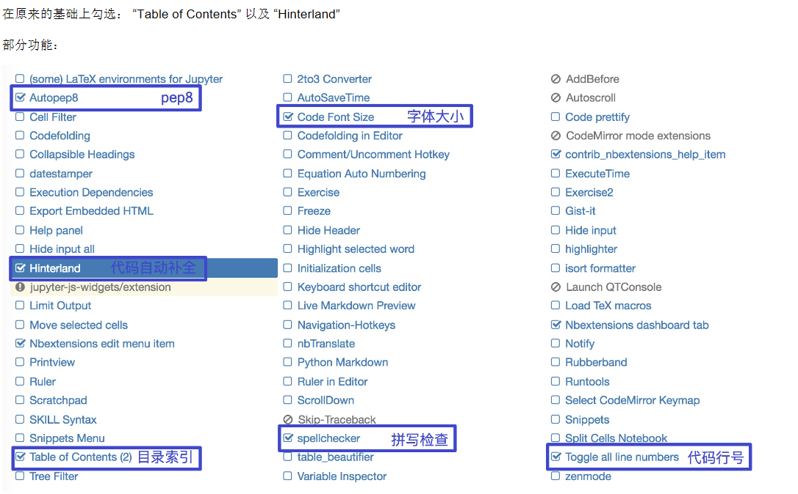

# 1 Jupyter Notebook的使用
## a 虚拟环境中安装

`pip install jupyter`


## b 界面启动、创建文件

环境搭建好后，本机输入jupyter notebook命令，会自动弹出浏览器窗口打开Jupyter Notebook
进入虚拟环境
`conda activate ai`
\# 输入命令
`jupyter notebook`
本地notebook的默认URL为：http://localhost:8888
想让notebook打开指定目录，只要进入此目录后执行命令即可


# 2 执行

Shift+Enter，执行本单元代码，并跳转到下一单元
Ctrl+Enter，执行本单元代码，留在本单元


# 3 cell操作
> 什么是cell？

cell：一对In Out会话被视作一个代码单元，称为cell
cell行号前的 * ，表示代码正在运行
Jupyter支持两种模式：


> 编辑模式（Enter）

命令模式下 回车Enter 或 鼠标双击 cell进入编辑模式
可以操作cell内文本或代码，剪切／复制／粘贴移动等操作


> 命令模式（Esc）

按 Esc 退出编辑，进入命令模式
可以操作cell单元本身进行剪切／复制／粘贴／移动等操


## 鼠标操作


## 快捷键操作


# 3 代码补全

## a.安装:

`pip install jupyter_contrib_nbextensions`

## b.然后执行：
`jupyter contrib nbextension install --user --skip-running-check`

## c.安装autopep8:

`pip install autopep8`

## d.启动 Jupyter Notebook，勾选设置
上面两个步骤都没报错后，启动 Jupyter Notebook，上面选项栏会出现 Nbextensions 的选项



# 4 关于jupyter的使用Tab无法使用代码补全，且hinterland无法自动补全


尝试降低ipython版本

```python
pip install ipython==7.1.1
```


# Shift+Tab 参数提示

